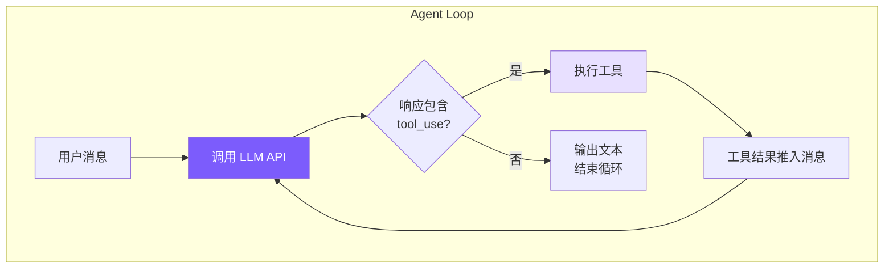

# 1. Agent Loop — 核心循环

## 本章目标

实现 coding agent 的心脏：一个 while 循环，不断调用 LLM → 检查是否需要执行工具 → 执行工具 → 把结果喂回 LLM → 重复，直到 LLM 认为任务完成。



## Claude Code 怎么做的

### 双层架构

Claude Code 把 Agent Loop 拆成两层：

- **QueryEngine**（~1155 行）：会话级，管整个对话生命周期——用户输入处理、USD 预算检查、Token 统计、会话恢复
- **queryLoop**（~1728 行）：单轮级，管一次查询的执行——消息压缩、API 调用、工具执行、错误恢复

这样拆的好处是关注点分离：QueryEngine 不需要知道"PTL 错误怎么恢复"，queryLoop 不需要知道"用户输入怎么解析"。

### queryLoop：异步生成器

queryLoop 签名是 `async function*`——异步生成器。选这个而不是回调/事件的原因：

1. **背压控制**：消费端不处理完，生产端不继续，天然防止事件堆积
2. **线性控制流**：所有循环分支用普通 `continue` / `break` 表达，不需要状态机

### 七种 Continue Reason

循环有 7 个继续位置，对应 7 种不同场景：

| # | 名称 | 触发场景 | 处理策略 |
|---|------|---------|---------|
| 1 | `next_turn` | 模型调用了工具 | 执行工具，结果推入消息，继续 |
| 2 | `collapse_drain_retry` | PTL 错误，有暂存的折叠操作 | 提交折叠释放空间，重试 |
| 3 | `reactive_compact_retry` | PTL 错误，折叠空间不够 | 强制全量摘要压缩，重试 |
| 4 | `max_output_tokens_escalate` | 输出 Token 截断，首次 | 升级到更高 Token 限制（16K→64K），重试 |
| 5 | `max_output_tokens_recovery` | 输出 Token 截断，升级不可用 | 注入续写提示，最多重试 3 次 |
| 6 | `stop_hook_blocking` | 任务完成但 Stop Hook 拦截 | 继续执行循环 |
| 7 | `token_budget_continuation` | API 侧 Token 预算耗尽 | 继续生成 |

我们的简化实现只处理第 1 种：有 tool_use 就继续，否则停。

### 错误扣留策略

这是个值得单独说的设计：**可恢复的错误不立即暴露给上层**。

当输出 Token 被截断时，如果直接 yield 错误给 QueryEngine，UI 会显示报错——但 queryLoop 后续的恢复逻辑其实能自动处理这个问题。所以 Claude Code 的做法是先"扣留"错误，执行恢复逻辑，成功了用户完全无感知，失败了才最终暴露。大多数 `max_output_tokens` 和 `prompt_too_long` 错误都被这样静默处理掉了。

### 并行工具执行

Claude Code 用 `StreamingToolExecutor` 在 API 流式响应期间并行执行工具：

```
串行（我们的实现）：
  [========= API 流式响应 =========][tool1][tool2][tool3]

并行（Claude Code）：
  [========= API 流式响应 =========]
       ↑ tool1 的 JSON 完成 → 立即执行
            ↑ tool2 的 JSON 完成 → 立即执行
```

一个典型 API 响应有 5-30 秒的流式窗口，在这个时间里多个工具可以并发完成。

## 我们的实现

把双层架构合并成一个 `Agent` 类，核心是 `chatAnthropic()` 方法：

<!-- tabs:start -->
#### **TypeScript**
```typescript
// agent.ts — chatAnthropic 方法（核心 Agent Loop）

private async chatAnthropic(userMessage: string): Promise<void> {
  this.anthropicMessages.push({ role: "user", content: userMessage });
  // 在 turn boundary 触发 auto-compact：此时最后一条消息是纯文本 user，
  // compactAnthropic 内部的 slice(0, -1) 不会切断 tool_use ↔ tool_result 配对（详见第 7 章）
  await this.checkAndCompact();

  while (true) {
    if (this.abortController?.signal.aborted) break;

    const response = await this.callAnthropicStream();

    // 累计 token 用量
    this.totalInputTokens += response.usage.input_tokens;
    this.totalOutputTokens += response.usage.output_tokens;
    this.lastInputTokenCount = response.usage.input_tokens;

    // 提取 tool_use block
    const toolUses: Anthropic.ToolUseBlock[] = [];
    for (const block of response.content) {
      if (block.type === "tool_use") toolUses.push(block);
    }

    // assistant 响应推入历史
    this.anthropicMessages.push({ role: "assistant", content: response.content });

    // 没有工具调用 → 任务完成
    if (toolUses.length === 0) {
      printCost(this.totalInputTokens, this.totalOutputTokens);
      break;
    }

    // 串行执行每个工具
    const toolResults: Anthropic.ToolResultBlockParam[] = [];
    for (const toolUse of toolUses) {
      if (this.abortController?.signal.aborted) break;

      const input = toolUse.input as Record<string, any>;
      printToolCall(toolUse.name, input);

      // 权限检查（详见第 6 章）
      const perm = checkPermission(toolUse.name, input, this.permissionMode, this.planFilePath);
      if (perm.action === "deny") {
        toolResults.push({ type: "tool_result", tool_use_id: toolUse.id,
          content: `Action denied: ${perm.message}` });
        continue;
      }
      if (perm.action === "confirm" && perm.message && !this.confirmedPaths.has(perm.message)) {
        const confirmed = await this.confirmDangerous(perm.message);
        if (!confirmed) {
          toolResults.push({ type: "tool_result", tool_use_id: toolUse.id,
            content: "User denied this action." });
          continue;
        }
        this.confirmedPaths.add(perm.message);
      }

      const result = await executeTool(toolUse.name, input);
      printToolResult(toolUse.name, result);
      toolResults.push({ type: "tool_result", tool_use_id: toolUse.id, content: result });
    }

    // 工具结果以 user 消息推入（Anthropic API 要求）
    this.anthropicMessages.push({ role: "user", content: toolResults });
  }
}
```
#### **Python**
```python
# agent.py — _chat_anthropic 方法（核心 Agent Loop）

async def _chat_anthropic(self, user_message: str) -> None:
    self._anthropic_messages.append({"role": "user", "content": user_message})
    # 在 turn boundary 触发 auto-compact：此时最后一条是纯文本 user，
    # _compact_anthropic 内部的 [:-1] 不会切断 tool_use ↔ tool_result 配对（详见第 7 章）
    await self._check_and_compact()

    while True:
        if self._aborted:
            break

        self._run_compression_pipeline()
        response = await self._call_anthropic_stream()

        self.total_input_tokens += response.usage.input_tokens
        self.total_output_tokens += response.usage.output_tokens
        self.last_input_token_count = response.usage.input_tokens

        tool_uses = [b for b in response.content if b.type == "tool_use"]

        self._anthropic_messages.append({
            "role": "assistant",
            "content": [self._block_to_dict(b) for b in response.content],
        })

        if not tool_uses:
            if not self.is_sub_agent:
                print_cost(self.total_input_tokens, self.total_output_tokens)
            break

        tool_results = []
        for tu in tool_uses:
            if self._aborted:
                break
            inp = dict(tu.input) if hasattr(tu.input, 'items') else tu.input
            print_tool_call(tu.name, inp)

            # 权限检查（详见第 6 章）
            perm = check_permission(tu.name, inp, self.permission_mode, self._plan_file_path)
            if perm["action"] == "deny":
                tool_results.append({"type": "tool_result", "tool_use_id": tu.id,
                                     "content": f"Action denied: {perm.get('message', '')}"})
                continue
            if perm["action"] == "confirm" and perm.get("message") \
               and perm["message"] not in self._confirmed_paths:
                confirmed = await self._confirm_dangerous(perm["message"])
                if not confirmed:
                    tool_results.append({"type": "tool_result", "tool_use_id": tu.id,
                                         "content": "User denied this action."})
                    continue
                self._confirmed_paths.add(perm["message"])

            result = await self._execute_tool_call(tu.name, inp)
            print_tool_result(tu.name, result)
            tool_results.append({"type": "tool_result", "tool_use_id": tu.id, "content": result})

        self._anthropic_messages.append({"role": "user", "content": tool_results})
```
<!-- tabs:end -->

### 消息数组的增长方式

理解 Agent Loop 的关键：消息数组是怎么增长的。

```
第 1 轮:
  messages = [
    { role: "user",      content: "帮我修复 bug" }
    { role: "assistant", content: [text + tool_use(read_file)] }
    { role: "user",      content: [tool_result("文件内容...")] }
  ]

第 2 轮（LLM 看到文件内容后决定编辑）:
  messages = [
    ...前 3 条,
    { role: "assistant", content: [text + tool_use(edit_file)] }
    { role: "user",      content: [tool_result("编辑成功")] }
  ]

第 3 轮（LLM 认为任务完成）:
  messages = [
    ...前 5 条,
    { role: "assistant", content: [text("已修复!")] }  ← 无 tool_use → break
  ]
```

每轮循环消息数组增长两条：一条 assistant，一条 user（工具结果）。模型每次都能看到完整历史，这是它能"记住"之前做过什么的原因。工具结果用 `role: "user"` 推入是 Anthropic API 的协议要求，结果必须通过 `tool_use_id` 关联回对应的调用。

### AbortController：优雅中断

<!-- tabs:start -->
#### **TypeScript**
```typescript
async chat(userMessage: string): Promise<void> {
  this.abortController = new AbortController();
  try {
    await this.chatAnthropic(userMessage);
  } finally {
    this.abortController = null;
  }
  printDivider();
  this.autoSave();
}

abort() {
  this.abortController?.abort();
}
```
#### **Python**
```python
async def chat(self, user_message: str) -> None:
    self._aborted = False
    try:
        if self.use_openai:
            await self._chat_openai(user_message)
        else:
            await self._chat_anthropic(user_message)
    finally:
        pass
    if not self.is_sub_agent:
        print_divider()
        self._auto_save()

def abort(self) -> None:
    self._aborted = True
```
<!-- tabs:end -->

`AbortController` 是标准的中断机制：`abort()` 被调用后 signal 变为 `aborted`，循环在下一个检查点退出。signal 同时传给 API 调用，确保网络请求也能被取消。

---

> **下一章**：循环的核心动力是工具——没有工具，LLM 只是一个聊天机器人。我们来看工具系统的实现。
