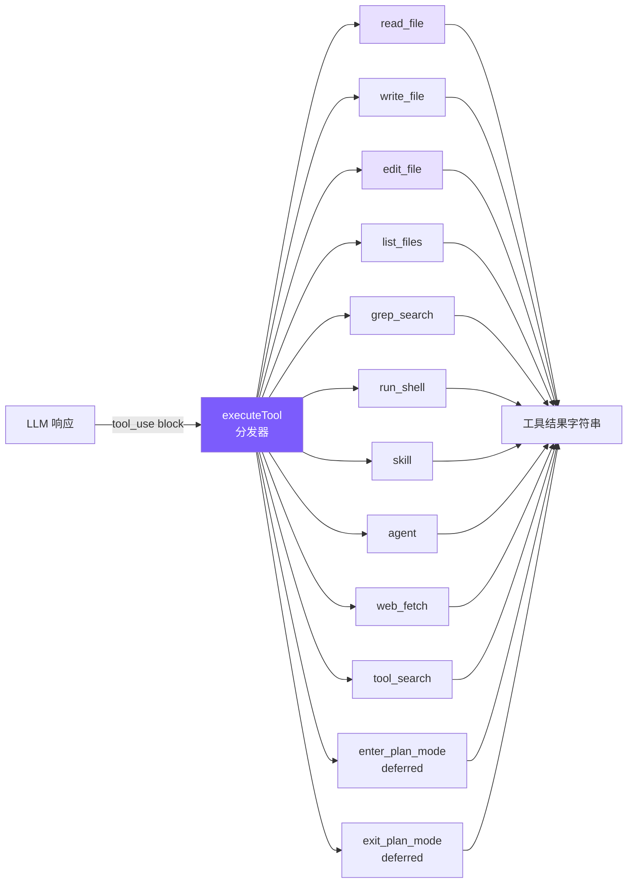
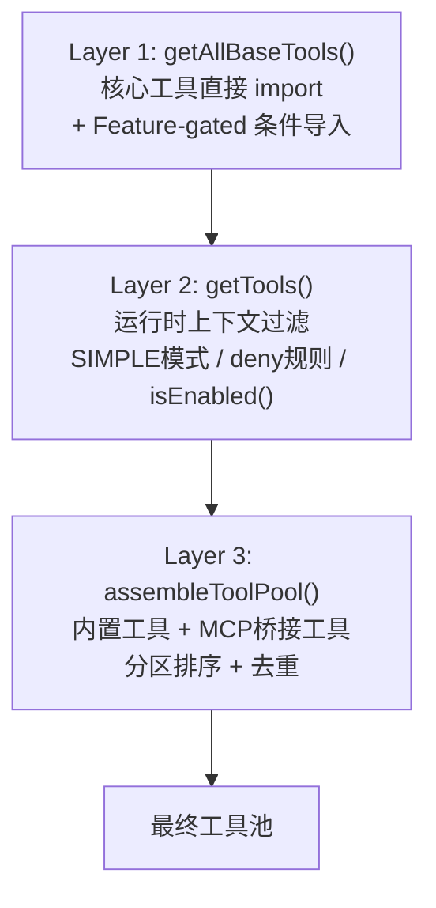
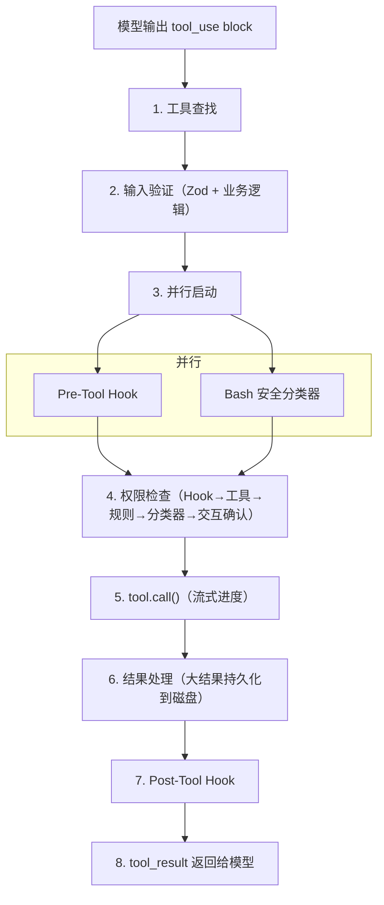

# 2. 工具系统

## 本章目标

定义 6 个核心工具（读文件、写文件、编辑文件、列文件、搜索、Shell）+ 5 个扩展工具（skill、agent、web_fetch、tool_search、plan mode），让 LLM 能真正操作你的代码库。实现编辑防护（read-before-edit + mtime 检查）和延迟加载（deferred tools）机制。



## Claude Code 怎么做的

### Tool 接口 — 每个工具的完整契约

Claude Code 的每个工具都遵循统一的 `Tool` 泛型接口，不是简单函数签名，而是完整的行为契约：

```typescript
type Tool<Input, Output, P extends ToolProgressData> = {
  name: string
  aliases?: string[]              // 废弃别名，平滑迁移
  maxResultSizeChars: number      // 超过则持久化到磁盘

  call(args, context, canUseTool, parentMessage, onProgress?): Promise<ToolResult<Output>>

  description(input, options): Promise<string>  // 发给 API 的工具描述
  prompt(options): Promise<string>              // 注入 system prompt 的使用指南

  inputSchema: Input              // Zod Schema（运行时验证 + 类型推导）
  inputJSONSchema?: ToolInputJSONSchema

  isConcurrencySafe(input): boolean   // 接收 input：同一工具不同参数可有不同安全语义
  isReadOnly(input): boolean
  isDestructive?(input): boolean
  checkPermissions(input, context): Promise<PermissionResult>

  renderToolUseMessage(input, options): React.ReactNode  // 每个工具自带渲染
  renderToolResultMessage?(content, progress, options): React.ReactNode
}
```

几个设计要点：

**`isConcurrencySafe(input)` 接收参数**——这意味着同一工具对不同输入可以有不同安全语义。BashTool 对 `ls` 返回 `isReadOnly: true`，对 `rm` 返回 `false`。比给整个工具打标签精确得多。

**`prompt()` 方法**——每个工具可以向 system prompt 注入自己的使用指南。FileEditTool 注入"精确匹配"规则，BashTool 注入安全执行提醒。工具行为指引和工具定义紧密关联，而非散落在全局 prompt 文件里。

**渲染方法**——每个工具自带渲染逻辑，新增工具不需要修改全局渲染代码。

### buildTool 工厂 — Fail-Closed 默认值

```typescript
const TOOL_DEFAULTS = {
  isConcurrencySafe: () => false,    // 默认不可并发
  isReadOnly: () => false,           // 默认有写入副作用
  isDestructive: () => false,
  checkPermissions: () => ({ behavior: 'allow', updatedInput }),
}
```

这是 **fail-closed** 设计：错误标记"只读"工具为"非只读"后果是不必要的权限弹窗（烦人但安全）；反向错误——错误标记"写入"工具为"只读"——可能让它在没有权限检查的情况下并发执行（危险且隐蔽）。默认值只能选安全的方向。

### 工具注册 — 三层流水线



Layer 1 的 Feature-gated 工具通过条件 `require()` 加载：

```typescript
const SleepTool = feature('PROACTIVE') || feature('KAIROS')
  ? require('./tools/SleepTool/SleepTool.js').SleepTool
  : null
```

`feature()` 是 Bun 打包器的编译时宏。外部构建时求值为 `false`，整个 `require()` 被死代码消除——内部工具在外部二进制中物理上不存在。

Layer 3 的分区排序：内置工具按字母序在前，MCP 工具追加在后，不做全局排序。原因是 API 服务器在最后一个内置工具之后设置了缓存断点，分区确保添加 MCP 工具不影响内置工具的缓存命中。

### 工具执行生命周期 — 8 个阶段



几个值得关注的阶段：

**Stage 2 两阶段验证**：Phase 1 是 Zod Schema（字段类型），Phase 2 是业务逻辑（如 FileEditTool 检查 old_string 是否唯一）。分离确保低成本检查先执行，减少不必要的磁盘 I/O。

**Stage 3 并行启动**：Pre-Tool Hook 和 Bash 分类器同时启动，各需数十到数百毫秒，并行化降低权限检查总延迟。

**Stage 6 大结果处理**：结果超过 `maxResultSizeChars` 时，完整内容保存到 `~/claude-code/tool-results/`，模型收到文件路径 + 截断指示符，需要时通过 FileReadTool 主动拉取。

> **核心设计哲学：错误是数据，不是异常。** 任何阶段的错误都转换为带 `is_error: true` 的 `tool_result` 返回给模型，让模型自我纠正。

### 并发控制

```typescript
private canExecuteTool(isConcurrencySafe: boolean): boolean {
  const executingTools = this.tools.filter(t => t.status === 'executing')
  return (
    executingTools.length === 0 ||
    (isConcurrencySafe && executingTools.every(t => t.isConcurrencySafe))
  )
}
```

规则很简单：非并发安全的工具必须独占执行；多个并发安全工具可以同时跑。`StreamingToolExecutor` 不等模型输出完所有 tool_use blocks，一旦检测到完整 block 就立即启动执行——工具执行延迟约 1 秒，模型流式输出持续 5-30 秒，大部分工具可以完全隐藏在流式窗口内。

并发上限 `MAX_TOOL_USE_CONCURRENCY = 10`。

### edit_file 的核心设计

FileEditTool 执行前有 14 步验证（按 I/O 成本排序：先检查内存状态，再访问磁盘），其中最关键的三个：

**读取前置检查**：代码层面的强制约束，不只是 prompt 建议。未先读取文件则拒绝执行，确保模型基于文件当前状态编辑而非过时记忆。

**外部修改检测**：通过 mtime 检测文件在读取后是否被外部修改（比如用户在 IDE 中编辑了同一个文件），解决真实竞争条件。

**配置文件保护**：对 `.claude/settings.json` 等，验证会模拟执行编辑后做 JSON Schema 校验，防止看似合理的编辑损坏配置格式。

### 为什么用 search-and-replace

在确定 search-and-replace 之前，有几种备选方案：

| 方案 | 致命缺陷 |
|------|---------|
| 行号编辑 | 位置相关：第一次插入 3 行后，后续所有行号偏移，多步编辑需要复杂重算 |
| AST 编辑 | 语法错误的文件恰恰最需要编辑，而 AST 解析器遇到语法错误会直接报错 |
| Unified diff | LLM 生成严格格式时表现很差：hunk header 行号、`+`/`-`/空格前缀任一出错则 patch 无法应用 |
| 全文件重写 | 大文件浪费 Token；模型可能遗漏未修改代码；用户无法快速 review |
| **字符串替换** | ✅ 无上述缺陷 |

search-and-replace 最被低估的优势是**幻觉安全**：模型提供了一个文件中不存在的字符串，工具直接失败，模型重新读取文件纠正记忆。全文件重写则可能静默地把错误的内容写入文件。

## 我们的简化决策

| Claude Code 的设计 | 我们的简化 | 简化理由 |
|-------------------|-----------|---------|
| 66+ 工具类，每个独立目录 | 1 个文件 + 6 个函数 | 教程不需要工业级模块化 |
| 8 阶段生命周期 | 直接 switch 分发 + 执行 | 省略 Hook、权限检查、分类器 |
| StreamingToolExecutor 并发 | 串行逐个执行 | 避免并发复杂度 |
| 14 步验证流水线 | 唯一性检查 + 引号容错 | 保留最关键的 2 个验证 |
| 三级大结果限制 | 单层 50K 截断 | 足够防止上下文爆炸 |
| MCP 7 种传输 + OAuth | 不支持 MCP | 教程聚焦核心概念 |

核心理念：**保留设计哲学，砍掉工程复杂度**。

## 我们的实现

### 工具定义：静态数组

<!-- tabs:start -->
#### **TypeScript**
```typescript
// tools.ts — 工具定义（Anthropic Tool schema 格式）

export const toolDefinitions: ToolDef[] = [
  {
    name: "read_file",
    description: "Read the contents of a file. Returns the file content with line numbers.",
    input_schema: {
      type: "object",
      properties: {
        file_path: { type: "string", description: "The path to the file to read" },
      },
      required: ["file_path"],
    },
  },
  {
    name: "write_file",
    description: "Write content to a file. Creates the file if it doesn't exist, overwrites if it does.",
    input_schema: {
      type: "object",
      properties: {
        file_path: { type: "string", description: "The path to the file to write" },
        content: { type: "string", description: "The content to write to the file" },
      },
      required: ["file_path", "content"],
    },
  },
  {
    name: "edit_file",
    description: "Edit a file by replacing an exact string match with new content. The old_string must match exactly.",
    input_schema: {
      type: "object",
      properties: {
        file_path: { type: "string", description: "The path to the file to edit" },
        old_string: { type: "string", description: "The exact string to find and replace" },
        new_string: { type: "string", description: "The string to replace it with" },
      },
      required: ["file_path", "old_string", "new_string"],
    },
  },
  // ... list_files, grep_search, run_shell
];
```
#### **Python**
```python
# tools.py — 工具定义（Anthropic Tool schema 格式）

tool_definitions: list[ToolDef] = [
    {
        "name": "read_file",
        "description": "Read the contents of a file. Returns the file content with line numbers.",
        "input_schema": {
            "type": "object",
            "properties": {
                "file_path": {"type": "string", "description": "The path to the file to read"},
            },
            "required": ["file_path"],
        },
    },
    # ... write_file, edit_file, list_files, grep_search, run_shell
]
```
<!-- tabs:end -->

这些定义直接传给 Anthropic API 的 `tools` 参数，格式完全一致，不需要任何转换。

**为什么用静态数组而非类？** Claude Code 用类体系是因为 66+ 工具需要继承、多态、独立测试。6 个工具用一个数组 + 一个 switch 就够了，简单性本身就是价值。

### 工具执行：switch 分发器

<!-- tabs:start -->
#### **TypeScript**
```typescript
export async function executeTool(
  name: string,
  input: Record<string, any>
): Promise<string> {
  let result: string;
  switch (name) {
    case "read_file":   result = readFile(input as { file_path: string }); break;
    case "write_file":  result = writeFile(input as { file_path: string; content: string }); break;
    case "edit_file":   result = editFile(input as { file_path: string; old_string: string; new_string: string }); break;
    case "list_files":  result = await listFiles(input as { pattern: string; path?: string }); break;
    case "grep_search": result = grepSearch(input as { pattern: string; path?: string; include?: string }); break;
    case "run_shell":   result = runShell(input as { command: string; timeout?: number }); break;
    default: return `Unknown tool: ${name}`;
  }
  return truncateResult(result);  // ← 50K 字符保护
}
```
#### **Python**
```python
async def execute_tool(name: str, inp: dict) -> str:
    handlers = {
        "read_file": _read_file,
        "write_file": _write_file,
        "edit_file": _edit_file,
        "list_files": _list_files,
        "grep_search": _grep_search,
        "run_shell": _run_shell,
    }
    handler = handlers.get(name)
    if not handler:
        return f"Unknown tool: {name}"
    return _truncate_result(handler(inp))
```
<!-- tabs:end -->

`default` 分支返回 `Unknown tool: ${name}` 而非抛异常——体现"错误是数据"的设计，让模型能自我纠正幻觉出的工具名。

### 逐个工具详解

#### read_file

<!-- tabs:start -->
#### **TypeScript**
```typescript
function readFile(input: { file_path: string }): string {
  try {
    const content = readFileSync(input.file_path, "utf-8");
    const lines = content.split("\n");
    const numbered = lines
      .map((line, i) => `${String(i + 1).padStart(4)} | ${line}`)
      .join("\n");
    return numbered;
  } catch (e: any) {
    return `Error reading file: ${e.message}`;
  }
}
```
#### **Python**
```python
def _read_file(inp: dict) -> str:
    try:
        content = Path(inp["file_path"]).read_text()
        lines = content.split("\n")
        numbered = "\n".join(f"{i+1:4d} | {line}" for i, line in enumerate(lines))
        return numbered
    except Exception as e:
        return f"Error reading file: {e}"
```
<!-- tabs:end -->

加行号是为了让 LLM 定位代码位置，但 `edit_file` 匹配时用的是实际内容字符串，不是行号。

#### edit_file — 最关键的工具

<!-- tabs:start -->
#### **TypeScript**
```typescript
function editFile(input: {
  file_path: string;
  old_string: string;
  new_string: string;
}): string {
  try {
    const content = readFileSync(input.file_path, "utf-8");

    // 唯一匹配检查
    const count = content.split(input.old_string).length - 1;
    if (count === 0)
      return `Error: old_string not found in ${input.file_path}`;
    if (count > 1)
      return `Error: old_string found ${count} times. Must be unique.`;

    const newContent = content.replace(input.old_string, input.new_string);
    writeFileSync(input.file_path, newContent);
    return `Successfully edited ${input.file_path}`;
  } catch (e: any) {
    return `Error editing file: ${e.message}`;
  }
}
```
#### **Python**
```python
def _edit_file(inp: dict) -> str:
    try:
        path = Path(inp["file_path"])
        content = path.read_text()

        # 引号容错匹配
        actual = _find_actual_string(content, inp["old_string"])
        if not actual:
            return f"Error: old_string not found in {inp['file_path']}"

        count = content.count(actual)
        if count > 1:
            return f"Error: old_string found {count} times in {inp['file_path']}. Must be unique."

        new_content = content.replace(actual, inp["new_string"], 1)
        path.write_text(new_content)

        diff = _generate_diff(content, actual, inp["new_string"])
        quote_note = " (matched via quote normalization)" if actual != inp["old_string"] else ""
        return f"Successfully edited {inp['file_path']}{quote_note}\n\n{diff}"
    except Exception as e:
        return f"Error editing file: {e}"
```
<!-- tabs:end -->

唯一匹配检查是核心：出现 0 次说明模型对文件内容记忆有误（幻觉检测），出现 > 1 次则要求模型提供更多上下文来唯一标识修改点。"宁可失败也不猜测"——静默替换第一个匹配远比告知失败危险。

#### 引号容错 + Diff 输出

LLM 的 tokenization 可能将直引号映射为弯引号（`"` → `"`），没有容错机制这类编辑会 100% 失败。

<!-- tabs:start -->
#### **TypeScript**
```typescript
function normalizeQuotes(s: string): string {
  return s
    .replace(/[\u2018\u2019\u2032]/g, "'")   // curly single → straight
    .replace(/[\u201C\u201D\u2033]/g, '"');   // curly double → straight
}

function findActualString(fileContent: string, searchString: string): string | null {
  if (fileContent.includes(searchString)) return searchString;
  const normSearch = normalizeQuotes(searchString);
  const normFile = normalizeQuotes(fileContent);
  const idx = normFile.indexOf(normSearch);
  if (idx !== -1) return fileContent.substring(idx, idx + searchString.length);
  return null;
}
```
#### **Python**
```python
def _normalize_quotes(s: str) -> str:
    s = re.sub("[\u2018\u2019\u2032]", "'", s)
    s = re.sub('[\u201c\u201d\u2033]', '"', s)
    return s

def _find_actual_string(file_content: str, search_string: str) -> str | None:
    if search_string in file_content:
        return search_string
    norm_search = _normalize_quotes(search_string)
    norm_file = _normalize_quotes(file_content)
    idx = norm_file.find(norm_search)
    if idx != -1:
        return file_content[idx:idx + len(search_string)]
    return None
```
<!-- tabs:end -->

关键细节：匹配成功后返回**文件中的原始字符串**而非标准化版本，替换时保持文件原始字符风格。

编辑成功后生成简易 diff，行号通过计算 `old_string` 前面有几个 `\n` 得出：

```
Successfully edited src/app.ts (matched via quote normalization)

@@ -15,1 +15,1 @@
- const msg = "hello";
+ const msg = "world";
```

#### write_file

<!-- tabs:start -->
#### **TypeScript**
```typescript
function writeFile(input: { file_path: string; content: string }): string {
  try {
    const dir = dirname(input.file_path);
    if (!existsSync(dir)) mkdirSync(dir, { recursive: true });
    writeFileSync(input.file_path, input.content);
    return `Successfully wrote to ${input.file_path}`;
  } catch (e: any) {
    return `Error writing file: ${e.message}`;
  }
}
```
#### **Python**
```python
def _write_file(inp: dict) -> str:
    try:
        path = Path(inp["file_path"])
        path.parent.mkdir(parents=True, exist_ok=True)
        path.write_text(inp["content"])
        lines = inp["content"].split("\n")
        line_count = len(lines)
        preview = "\n".join(f"{i+1:4d} | {l}" for i, l in enumerate(lines[:30]))
        trunc = f"\n  ... ({line_count} lines total)" if line_count > 30 else ""
        return f"Successfully wrote to {inp['file_path']} ({line_count} lines)\n\n{preview}{trunc}"
    except Exception as e:
        return f"Error writing file: {e}"
```
<!-- tabs:end -->

自动创建父目录（`mkdir -p` 效果）避免模型还得额外调用 shell 命令。System Prompt 里告诉 LLM 优先用 `edit_file`，只对新文件用 `write_file`。

#### grep_search

<!-- tabs:start -->
#### **TypeScript**
```typescript
function grepSearch(input: {
  pattern: string;
  path?: string;
  include?: string;
}): string {
  try {
    const args = ["--line-number", "--color=never", "-r"];
    if (input.include) args.push(`--include=${input.include}`);
    args.push(input.pattern);
    args.push(input.path || ".");
    const result = execSync(`grep ${args.join(" ")}`, {
      encoding: "utf-8",
      maxBuffer: 1024 * 1024,
      timeout: 10000,
    });
    const lines = result.split("\n").filter(Boolean);
    return lines.slice(0, 100).join("\n") +
      (lines.length > 100 ? `\n... and ${lines.length - 100} more matches` : "");
  } catch (e: any) {
    if (e.status === 1) return "No matches found.";
    return `Error: ${e.message}`;
  }
}
```
#### **Python**
```python
def _grep_search(inp: dict) -> str:
    pattern = inp["pattern"]
    path = inp.get("path") or "."
    include = inp.get("include")

    try:
        args = ["grep", "--line-number", "--color=never", "-r"]
        if include:
            args.append(f"--include={include}")
        args.extend(["--", pattern, path])
        result = subprocess.run(args, capture_output=True, text=True, timeout=10)
        if result.returncode == 1:
            return "No matches found."
        if result.returncode != 0:
            return f"Error: {result.stderr}"
        lines = [l for l in result.stdout.split("\n") if l]
        output = "\n".join(lines[:100])
        if len(lines) > 100:
            output += f"\n... and {len(lines) - 100} more matches"
        return output
    except Exception as e:
        return f"Error: {e}"
```
<!-- tabs:end -->

`--color=never` 禁用 ANSI 颜色代码（输出给模型看的，不需要颜色）。Python 版本的 `--` 分隔符确保以 `-` 开头的 pattern 不被误解析为 grep 选项。

grep 退出码 1 表示"无匹配"不是错误，2+ 才是真正错误，需要分别处理。结果截断为前 100 条，附加 `... and N more matches` 提示。

Claude Code 用 ripgrep (`rg`)，我们用系统 `grep`——功能够用，少一个依赖。

#### run_shell

<!-- tabs:start -->
#### **TypeScript**
```typescript
function runShell(input: { command: string; timeout?: number }): string {
  try {
    const result = execSync(input.command, {
      encoding: "utf-8",
      maxBuffer: 5 * 1024 * 1024,
      timeout: input.timeout || 30000,
      stdio: ["pipe", "pipe", "pipe"],
    });
    return result || "(no output)";
  } catch (e: any) {
    const stderr = e.stderr ? `\nStderr: ${e.stderr}` : "";
    const stdout = e.stdout ? `\nStdout: ${e.stdout}` : "";
    return `Command failed (exit code ${e.status})${stdout}${stderr}`;
  }
}
```
#### **Python**
```python
def _run_shell(inp: dict) -> str:
    try:
        timeout = inp.get("timeout", 30)
        result = subprocess.run(
            inp["command"],
            shell=True,
            capture_output=True,
            text=True,
            timeout=timeout,
        )
        if result.returncode != 0:
            stderr = f"\nStderr: {result.stderr}" if result.stderr else ""
            stdout = f"\nStdout: {result.stdout}" if result.stdout else ""
            return f"Command failed (exit code {result.returncode}){stdout}{stderr}"
        return result.stdout or "(no output)"
    except subprocess.TimeoutExpired:
        return f"Command timed out after {inp.get('timeout', 30)}s"
    except Exception as e:
        return f"Error: {e}"
```
<!-- tabs:end -->

失败时同时返回 stdout 和 stderr——很多编译器在 stderr 输出错误的同时，stdout 可能有有用的部分输出。`"(no output)"` 避免模型在命令成功但无输出时（`mkdir`、`touch`）产生困惑。

Claude Code 的 BashTool 分布在 18 个源文件中，有 AST 解析命令、沙箱执行、23 个安全检查。我们只做 timeout 保护（安全机制在第 6 章详述）。

### 工具结果截断

<!-- tabs:start -->
#### **TypeScript**
```typescript
const MAX_RESULT_CHARS = 50000;

function truncateResult(result: string): string {
  if (result.length <= MAX_RESULT_CHARS) return result;
  const keepEach = Math.floor((MAX_RESULT_CHARS - 60) / 2);
  return (
    result.slice(0, keepEach) +
    "\n\n[... truncated " + (result.length - keepEach * 2) + " chars ...]\n\n" +
    result.slice(-keepEach)
  );
}
```
#### **Python**
```python
MAX_RESULT_CHARS = 50000

def _truncate_result(result: str) -> str:
    if len(result) <= MAX_RESULT_CHARS:
        return result
    keep_each = (MAX_RESULT_CHARS - 60) // 2
    return (
        result[:keep_each]
        + f"\n\n[... truncated {len(result) - keep_each * 2} chars ...]\n\n"
        + result[-keep_each:]
    )
```
<!-- tabs:end -->

保留头尾而非只保留头部，因为很多命令的关键输出在末尾（编译错误摘要、测试结果统计）。截断提示明确告知模型内容被截断，模型可据此决定是否用 `grep_search` 或 `read_file` 获取完整内容。

### WebFetch 工具

让 Agent 能访问 URL 获取内容——查文档、读 API 响应、抓取网页信息：

<!-- tabs:start -->
#### **TypeScript**
```typescript
// tools.ts — web_fetch 定义
{
  name: "web_fetch",
  description: "Fetch a URL and return its content as text. For HTML pages, tags are stripped.",
  input_schema: {
    type: "object",
    properties: {
      url: { type: "string", description: "The URL to fetch" },
      max_length: { type: "number", description: "Maximum content length (default 50000)" },
    },
    required: ["url"],
  },
}

// tools.ts — web_fetch 执行
case "web_fetch": {
  const url = input.url as string;
  const maxLength = (input.max_length as number) || 50000;
  const controller = new AbortController();
  const timeout = setTimeout(() => controller.abort(), 30000);
  try {
    const res = await fetch(url, {
      signal: controller.signal,
      headers: { "User-Agent": "mini-claude/1.0" },
    });
    clearTimeout(timeout);
    if (!res.ok) { result = `HTTP error: ${res.status} ${res.statusText}`; break; }
    let text = await res.text();
    if (contentType.includes("html")) {
      // 去掉 script/style 标签，HTML 标签转空格，处理 HTML 实体
      text = text
        .replace(/<script[\s\S]*?<\/script>/gi, "")
        .replace(/<style[\s\S]*?<\/style>/gi, "")
        .replace(/<[^>]*>/g, " ")
        .replace(/&nbsp;/g, " ").replace(/&amp;/g, "&")
        .replace(/\s{2,}/g, " ").replace(/\n{3,}/g, "\n\n").trim();
    }
    if (text.length > maxLength) {
      text = text.slice(0, maxLength) + `\n\n[... truncated at ${maxLength} characters]`;
    }
    result = text || "(empty response)";
  } catch (err: any) {
    clearTimeout(timeout);
    result = err.name === "AbortError"
      ? "Error: Request timed out (30s)"
      : `Error fetching ${url}: ${err.message}`;
  }
  break;
}
```
<!-- tabs:end -->

设计选择：
- **30 秒超时**：防止模型访问慢速或无响应的 URL 时阻塞整个循环
- **HTML 去标签**：LLM 不需要看 HTML 标签，纯文本更高效
- **50KB 上限**：避免网页内容挤占上下文窗口
- 标记为 `CONCURRENCY_SAFE_TOOLS`（只读、无副作用），可并行执行

### Read-before-edit + mtime 防护

Claude Code 的一个重要安全机制：**编辑文件前必须先读取**。这防止模型在不了解文件当前内容的情况下盲目修改，同时检测外部修改避免覆盖用户的手动编辑。

<!-- tabs:start -->
#### **TypeScript**
```typescript
// tools.ts — executeTool 中的 mtime 追踪

export async function executeTool(
  name: string,
  input: Record<string, any>,
  readFileState?: Map<string, number>  // filepath → mtimeMs
): Promise<string> {
  switch (name) {
    case "read_file":
      result = readFile(input as { file_path: string });
      // 记录文件的修改时间
      if (readFileState && !result.startsWith("Error")) {
        const absPath = resolve(input.file_path);
        try { readFileState.set(absPath, statSync(absPath).mtimeMs); } catch {}
      }
      break;

    case "write_file": {
      const absPath = resolve(input.file_path);
      // 已存在的文件必须先 read
      if (readFileState && existsSync(absPath)) {
        if (!readFileState.has(absPath)) {
          return "Error: You must read this file before writing. Use read_file first.";
        }
        // mtime 变化说明文件被外部修改
        const cur = statSync(absPath).mtimeMs;
        if (cur !== readFileState.get(absPath)!) {
          return "Warning: file was modified externally. Please read_file again.";
        }
      }
      result = writeFile(input as { file_path: string; content: string });
      // 更新 mtime
      if (readFileState && !result.startsWith("Error")) {
        try { readFileState.set(absPath, statSync(absPath).mtimeMs); } catch {}
      }
      break;
    }
    // edit_file 同理...
  }
}
```
<!-- tabs:end -->

三个关键点：
- **readFileState Map** 在 Agent 实例中维护，key 是绝对路径，value 是上次读取时的 `mtimeMs`
- **新文件跳过检查**：`existsSync(absPath)` 为 false 时不强制先读——创建新文件不需要先读
- **mtime 比较**：读取时记录 mtime，写入前比较。如果不一致，说明文件在 Agent 读取后被用户或其他进程修改了，返回警告而非静默覆盖

这与 Claude Code 的 `readFileTimestamps` 机制对齐——编辑必须基于已知状态，不能"盲写"。

### ToolSearch 延迟加载

当工具数量增多时（66+ 工具），把所有工具的 schema 都发给 API 会浪费大量 token。Claude Code 的做法是**延迟加载**：不常用的工具只发名称，模型需要时通过 `ToolSearch` 按需激活。

<!-- tabs:start -->
#### **TypeScript**
```typescript
// tools.ts — deferred 标记
{
  name: "enter_plan_mode",
  description: "Enter plan mode to switch to a read-only planning phase...",
  input_schema: { type: "object", properties: {} },
  deferred: true,  // ← 标记为延迟加载
},

// tools.ts — tool_search 工具
{
  name: "tool_search",
  description: "Search for available tools by name or keyword. Returns full schemas for matching deferred tools.",
  input_schema: {
    type: "object",
    properties: { query: { type: "string", description: "Tool name or search keywords" } },
    required: ["query"],
  },
}

// tools.ts — 激活逻辑
const activatedTools = new Set<string>();

export function getActiveToolDefinitions(allTools?: ToolDef[]): Anthropic.Tool[] {
  const tools = allTools || toolDefinitions;
  return tools
    .filter(t => !t.deferred || activatedTools.has(t.name))
    .map(({ deferred, ...rest }) => rest);
}

// tool_search 执行：匹配 → 激活 → 返回 schema
case "tool_search": {
  const query = (input.query as string || "").toLowerCase();
  const deferred = toolDefinitions.filter(t => t.deferred);
  const matches = deferred.filter(t =>
    t.name.toLowerCase().includes(query) ||
    (t.description || "").toLowerCase().includes(query)
  );
  if (matches.length === 0) return "No matching deferred tools found.";
  for (const m of matches) activatedTools.add(m.name);
  return JSON.stringify(matches.map(t => ({
    name: t.name, description: t.description, input_schema: t.input_schema,
  })), null, 2);
}
```
<!-- tabs:end -->

工作流程：
1. API 调用时，`getActiveToolDefinitions()` 过滤掉未激活的 deferred 工具（只发名称，不发 schema）
2. System prompt 中通过 `getDeferredToolNames()` 告知模型哪些工具可以通过 `tool_search` 激活
3. 模型需要时调用 `tool_search`，匹配的工具被加入 `activatedTools` Set
4. 下一次 API 调用自动包含已激活工具的完整 schema

我们只有 2 个 deferred 工具（plan mode），但这个机制对扩展到 20+ 工具时至关重要。

## 简化对比

| 维度 | Claude Code | mini-claude |
|------|------------|-------------|
| **工具数量** | 66+ | 13（6 核心 + web_fetch + tool_search + skill + agent + 2 plan mode） |
| **执行模式** | 并发执行 + streaming 早期启动 | 并行执行（concurrencySafe）+ streaming 早期启动 |
| **搜索引擎** | ripgrep（rg） | 系统 grep |
| **编辑验证** | 14 步流水线 + readFileTimestamps | 引号容错 + 唯一性 + diff + read-before-edit + mtime |
| **Shell 安全** | AST 解析 + 沙箱 | 正则匹配 + 确认 |
| **结果截断** | 选择性裁剪 + 磁盘持久化 | 保留头尾 50K + 30KB 磁盘持久化 |
| **延迟加载** | deferred tools + ToolSearch | deferred 标记 + tool_search |
| **网络访问** | WebFetch（去标签 + 超时） | web_fetch（去标签 + 30s 超时 + 50KB 上限） |

---

> **下一章**：工具定义了 agent 的能力，但 System Prompt 定义了它的行为——怎么用这些工具、什么时候该小心。
