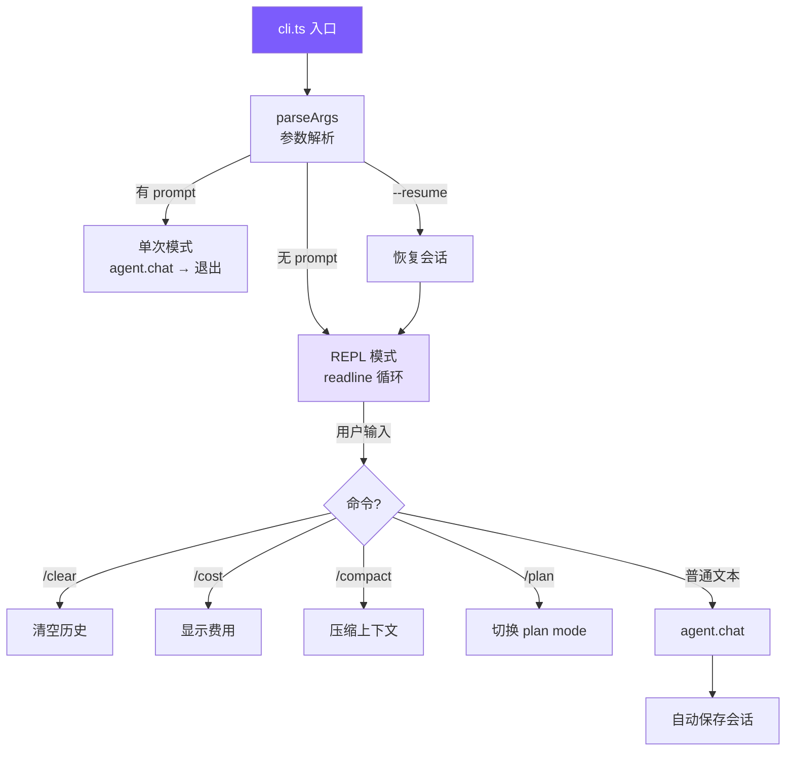

# 4. CLI 与会话

## 本章目标

构建用户接口层：命令行参数解析、交互式 REPL、Ctrl+C 中断处理、会话持久化和恢复。



## Claude Code 怎么做的

Claude Code 的入口是 `src/entrypoints/cli.tsx`——用 React/Ink 把组件模型搬进终端，支持流式 Markdown 渲染、Vim 模式、多 Tab、键盘自定义。会话用 JSONL 格式追加写入，崩溃安全。

### 终端原生 vs GUI

这是一个主动选择。开发者的工作流在终端里，打开浏览器意味着上下文切换。终端原生就是另一个命令行工具，跟 `git`、`grep` 一样嵌入到已有工作流。具体好处：SSH 环境可用、可接管道 (`echo "fix" | claude`)、支持 tmux 多实例并行、内存开销接近零。

React/Ink 的作用是弥补终端的交互限制——有了组件模型，流式输出、diff 视图这类复杂 UI 才变得可维护。

### 可观察的自主性

Claude Code UX 的核心理念：**Agent 自由行动，但让用户实时看到每一步**。

```
📖 read_file src/app.ts
  1 | import express from ...
  ... (1234 chars total)

✏️ edit_file src/app.ts
  - const port = 3000
  + const port = process.env.PORT
```

中断成本远低于撤销成本。用户在 Agent 走错方向前 3 秒就能按 Ctrl+C，而不是等 20 秒执行完再花更多时间撤销。每个工具有 4 种渲染方法（开始/完成/被拒/报错），长时间运行的工具实时流式输出 stdout，而不是等完成才展示。

### JSONL 会话存储

整体 JSON 覆盖写入有两个问题：写入中途崩溃会损坏整个文件；对话越长每次保存越慢。

JSONL 每轮追加一行，O(1) 写入，崩溃最多丢最后一行。文件系统的 append 操作通常是原子的。恢复时逐行解析，跳过末尾不完整的行即可。

## 我们的实现

### 参数解析

<!-- tabs:start -->
#### **TypeScript**
```typescript
// cli.ts — parseArgs

function parseArgs(): ParsedArgs {
  const args = process.argv.slice(2);
  let permissionMode: PermissionMode = "default";
  let thinking = false;
  let model = process.env.MINI_CLAUDE_MODEL || "claude-opus-4-6";
  let apiBase: string | undefined;
  let resume = false;
  let maxCost: number | undefined;
  let maxTurns: number | undefined;
  const positional: string[] = [];

  for (let i = 0; i < args.length; i++) {
    if (args[i] === "--yolo" || args[i] === "-y") {
      permissionMode = "bypassPermissions";
    } else if (args[i] === "--plan") {
      permissionMode = "plan";
    } else if (args[i] === "--accept-edits") {
      permissionMode = "acceptEdits";
    } else if (args[i] === "--dont-ask") {
      permissionMode = "dontAsk";
    } else if (args[i] === "--thinking") {
      thinking = true;
    } else if (args[i] === "--model" || args[i] === "-m") {
      model = args[++i] || model;
    } else if (args[i] === "--api-base") {
      apiBase = args[++i];
    } else if (args[i] === "--resume") {
      resume = true;
    } else if (args[i] === "--max-cost") {
      const v = parseFloat(args[++i]);
      if (!isNaN(v)) maxCost = v;
    } else if (args[i] === "--max-turns") {
      const v = parseInt(args[++i], 10);
      if (!isNaN(v)) maxTurns = v;
    } else if (args[i] === "--help" || args[i] === "-h") {
      console.log(`Usage: mini-claude [options] [prompt] ...`);
      process.exit(0);
    } else {
      positional.push(args[i]);
    }
  }

  return {
    permissionMode, model, apiBase, resume, thinking, maxCost, maxTurns,
    prompt: positional.length > 0 ? positional.join(" ") : undefined,
  };
}
```
#### **Python**
```python
# __main__.py — parse_args

def parse_args() -> argparse.Namespace:
    parser = argparse.ArgumentParser(prog="mini-claude", add_help=False)
    parser.add_argument("prompt", nargs="*")
    parser.add_argument("--yolo", "-y", action="store_true")
    parser.add_argument("--plan", action="store_true")
    parser.add_argument("--accept-edits", action="store_true")
    parser.add_argument("--dont-ask", action="store_true")
    parser.add_argument("--thinking", action="store_true")
    parser.add_argument("--model", "-m", default=None)
    parser.add_argument("--api-base", default=None)
    parser.add_argument("--resume", action="store_true")
    parser.add_argument("--max-cost", type=float, default=None)
    parser.add_argument("--max-turns", type=int, default=None)
    parser.add_argument("--help", "-h", action="store_true")
    return parser.parse_args()


def _resolve_permission_mode(args: argparse.Namespace) -> str:
    if args.yolo: return "bypassPermissions"
    if args.plan: return "plan"
    if args.accept_edits: return "acceptEdits"
    if args.dont_ask: return "dontAsk"
    return "default"
```
<!-- tabs:end -->

TypeScript 版手写循环而不用 commander.js，因为只有 11 个参数，零依赖更轻。用 `for` 而不是 `forEach` 是因为带值参数（`--model claude-sonnet`）需要 `++i` 跳到下一个元素。Python 直接用标准库 `argparse`。

### 两种运行模式

<!-- tabs:start -->
#### **TypeScript**
```typescript
// cli.ts — main

async function main() {
  const { permissionMode, model, apiBase, prompt, resume, thinking, maxCost, maxTurns } = parseArgs();

  // API key 从环境变量获取，不支持命令行传递（避免泄露到 shell history）
  // 优先级：OPENAI_API_KEY + OPENAI_BASE_URL → ANTHROPIC_API_KEY → OPENAI_API_KEY
  const resolvedApiKey = resolveApiKey(apiBase);
  if (!resolvedApiKey) {
    printError(`API key is required. Set ANTHROPIC_API_KEY or OPENAI_API_KEY env var.`);
    process.exit(1);
  }

  const agent = new Agent({ permissionMode, model, apiBase, apiKey: resolvedApiKey, thinking, maxCost, maxTurns });

  if (resume) {
    const sessionId = getLatestSessionId();
    if (sessionId) {
      const session = loadSession(sessionId);
      if (session) agent.restoreSession(session);
    }
  }

  if (prompt) {
    await agent.chat(prompt);       // 单次模式：执行后退出
  } else {
    await runRepl(agent);           // REPL 模式：交互循环
  }
}
```
#### **Python**
```python
# __main__.py — main

def main() -> None:
    args = parse_args()
    permission_mode = _resolve_permission_mode(args)
    model = args.model or os.environ.get("MINI_CLAUDE_MODEL", "claude-opus-4-6")

    resolved_api_key: str | None = None
    resolved_use_openai = bool(args.api_base)
    if os.environ.get("OPENAI_API_KEY") and os.environ.get("OPENAI_BASE_URL"):
        resolved_api_key = os.environ["OPENAI_API_KEY"]
        resolved_use_openai = True
    elif os.environ.get("ANTHROPIC_API_KEY"):
        resolved_api_key = os.environ["ANTHROPIC_API_KEY"]
    elif os.environ.get("OPENAI_API_KEY"):
        resolved_api_key = os.environ["OPENAI_API_KEY"]
        resolved_use_openai = True

    if not resolved_api_key:
        print_error("API key is required.")
        sys.exit(1)

    agent = Agent(permission_mode=permission_mode, model=model, thinking=args.thinking,
                  max_cost_usd=args.max_cost, max_turns=args.max_turns, api_key=resolved_api_key)

    if args.resume:
        session_id = get_latest_session_id()
        if session_id:
            session = load_session(session_id)
            if session: agent.restore_session(session)

    prompt = " ".join(args.prompt) if args.prompt else None
    if prompt:
        asyncio.run(agent.chat(prompt))
    else:
        asyncio.run(run_repl(agent))
```
<!-- tabs:end -->

### REPL 实现

<!-- tabs:start -->
#### **TypeScript**
```typescript
// cli.ts — runRepl

async function runRepl(agent: Agent) {
  const rl = readline.createInterface({ input: process.stdin, output: process.stdout });

  let sigintCount = 0;
  process.on("SIGINT", () => {
    if (agent.isProcessing) {
      agent.abort();
      console.log("\n  (interrupted)");
      sigintCount = 0;
      printUserPrompt();
    } else {
      sigintCount++;
      if (sigintCount >= 2) { console.log("\nBye!\n"); process.exit(0); }
      console.log("\n  Press Ctrl+C again to exit.");
      printUserPrompt();
    }
  });

  printWelcome();

  // rl.once 而非 rl.on：保证严格串行，避免多个 chat 并发修改消息历史
  const askQuestion = (): void => {
    printUserPrompt();
    rl.once("line", async (line) => {
      const input = line.trim();
      sigintCount = 0;

      if (!input) { askQuestion(); return; }
      if (input === "exit" || input === "quit") { console.log("\nBye!\n"); process.exit(0); }

      if (input === "/clear") { agent.clearHistory(); askQuestion(); return; }
      if (input === "/cost")  { agent.showCost(); askQuestion(); return; }
      if (input === "/compact") {
        try { await agent.compact(); } catch (e: any) { printError(e.message); }
        askQuestion(); return;
      }
      if (input === "/plan") { agent.togglePlanMode(); askQuestion(); return; }

      try {
        await agent.chat(input);
      } catch (e: any) {
        if (e.name !== "AbortError" && !e.message?.includes("aborted")) printError(e.message);
      }

      askQuestion();
    });
  };

  askQuestion();
}
```
#### **Python**
```python
# __main__.py — run_repl

async def run_repl(agent: Agent) -> None:
    sigint_count = 0

    def handle_sigint(sig, frame):
        nonlocal sigint_count
        if agent._aborted is False and agent._output_buffer is not None:
            agent.abort()
            print("\n  (interrupted)")
            sigint_count = 0
            print_user_prompt()
        else:
            sigint_count += 1
            if sigint_count >= 2: print("\nBye!\n"); sys.exit(0)
            print("\n  Press Ctrl+C again to exit.")
            print_user_prompt()

    signal.signal(signal.SIGINT, handle_sigint)
    print_welcome()

    while True:
        print_user_prompt()
        try:
            line = input()
        except (EOFError, KeyboardInterrupt):
            print("\nBye!\n"); break

        inp = line.strip()
        sigint_count = 0
        if not inp: continue
        if inp in ("exit", "quit"): print("\nBye!\n"); break

        if inp == "/clear": agent.clear_history(); continue
        if inp == "/cost": agent.show_cost(); continue
        if inp == "/compact": await agent.compact(); continue
        if inp == "/plan": agent.toggle_plan_mode(); continue

        try:
            await agent.chat(inp)
        except Exception as e:
            if "abort" not in str(e).lower(): print_error(str(e))
```
<!-- tabs:end -->

**Ctrl+C 的双重语义**：处理中按下 → 中断当前操作，回到输入提示；空闲时按下 → 第一次提醒，第二次退出。这避免了两种意外：手滑 Ctrl+C 导致整个会话丢失，以及 Agent 跑偏时只能眼睁睁等它跑完。

**`rl.once` vs `rl.on`**：`rl.on` 注册的 handler 不会等 `await agent.chat()` 完成就响应下一行输入，导致多个 chat 并发修改消息历史。`rl.once` 每次只监听一行，处理完再递归注册，天然串行。Python 的 `while + input() + await` 没有这个问题。

### 会话持久化

<!-- tabs:start -->
#### **TypeScript**
```typescript
// session.ts

const SESSION_DIR = join(homedir(), ".mini-claude", "sessions");

export function saveSession(id: string, data: SessionData): void {
  ensureDir();
  writeFileSync(join(SESSION_DIR, `${id}.json`), JSON.stringify(data, null, 2));
}

export function getLatestSessionId(): string | null {
  const sessions = listSessions();
  if (sessions.length === 0) return null;
  sessions.sort((a, b) => new Date(b.startTime).getTime() - new Date(a.startTime).getTime());
  return sessions[0].id;
}
```
#### **Python**
```python
# session.py

SESSION_DIR = Path.home() / ".mini-claude" / "sessions"

def save_session(session_id: str, data: dict[str, Any]) -> None:
    SESSION_DIR.mkdir(parents=True, exist_ok=True)
    (SESSION_DIR / f"{session_id}.json").write_text(json.dumps(data, indent=2, default=str))

def get_latest_session_id() -> str | None:
    sessions = list_sessions()
    if not sessions: return None
    sessions.sort(key=lambda s: s.get("startTime", ""), reverse=True)
    return sessions[0].get("id")
```
<!-- tabs:end -->

每次 `agent.chat()` 完成后自动保存，保存失败静默忽略（不能因为磁盘满让整个对话崩溃）。恢复时直接把消息数组加载回 Agent：

<!-- tabs:start -->
#### **TypeScript**
```typescript
// agent.ts
private autoSave() {
  try {
    saveSession(this.sessionId, {
      metadata: { id: this.sessionId, model: this.model, cwd: process.cwd(),
                  startTime: this.sessionStartTime, messageCount: this.getMessageCount() },
      anthropicMessages: this.useOpenAI ? undefined : this.anthropicMessages,
      openaiMessages: this.useOpenAI ? this.openaiMessages : undefined,
    });
  } catch {}
}

restoreSession(data: { anthropicMessages?: any[]; openaiMessages?: any[] }) {
  if (data.anthropicMessages) this.anthropicMessages = data.anthropicMessages;
  if (data.openaiMessages) this.openaiMessages = data.openaiMessages;
  printInfo(`Session restored (${this.getMessageCount()} messages).`);
}
```
#### **Python**
```python
# agent.py
def _auto_save(self) -> None:
    try:
        save_session(self.session_id, {
            "metadata": { "id": self.session_id, "model": self.model,
                          "cwd": str(Path.cwd()), "startTime": self.session_start_time,
                          "messageCount": self._get_message_count() },
            "anthropicMessages": self._anthropic_messages if not self.use_openai else None,
            "openaiMessages": self._openai_messages if self.use_openai else None,
        })
    except Exception:
        pass

def restore_session(self, data: dict) -> None:
    if data.get("anthropicMessages"): self._anthropic_messages = data["anthropicMessages"]
    if data.get("openaiMessages"): self._openai_messages = data["openaiMessages"]
    print_info(f"Session restored ({self._get_message_count()} messages).")
```
<!-- tabs:end -->

### 终端 UI — ui.ts

所有输出通过 `ui.ts` 统一格式化：

<!-- tabs:start -->
#### **TypeScript**
```typescript
// ui.ts（使用 chalk）

export function printToolCall(name: string, input: Record<string, any>) {
  const icon = getToolIcon(name);      // read_file → 📖, run_shell → 💻
  const summary = getToolSummary(name, input);
  console.log(chalk.yellow(`\n  ${icon} ${name}`) + chalk.gray(` ${summary}`));
}

export function printToolResult(name: string, result: string) {
  const maxLen = 500;
  const truncated = result.length > maxLen
    ? result.slice(0, maxLen) + chalk.gray(`\n  ... (${result.length} chars total)`)
    : result;
  console.log(chalk.dim(truncated.split("\n").map((l) => "  " + l).join("\n")));
}
```
#### **Python**
```python
# ui.py（使用 rich）

def print_tool_call(name: str, inp: dict) -> None:
    icon = _get_tool_icon(name)
    summary = _get_tool_summary(name, inp)
    console.print(f"\n  [yellow]{icon} {name}[/yellow][dim] {summary}[/dim]")

def print_tool_result(name: str, result: str) -> None:
    max_len = 500
    truncated = result[:max_len] + f"\n  ... ({len(result)} chars total)" if len(result) > max_len else result
    lines = "\n".join("  " + l for l in truncated.split("\n"))
    console.print(f"[dim]{lines}[/dim]")
```
<!-- tabs:end -->

工具结果在 UI 层截断到 500 字符——这是给人看的显示，完整结果已在消息历史中。

> **下一章**：让 Agent 的输出实时显示——流式输出与双后端支持。
