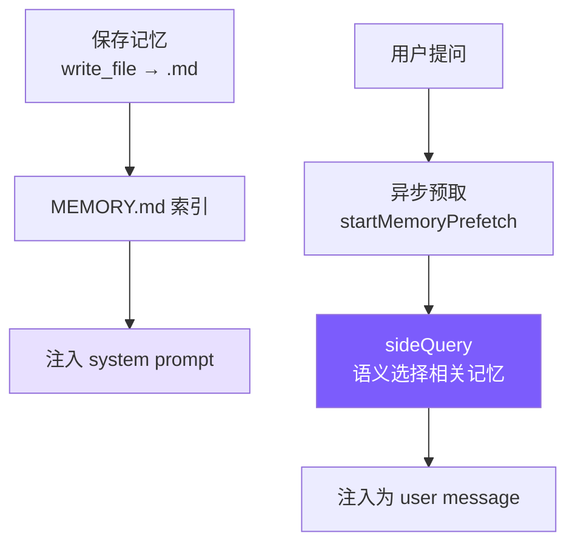

# 8. 记忆系统

## 本章目标

实现跨会话记忆：让 Agent 在多次对话间保持对用户和项目的认知，不依赖对话历史。



---

## Claude Code 怎么做的

Claude Code 记忆系统的核心约束只有一条：**只记忆不可从当前项目状态推导的信息**。代码模式、架构、文件路径、git 历史、正在进行的调试——这些读代码和 `git log` 就能获得，记忆中的版本只会制造漂移。连用户明确要求保存的信息也不例外——如果用户说"记住这个 PR 列表"，Agent 应该追问：列表中有什么是不可推导的？某个截止日期？某个意外发现？

记忆分四种类型：

| 类型 | 记什么 | 触发时机 |
|------|--------|---------|
| **user** | 用户身份、偏好、知识背景 | 了解到用户角色/偏好时 |
| **feedback** | 对 Agent 行为的纠正**和肯定** | 用户纠正或肯定某个行为时 |
| **project** | 项目进展、决策、截止日期 | 了解到项目动态时 |
| **reference** | 外部系统的定位信息 | 了解到外部系统位置时 |

封闭分类法而非自由标签——防止标签膨胀导致召回时的模糊匹配。

`feedback` 类型有个细节：不只记录纠正，也记录用户的肯定。原因很实际：只记录"错误"会让模型避免重蹈覆辙，但也可能无意间放弃用户已经验证过的好做法。这两种类型还要求正文包含 `Why` 和 `How to apply`——因为知道"为什么"才能判断边界情况，盲目执行规则往往适得其反。

`project` 类型有个具体要求：相对日期必须转为绝对日期。"周四之后合并冻结"→"2026-03-05 后合并冻结"。记忆可能在几周后被读取，"周四"到时已毫无意义。

**MEMORY.md 是索引不是容器。** 它每次会话都完整加载到 system prompt，所以必须紧凑——每条一行链接，实际内容按需读取。设有 200 行/25KB 双重截断，超出时追加提示"keep index entries to one line under ~200 chars"。错误消息包含修复指引，这是贯穿整个系统的设计习惯。

**召回机制**用 `sideQuery` 调模型做语义匹配，而非关键词搜索。用户问"部署流程"时，语义匹配能找到标题为"CI/CD 注意事项"的记忆，关键词匹配则不行。召回在模型开始生成响应的同时异步执行（`pendingMemoryPrefetch`），对用户而言延迟近乎为零。每次最多返回 5 条，上下文成本可控。

每条记忆还附带 **freshness warning**——超过 1 天的记忆会标注过期天数，提醒模型记忆是时间切片而非实时状态。"下周截止"的记忆在两周后读到时，模型需要知道它可能已经过时。

---

## 我们的实现

### 存储结构

```
~/.mini-claude/projects/{sha256-hash}/memory/
├── MEMORY.md                          # 索引文件
├── user_prefers_concise_output.md
├── feedback_no_summary_at_end.md
├── project_auth_migration_q2.md
└── reference_ci_dashboard_url.md
```

路径中的哈希是 `process.cwd()` 的 sha256 前 16 位——同一项目目录始终映射到同一记忆空间。

### 记忆文件格式

```markdown
---
name: 不要在回复末尾总结
description: 用户明确要求省略总结段落
type: feedback
---
用户说"不要在响应末尾总结"，因为他们能自己看 diff 和代码变更。

**Why:** 用户觉得总结浪费时间，更喜欢直接给出结果。
**How to apply:** 完成任务后直接结束，不要加 "总结" 或 "以上是..." 段落。
```

### Frontmatter 解析（共享模块）

记忆和技能都要解析 YAML frontmatter，抽出 `frontmatter.ts`：

<!-- tabs:start -->
#### **TypeScript**
```typescript
// frontmatter.ts

export function parseFrontmatter(content: string): FrontmatterResult {
  const lines = content.split("\n");
  if (lines[0]?.trim() !== "---") return { meta: {}, body: content };

  let endIdx = -1;
  for (let i = 1; i < lines.length; i++) {
    if (lines[i].trim() === "---") { endIdx = i; break; }
  }
  if (endIdx === -1) return { meta: {}, body: content };

  const meta: Record<string, string> = {};
  for (let i = 1; i < endIdx; i++) {
    const colonIdx = lines[i].indexOf(":");
    if (colonIdx === -1) continue;
    const key = lines[i].slice(0, colonIdx).trim();
    const value = lines[i].slice(colonIdx + 1).trim();
    if (key) meta[key] = value;
  }

  const body = lines.slice(endIdx + 1).join("\n").trim();
  return { meta, body };
}
```
#### **Python**
```python
# frontmatter.py

@dataclass
class FrontmatterResult:
    meta: dict[str, str] = field(default_factory=dict)
    body: str = ""


def parse_frontmatter(content: str) -> FrontmatterResult:
    lines = content.split("\n")
    if not lines or lines[0].strip() != "---":
        return FrontmatterResult(body=content)

    end_idx = -1
    for i in range(1, len(lines)):
        if lines[i].strip() == "---":
            end_idx = i
            break
    if end_idx == -1:
        return FrontmatterResult(body=content)

    meta: dict[str, str] = {}
    for i in range(1, end_idx):
        colon_idx = lines[i].find(":")
        if colon_idx == -1:
            continue
        key = lines[i][:colon_idx].strip()
        value = lines[i][colon_idx + 1:].strip()
        if key:
            meta[key] = value

    body = "\n".join(lines[end_idx + 1:]).strip()
    return FrontmatterResult(meta=meta, body=body)
```
<!-- tabs:end -->

没有用 `js-yaml` 之类的库——我们的 frontmatter 只是简单的 `key: value`，20 行手写解析器够用且零依赖。

### 保存与索引

<!-- tabs:start -->
#### **TypeScript**
```typescript
// memory.ts — saveMemory

export function saveMemory(entry: Omit<MemoryEntry, "filename">): string {
  const dir = getMemoryDir();
  const filename = `${entry.type}_${slugify(entry.name)}.md`;
  const content = formatFrontmatter(
    { name: entry.name, description: entry.description, type: entry.type },
    entry.content
  );
  writeFileSync(join(dir, filename), content);
  updateMemoryIndex();
  return filename;
}

function updateMemoryIndex(): void {
  const memories = listMemories();
  const lines = ["# Memory Index", ""];
  for (const m of memories) {
    lines.push(`- **[${m.name}](${m.filename})** (${m.type}) — ${m.description}`);
  }
  writeFileSync(getIndexPath(), lines.join("\n"));
}
```
#### **Python**
```python
# memory.py — save_memory

def save_memory(name: str, description: str, type: str, content: str) -> str:
    d = get_memory_dir()
    filename = f"{type}_{_slugify(name)}.md"
    text = format_frontmatter(
        {"name": name, "description": description, "type": type}, content
    )
    (d / filename).write_text(text)
    _update_memory_index()
    return filename

def _update_memory_index() -> None:
    memories = list_memories()
    lines = ["# Memory Index", ""]
    for m in memories:
        lines.append(f"- **[{m.name}]({m.filename})** ({m.type}) — {m.description}")
    _get_index_path().write_text("\n".join(lines))
```
<!-- tabs:end -->

文件名格式 `{type}_{slugified_name}.md` 让文件系统排序时自动按类型分组，人眼扫描也一目了然。每次写入后立即重建索引，保持 MEMORY.md 与文件系统同步。

### 索引截断

<!-- tabs:start -->
#### **TypeScript**
```typescript
// memory.ts — loadMemoryIndex

const MAX_INDEX_LINES = 200;
const MAX_INDEX_BYTES = 25000;

export function loadMemoryIndex(): string {
  // ...
  const lines = content.split("\n");
  if (lines.length > MAX_INDEX_LINES) {
    content = lines.slice(0, MAX_INDEX_LINES).join("\n") +
      "\n\n[... truncated, too many memory entries ...]";
  }
  if (Buffer.byteLength(content) > MAX_INDEX_BYTES) {
    content = content.slice(0, MAX_INDEX_BYTES) +
      "\n\n[... truncated, index too large ...]";
  }
  return content;
}
```
#### **Python**
```python
# memory.py — load_memory_index

MAX_INDEX_LINES = 200
MAX_INDEX_BYTES = 25000

def load_memory_index() -> str:
    index_path = _get_index_path()
    if not index_path.exists():
        return ""
    content = index_path.read_text()
    lines = content.split("\n")
    if len(lines) > MAX_INDEX_LINES:
        content = "\n".join(lines[:MAX_INDEX_LINES]) + "\n\n[... truncated, too many memory entries ...]"
    if len(content.encode()) > MAX_INDEX_BYTES:
        content = content[:MAX_INDEX_BYTES] + "\n\n[... truncated, index too large ...]"
    return content
```
<!-- tabs:end -->

两层截断各有用途：行截断（200 行）是正常防护，按完整条目截断；字节截断（25KB）是异常防御，捕捉行数不多但单行极长的情况——Claude Code 团队在生产中见过 197KB 塞在 200 行内的案例。

### System Prompt 注入

`buildMemoryPromptSection()` 生成注入到 system prompt 的文本，告诉模型记忆系统的存在和用法：

<!-- tabs:start -->
#### **TypeScript**
```typescript
// memory.ts — buildMemoryPromptSection（简化展示）

export function buildMemoryPromptSection(): string {
  const index = loadMemoryIndex();
  const memoryDir = getMemoryDir();

  return `# Memory System

You have a persistent, file-based memory system at \`${memoryDir}\`.

## Memory Types
- **user**: User's role, preferences, knowledge level
- **feedback**: Corrections and guidance from the user
- **project**: Ongoing work, goals, deadlines, decisions
- **reference**: Pointers to external resources

## How to Save Memories
Use the write_file tool to create a memory file with YAML frontmatter:
...
Save to: \`${memoryDir}/\`
Filename format: \`{type}_{slugified_name}.md\`

## What NOT to Save
- Code patterns or architecture (read the code instead)
- Git history (use git log)
- Anything already in CLAUDE.md
- Ephemeral task details

${index ? `## Current Memory Index\n${index}` : "(No memories saved yet.)"}`;
}
```
#### **Python**
```python
# memory.py — build_memory_prompt_section（简化展示）

def build_memory_prompt_section() -> str:
    index = load_memory_index()
    memory_dir = str(get_memory_dir())

    return f"""# Memory System

You have a persistent, file-based memory system at `{memory_dir}`.

## Memory Types
- **user**: User's role, preferences, knowledge level
- **feedback**: Corrections and guidance from the user
- **project**: Ongoing work, goals, deadlines, decisions
- **reference**: Pointers to external resources

## How to Save Memories
Use the write_file tool to create a memory file with YAML frontmatter:
...
Save to: `{memory_dir}/`
Filename format: `{{type}}_{{slugified_name}}.md`

## What NOT to Save
- Code patterns or architecture (read the code instead)
- Git history (use git log)
- Anything already in CLAUDE.md
- Ephemeral task details

{"## Current Memory Index" + chr(10) + index if index else "(No memories saved yet.)"}"""
```
<!-- tabs:end -->

这段 prompt 做了三件事：教模型分类（四种类型）、教模型操作（用 `write_file`、存到哪里、什么格式）、教模型克制（"What NOT to Save"）。"让模型使用记忆"不只是给它一个工具，还要在 prompt 中描述完整的类型体系和边界，模型才能做出好的决策。

最后在 `prompt.ts` 中通过占位符注入：

<!-- tabs:start -->
#### **TypeScript**
```typescript
systemPrompt = systemPrompt.replace("{{memory}}", buildMemoryPromptSection());
```
#### **Python**
```python
result = result.replace("{{memory}}", build_memory_prompt_section())
```
<!-- tabs:end -->

### CLI 交互

用户在 REPL 中输入 `/memory` 可以列出所有记忆：

<!-- tabs:start -->
#### **TypeScript**
```typescript
if (input === "/memory") {
  const memories = listMemories();
  if (memories.length === 0) {
    printInfo("No memories saved yet.");
  } else {
    printInfo(`${memories.length} memories:`);
    for (const m of memories) {
      console.log(`    [${m.type}] ${m.name} — ${m.description}`);
    }
  }
}
```
#### **Python**
```python
if inp == "/memory":
    memories = list_memories()
    if not memories:
        print_info("No memories saved yet.")
    else:
        print_info(f"{len(memories)} memories:")
        for m in memories:
            print(f"    [{m.type}] {m.name} — {m.description}")
    continue
```
<!-- tabs:end -->

---

### 语义召回（sideQuery）

早期版本用关键词匹配做记忆召回——把查询拆成词，统计每条记忆的命中数排序。这很简单但能力有限：用户问"部署流程"时，标题为"CI/CD 注意事项"的记忆完全匹配不上，因为没有共同关键词。

新版本用 `sideQuery` 做语义召回：把所有记忆的文件名和描述发给模型，让模型判断哪些与当前查询相关。

```typescript
// memory.ts — selectRelevantMemories

const SELECT_MEMORIES_PROMPT = `You are selecting memories that will be useful to an AI coding assistant as it processes a user's query. You will be given the user's query and a list of available memory files with their filenames and descriptions.

Return a JSON object with a "selected_memories" array of filenames for the memories that will clearly be useful (up to 5). Only include memories that you are certain will be helpful based on their name and description.
- If you are unsure if a memory will be useful, do not include it.
- If no memories would clearly be useful, return an empty array.`;

export async function selectRelevantMemories(
  query: string,
  sideQuery: SideQueryFn,
  alreadySurfaced: Set<string>,
  signal?: AbortSignal,
): Promise<RelevantMemory[]> {
  const headers = scanMemoryHeaders();
  if (headers.length === 0) return [];

  // 过滤已经在本会话中展示过的记忆
  const candidates = headers.filter((h) => !alreadySurfaced.has(h.filePath));
  if (candidates.length === 0) return [];

  const manifest = formatMemoryManifest(candidates);

  try {
    const text = await sideQuery(
      SELECT_MEMORIES_PROMPT,
      `Query: ${query}\n\nAvailable memories:\n${manifest}`,
      signal,
    );

    // 从响应中提取 JSON（模型可能用 markdown 代码块包裹）
    const jsonMatch = text.match(/\{[\s\S]*\}/);
    if (!jsonMatch) return [];

    const parsed = JSON.parse(jsonMatch[0]);
    const selectedFilenames: string[] = parsed.selected_memories || [];

    // 文件名映射回 header，读取完整内容
    const filenameSet = new Set(selectedFilenames);
    const selected = candidates.filter((h) => filenameSet.has(h.filename));

    return selected.slice(0, 5).map((h) => {
      let content = readFileSync(h.filePath, "utf-8");
      // 单文件截断（4KB）
      if (Buffer.byteLength(content) > MAX_MEMORY_BYTES_PER_FILE) {
        content = content.slice(0, MAX_MEMORY_BYTES_PER_FILE) +
          "\n\n[... truncated, memory file too large ...]";
      }
      const freshness = memoryFreshnessWarning(h.mtimeMs);
      const headerText = freshness
        ? `${freshness}\n\nMemory: ${h.filePath}:`
        : `Memory (saved ${memoryAge(h.mtimeMs)}): ${h.filePath}:`;

      return { path: h.filePath, content, mtimeMs: h.mtimeMs, header: headerText };
    });
  } catch (err: any) {
    // 静默失败——记忆召回永远不应阻塞主循环
    if (signal?.aborted) return [];
    console.error(`[memory] semantic recall failed: ${err.message}`);
    return [];
  }
}
```

几个关键设计点：

**sideQuery 用的是同一个模型，不是单独的小模型。** Claude Code 用 Sonnet 做 sideQuery，我们简化为直接复用用户配置的模型。sideQuery 只发送记忆清单（文件名 + 描述），不发送完整内容，所以输入 token 很少。

**模型做语义选择，比关键词匹配强得多。** "部署流程"能匹配到"CI/CD 注意事项"，"数据库性能"能匹配到"PostgreSQL 索引优化经验"——因为模型理解语义关联，不只是字面重叠。

**`alreadySurfaced` Set 防止重复召回。** 同一会话中已经展示过的记忆不会再次出现，避免用户每次提问都看到相同的记忆。这个 Set 在整个会话生命周期内持续增长。

**单文件 4KB 截断 + 会话总预算 60KB。** 防止单条巨大记忆或累积过多召回挤占上下文。预算是字节级控制，不是 token 级——字节计算更快，且对多语言文本更公平。

> **对比旧版关键词匹配（已替换）：** 旧实现把查询拆词后逐条匹配，零 API 调用但准确度低。新版每次召回消耗 1 次 API 调用，但语义理解能力质的飞跃。对于教程项目记忆量少的场景，这个 API 成本完全可以接受。

### 异步预取（startMemoryPrefetch）

语义召回需要一次 API 调用，如果同步执行会增加用户等待时间。解决方案：**在用户提交输入的瞬间就启动召回，与第一次模型 API 调用并行执行。**

```typescript
// memory.ts — startMemoryPrefetch

export function startMemoryPrefetch(
  query: string,
  sideQuery: SideQueryFn,
  alreadySurfaced: Set<string>,
  sessionMemoryBytes: number,
  signal?: AbortSignal,
): MemoryPrefetch | null {
  // 门控 1: 单词查询跳过（太短，无法语义匹配）
  if (!/\s/.test(query.trim())) return null;

  // 门控 2: 会话预算已满
  if (sessionMemoryBytes >= MAX_SESSION_MEMORY_BYTES) return null;

  // 门控 3: 没有记忆文件
  const dir = getMemoryDir();
  const hasMemories = readdirSync(dir).some(
    (f) => f.endsWith(".md") && f !== "MEMORY.md"
  );
  if (!hasMemories) return null;

  const handle: MemoryPrefetch = {
    promise: selectRelevantMemories(query, sideQuery, alreadySurfaced, signal),
    settled: false,
    consumed: false,
  };
  handle.promise.then(() => { handle.settled = true; }).catch(() => { handle.settled = true; });
  return handle;
}
```

在 `agent.ts` 中的使用：

```typescript
// agent.ts — 预取启动与消费

// 用户消息进入后立即启动预取
this.anthropicMessages.push({ role: "user", content: userMessage });
let memoryPrefetch: MemoryPrefetch | null = null;
if (!this.isSubAgent) {
  const sq = this.buildSideQuery();
  if (sq) {
    memoryPrefetch = startMemoryPrefetch(
      userMessage, sq,
      this.alreadySurfacedMemories, this.sessionMemoryBytes,
      this.abortController?.signal,
    );
  }
}

// while 循环中，每次 API 调用前做非阻塞轮询
if (memoryPrefetch && memoryPrefetch.settled && !memoryPrefetch.consumed) {
  memoryPrefetch.consumed = true;
  const memories = await memoryPrefetch.promise;
  if (memories.length > 0) {
    const injectionText = formatMemoriesForInjection(memories);
    this.anthropicMessages.push({ role: "user", content: injectionText });
    // 跟踪已展示的记忆和会话预算
    for (const m of memories) {
      this.alreadySurfacedMemories.add(m.path);
      this.sessionMemoryBytes += Buffer.byteLength(m.content);
    }
  }
}
```

这个设计的关键在于**非阻塞轮询**：

1. **预取在用户输入时启动**——与第一次模型 API 调用并行，用户感知不到额外延迟
2. **每次循环迭代都检查**——如果预取还没完成，不等待，直接跳过；下一次迭代再检查
3. **`settled` 标志用 `.then()` 设置**——不用 `await`，只在确认完成后才读取结果
4. **消费后标记 `consumed = true`**——确保同一次预取只注入一次

三个门控条件避免浪费 API 调用：
- **多词查询**：单个词（如 "hi"）太短，语义匹配无意义
- **会话预算**：累积超过 60KB 后停止召回，防止上下文过载
- **记忆存在性**：没有记忆文件时跳过，省一次 API 调用

`formatMemoriesForInjection` 把每条记忆包裹在 `<system-reminder>` 标签中注入为 user message：

```typescript
export function formatMemoriesForInjection(memories: RelevantMemory[]): string {
  return memories
    .map((m) => `<system-reminder>\n${m.header}\n\n${m.content}\n</system-reminder>`)
    .join("\n\n");
}
```

### Freshness Warning

记忆是时间切片，不是实时状态。一条"项目下周截止"的记忆在两周后读到时已经过时，模型如果不知道这一点就会给出错误建议。

```typescript
// memory.ts — memoryFreshnessWarning

export function memoryFreshnessWarning(mtimeMs: number): string {
  const days = Math.max(0, Math.floor((Date.now() - mtimeMs) / 86_400_000));
  if (days <= 1) return "";
  return `This memory is ${days} days old. Memories are point-in-time observations, not live state — claims about code behavior may be outdated. Verify against current code before asserting as fact.`;
}
```

规则很简单：1 天以内不提示（信息基本新鲜），超过 1 天就附带警告。警告文本明确告诉模型两件事："这是过去某个时刻的观察"和"需要对照当前代码验证"。这比简单标注"X 天前"更有效——它给出了行动指引，而非只是信息。

---

## 关键设计决策

**为什么记忆用文件系统而非数据库？** 三个好处：用户可以直接用编辑器读写记忆文件；模型用已有的 `write_file`/`read_file` 工具就能操作，不需要专门的记忆 API；如有需要可以纳入 git 版本控制。记忆系统"寄生"在工具系统上，减少了需要暴露的接口数量。

**为什么用语义召回而非关键词匹配？** 关键词匹配只能找到字面重叠的记忆，语义召回能理解"部署流程"和"CI/CD 注意事项"的关联。代价是每次召回消耗 1 次 API 调用，但 sideQuery 只发送记忆清单（文件名 + 描述），输入 token 极少，成本很低。对于记忆量有限的场景，这个 trade-off 完全值得。

**为什么异步预取而非同步召回？** 同步召回意味着用户每次提问都要多等一个 API 往返。预取与第一次模型调用并行，如果预取先完成，记忆在第一轮响应中就可见；如果没完成，第二轮也能赶上。最差情况下记忆晚到一轮，但用户永远不需要等。

**为什么需要会话级预算？** 无限召回会让上下文充满记忆，挤掉真正的对话内容。60KB 预算大约相当于 20-30 条中等长度的记忆，足够覆盖一次会话的上下文需求。`alreadySurfaced` 集合配合预算上限，让越到会话后期记忆召回越精准——已经展示过的不重复，预算内只留真正需要的。

### 对比总览

| 维度 | Claude Code | mini-claude |
|------|------------|-------------|
| **召回方式** | Sonnet sideQuery 语义匹配 | sideQuery 语义匹配（同模型） |
| **异步预取** | pendingMemoryPrefetch | startMemoryPrefetch |
| **会话预算** | 60KB | 60KB |
| **Freshness** | 过期警告 | 过期警告 |
| **API 调用** | 每次召回 1 次 | 每次召回 1 次 |

---

> **下一章**：可复用的 Prompt 模块——技能系统。
