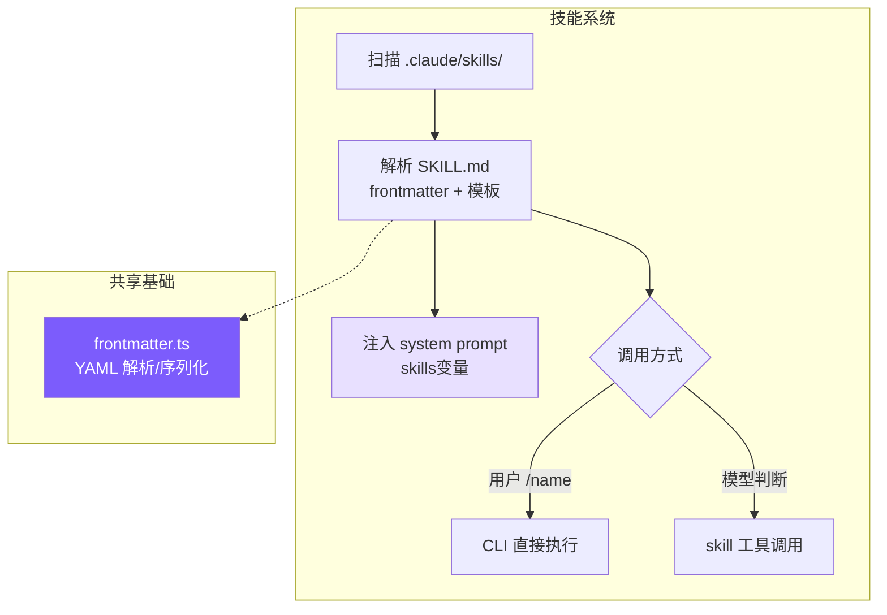
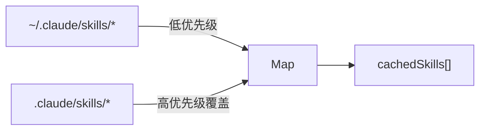
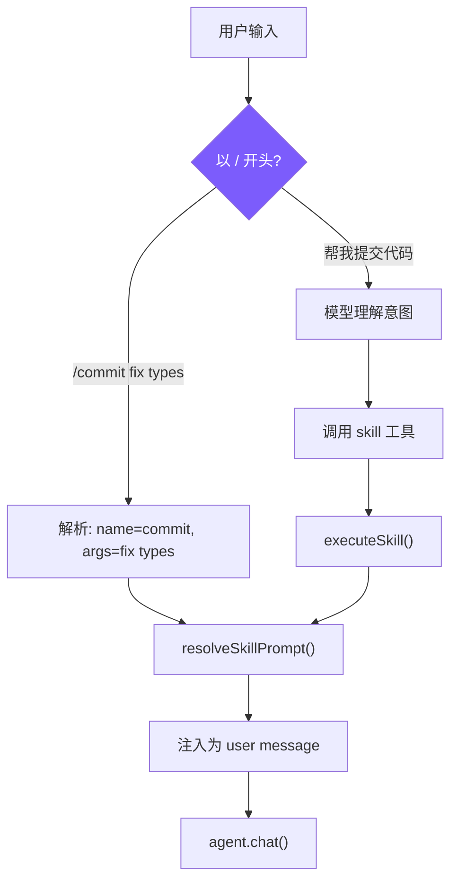

# 9. 技能系统

## 本章目标

让 Agent 拥有可复用的 Prompt 模块：用户定义一次，反复调用。像 Shell 脚本一样即装即用。



---

## Claude Code 怎么做的

技能是 Claude Code 的"AI Shell 脚本"——把 AI 工作流模板化，一次定义，反复复用。一个 `/commit` 技能封装了"读 diff → 分析变更 → 撰写 commit message → 提交"的完整 prompt。

技能从 6 个来源加载，优先级从高到低：企业策略（managed）> 项目级 > 用户级 > 插件 > 内置（bundled）> MCP。规律很简单：越接近用户控制的来源优先级越高，MCP 来自远程不受信任的服务端所以垫底。每个技能必须是目录格式 `skill-name/SKILL.md`，允许技能附带资源文件并通过 `${CLAUDE_SKILL_DIR}` 引用。

启动时只预加载 frontmatter（name/description/whenToUse），完整 prompt 在调用时才读取。几十个技能全量加载会挤占大量上下文，懒加载把成本推迟到真正需要的时刻。即使只是 frontmatter，技能列表也需要 token 空间——`formatCommandsWithinBudget()` 用三阶段算法控制：预算充足时全量展示；超出时内置技能（`/commit`、`/review`）始终保留完整描述，其余按剩余预算均分；每个技能不足 20 字符时降级为仅显示名称。

技能 prompt 执行前经过多层替换：`$ARGUMENTS` 替换用户参数，`${CLAUDE_SKILL_DIR}` 替换技能目录路径，`` !`command` `` 内联 Shell 执行（MCP 技能禁用此特性，防止远程提示词注入执行任意命令）。

执行模式有两种：**inline**（默认）直接注入当前对话，**fork** 创建独立子 Agent 执行后返回结果。fork 适合需要大量工具调用的技能——比如代码审查要读多个文件，这些调用会污染主对话上下文，fork 后只有最终结果回到主线。

---

## 我们的实现

### SKILL.md 格式

```markdown
---
name: commit
description: Create a git commit with a descriptive message
when_to_use: When the user asks to commit changes or says "commit"
allowed-tools: run_shell, read_file
user-invocable: true
---
Look at the current git diff and staged changes. Write a clear, concise
commit message following conventional commits format.

The user's request: $ARGUMENTS

Project skill directory: ${CLAUDE_SKILL_DIR}
```

- `when_to_use`：给模型看的触发条件，模型根据此判断是否自动调用
- `allowed-tools`：安全边界，限制技能可使用的工具
- `user-invocable`：`false` 的技能只能被模型自动触发

### 发现与加载



<!-- tabs:start -->
#### **TypeScript**
```typescript
// skills.ts — discoverSkills

let cachedSkills: SkillDefinition[] | null = null;

export function discoverSkills(): SkillDefinition[] {
  if (cachedSkills) return cachedSkills;

  const skills = new Map<string, SkillDefinition>();

  loadSkillsFromDir(join(homedir(), ".claude", "skills"), "user", skills);
  loadSkillsFromDir(join(process.cwd(), ".claude", "skills"), "project", skills);

  cachedSkills = Array.from(skills.values());
  return cachedSkills;
}
```
#### **Python**
```python
# skills.py — discover_skills

_cached_skills: list[SkillDefinition] | None = None


def discover_skills() -> list[SkillDefinition]:
    global _cached_skills
    if _cached_skills is not None:
        return _cached_skills

    skills: dict[str, SkillDefinition] = {}

    _load_skills_from_dir(Path.home() / ".claude" / "skills", "user", skills)
    _load_skills_from_dir(Path.cwd() / ".claude" / "skills", "project", skills)

    _cached_skills = list(skills.values())
    return _cached_skills
```
<!-- tabs:end -->

用 Map 去重自然实现"项目级覆盖用户级"——先加载 user，再加载 project，同名 key 被后者覆盖。Claude Code 有 6 个来源是因为要支持企业和 MCP 场景，project + user 覆盖了个人开发者的核心需求。

### 技能解析

<!-- tabs:start -->
#### **TypeScript**
```typescript
// skills.ts — parseSkillFile

function parseSkillFile(
  filePath: string, source: "project" | "user", skillDir: string
): SkillDefinition | null {
  const raw = readFileSync(filePath, "utf-8");
  const { meta, body } = parseFrontmatter(raw);

  const name = meta.name || skillDir.split("/").pop() || "unknown";
  const userInvocable = meta["user-invocable"] !== "false";

  let allowedTools: string[] | undefined;
  if (meta["allowed-tools"]) {
    const raw = meta["allowed-tools"];
    if (raw.startsWith("[")) {
      try { allowedTools = JSON.parse(raw); } catch {
        allowedTools = raw.replace(/[\[\]]/g, "").split(",").map((s) => s.trim());
      }
    } else {
      allowedTools = raw.split(",").map((s) => s.trim());
    }
  }

  return {
    name, description: meta.description || "",
    whenToUse: meta.when_to_use || meta["when-to-use"],
    allowedTools, userInvocable,
    promptTemplate: body, source, skillDir,
  };
}
```
#### **Python**
```python
# skills.py — _parse_skill_file

def _parse_skill_file(
    file_path: Path, source: str, skill_dir: str
) -> SkillDefinition | None:
    try:
        raw = file_path.read_text()
        result = parse_frontmatter(raw)
        meta = result.meta

        name = meta.get("name") or file_path.parent.name or "unknown"
        user_invocable = meta.get("user-invocable", "true") != "false"
        context = "fork" if meta.get("context") == "fork" else "inline"

        allowed_tools: list[str] | None = None
        if "allowed-tools" in meta:
            raw_tools = meta["allowed-tools"]
            if raw_tools.startswith("["):
                try:
                    allowed_tools = json.loads(raw_tools)
                except Exception:
                    allowed_tools = [s.strip() for s in raw_tools.strip("[]").split(",")]
            else:
                allowed_tools = [s.strip() for s in raw_tools.split(",")]

        return SkillDefinition(
            name=name, description=meta.get("description", ""),
            when_to_use=meta.get("when_to_use") or meta.get("when-to-use"),
            allowed_tools=allowed_tools, user_invocable=user_invocable,
            context=context, prompt_template=result.body,
            source=source, skill_dir=skill_dir,
        )
    except Exception:
        return None
```
<!-- tabs:end -->

`allowed-tools` 同时支持逗号分隔和 JSON 数组两种写法，先尝试 JSON.parse，失败就按逗号拆——用户写 YAML 时两种格式都很自然，容错解析避免因格式问题导致技能加载失败。`when_to_use` 同时兼容下划线和连字符两种 key 名，同理。

### Prompt 模板替换

<!-- tabs:start -->
#### **TypeScript**
```typescript
// skills.ts — resolveSkillPrompt

export function resolveSkillPrompt(skill: SkillDefinition, args: string): string {
  let prompt = skill.promptTemplate;
  prompt = prompt.replace(/\$ARGUMENTS|\$\{ARGUMENTS\}/g, args);
  prompt = prompt.replace(/\$\{CLAUDE_SKILL_DIR\}/g, skill.skillDir);
  return prompt;
}
```
#### **Python**
```python
# skills.py — resolve_skill_prompt

def resolve_skill_prompt(skill: SkillDefinition, args: str) -> str:
    prompt = skill.prompt_template
    prompt = re.sub(r"\$ARGUMENTS|\$\{ARGUMENTS\}", args, prompt)
    prompt = prompt.replace("${CLAUDE_SKILL_DIR}", skill.skill_dir)
    return prompt
```
<!-- tabs:end -->

`$ARGUMENTS` 替换用户传入的参数，`${CLAUDE_SKILL_DIR}` 替换技能目录路径（技能可以在目录里放模板文件，在 prompt 中用 `read_file` 引用）。Claude Code 还支持 `` !`shell_command` `` 内联执行，我们没有实现——它增加了安全风险，教程场景不需要。

### 双重调用路径



**路径 1：用户手动调用**（cli.ts）

<!-- tabs:start -->
#### **TypeScript**
```typescript
if (input.startsWith("/")) {
  const spaceIdx = input.indexOf(" ");
  const cmdName = spaceIdx > 0 ? input.slice(1, spaceIdx) : input.slice(1);
  const cmdArgs = spaceIdx > 0 ? input.slice(spaceIdx + 1) : "";
  const skill = getSkillByName(cmdName);
  if (skill && skill.userInvocable) {
    const resolved = resolveSkillPrompt(skill, cmdArgs);
    printInfo(`Invoking skill: ${skill.name}`);
    await agent.chat(resolved);
    return;
  }
}
```
#### **Python**
```python
if inp.startswith("/"):
    space_idx = inp.find(" ")
    cmd_name = inp[1:space_idx] if space_idx > 0 else inp[1:]
    cmd_args = inp[space_idx + 1:] if space_idx > 0 else ""
    skill = get_skill_by_name(cmd_name)
    if skill and skill.user_invocable:
        resolved = resolve_skill_prompt(skill, cmd_args)
        print_info(f"Invoking skill: {skill.name}")
        await agent.chat(resolved)
        continue
```
<!-- tabs:end -->

**路径 2：模型程序化调用**（tools.ts）

<!-- tabs:start -->
#### **TypeScript**
```typescript
// tools.ts — skill 工具定义与执行

{
  name: "skill",
  description: "Invoke a registered skill by name...",
  input_schema: {
    properties: {
      skill_name: { type: "string" },
      args: { type: "string" },
    },
    required: ["skill_name"],
  },
}

function runSkillTool(input: { skill_name: string; args?: string }): string {
  const result = executeSkill(input.skill_name, input.args || "");
  if (!result) return `Unknown skill: ${input.skill_name}`;
  return `[Skill "${input.skill_name}" activated]\n\n${result.prompt}`;
}
```
#### **Python**
```python
# tools.py — skill 工具定义与执行

{
    "name": "skill",
    "description": "Invoke a registered skill by name...",
    "input_schema": {
        "type": "object",
        "properties": {
            "skill_name": {"type": "string"},
            "args": {"type": "string"},
        },
        "required": ["skill_name"],
    },
}

async def _execute_skill_tool(self, inp: dict) -> str:
    result = execute_skill(inp.get("skill_name", ""), inp.get("args", ""))
    if not result:
        return f"Unknown skill: {inp.get('skill_name', '')}"
    return f'[Skill "{inp.get("skill_name", "")}" activated]\n\n{result["prompt"]}'
```
<!-- tabs:end -->

模型调用 `skill` 工具后得到的是展开后的 prompt 文本，在接下来的回合中按这个 prompt 执行任务。本质上是**元工具**——工具的返回值不是数据，而是指令。

### 执行模式：inline vs fork

<!-- tabs:start -->
#### **TypeScript**
```typescript
// agent.ts — executeSkillTool

private async executeSkillTool(input: Record<string, any>): Promise<string> {
  const result = executeSkill(input.skill_name, input.args || "");
  if (!result) return `Unknown skill: ${input.skill_name}`;

  if (result.context === "fork") {
    const tools = result.allowedTools
      ? this.tools.filter(t => result.allowedTools!.includes(t.name))
      : this.tools.filter(t => t.name !== "agent");
    const subAgent = new Agent({
      customSystemPrompt: result.prompt,
      customTools: tools,
      isSubAgent: true,
      permissionMode: "bypassPermissions",
    });
    const subResult = await subAgent.runOnce(input.args || "Execute this skill task.");
    return subResult.text;
  }

  return `[Skill "${input.skill_name}" activated]\n\n${result.prompt}`;
}
```
#### **Python**
```python
# agent.py — _execute_skill_tool

async def _execute_skill_tool(self, inp: dict) -> str:
    result = execute_skill(inp.get("skill_name", ""), inp.get("args", ""))
    if not result:
        return f"Unknown skill: {inp.get('skill_name', '')}"

    if result["context"] == "fork":
        tools = (
            [t for t in self.tools if t["name"] in result["allowed_tools"]]
            if result.get("allowed_tools")
            else [t for t in self.tools if t["name"] != "agent"]
        )
        sub_agent = Agent(
            model=self.model,
            custom_system_prompt=result["prompt"],
            custom_tools=tools,
            is_sub_agent=True,
            permission_mode="bypassPermissions",
        )
        sub_result = await sub_agent.run_once(inp.get("args") or "Execute this skill task.")
        return sub_result["text"] or "(Skill produced no output)"

    return f'[Skill "{inp.get("skill_name", "")}" activated]\n\n{result["prompt"]}'
```
<!-- tabs:end -->

fork 时子 Agent 工具受 `allowedTools` 白名单约束，没指定则排除 `agent` 工具防止递归。技能需要多轮工具调用（如代码审查读多个文件）时选 fork，保持主对话干净。

### System Prompt 描述

<!-- tabs:start -->
#### **TypeScript**
```typescript
// skills.ts — buildSkillDescriptions

export function buildSkillDescriptions(): string {
  const skills = discoverSkills();
  if (skills.length === 0) return "";

  const lines = ["# Available Skills", ""];
  const invocable = skills.filter((s) => s.userInvocable);
  const autoOnly = skills.filter((s) => !s.userInvocable);

  if (invocable.length > 0) {
    lines.push("User-invocable skills (user types /<name> to invoke):");
    for (const s of invocable) {
      lines.push(`- **/${s.name}**: ${s.description}`);
      if (s.whenToUse) lines.push(`  When to use: ${s.whenToUse}`);
    }
  }

  if (autoOnly.length > 0) {
    lines.push("Auto-invocable skills (use the skill tool when appropriate):");
    for (const s of autoOnly) {
      lines.push(`- **${s.name}**: ${s.description}`);
      if (s.whenToUse) lines.push(`  When to use: ${s.whenToUse}`);
    }
  }

  lines.push("To invoke a skill programmatically, use the `skill` tool.");
  return lines.join("\n");
}
```
#### **Python**
```python
# skills.py — build_skill_descriptions

def build_skill_descriptions() -> str:
    skills = discover_skills()
    if not skills:
        return ""

    lines = ["# Available Skills", ""]
    invocable = [s for s in skills if s.user_invocable]
    auto_only = [s for s in skills if not s.user_invocable]

    if invocable:
        lines.append("User-invocable skills (user types /<name> to invoke):")
        for s in invocable:
            lines.append(f"- **/{s.name}**: {s.description}")
            if s.when_to_use:
                lines.append(f"  When to use: {s.when_to_use}")
        lines.append("")

    if auto_only:
        lines.append("Auto-invocable skills (use the skill tool when appropriate):")
        for s in auto_only:
            lines.append(f"- **{s.name}**: {s.description}")
            if s.when_to_use:
                lines.append(f"  When to use: {s.when_to_use}")
        lines.append("")

    lines.append("To invoke a skill programmatically, use the `skill` tool.")
    return "\n".join(lines)
```
<!-- tabs:end -->

技能分两组展示：用户可调用的加 `/` 前缀，仅模型可调用的不加。`whenToUse` 是给模型看的判断条件，决定是否主动触发。Claude Code 还做了 token 预算控制（`formatCommandsWithinBudget()`），我们跳过——教程场景技能数量有限。

---

## 关键设计决策

**为什么技能用 Markdown 而非 JSON/YAML？** 技能的本体是大段自然语言 prompt。Markdown 的 body 直接就是 prompt 本身，frontmatter 提供结构化元数据。JSON 存储的话 prompt 需要转义换行符和引号，可读性很差。

**为什么需要双重调用路径？** 只支持 `/commit` 手动调用不够——用户可能说"帮我提交代码"而不知道有这个技能；只支持模型自动调用也不够——用户有时想精确控制触发时机。两条路径最终汇合到同一个 `resolveSkillPrompt()`，逻辑不重复。

### 简化对比总览

| 维度 | Claude Code | mini-claude |
|------|------------|-------------|
| **技能来源** | 6 个（managed/project/user/plugin/bundled/MCP） | 2 个（project + user） |
| **技能加载** | 懒加载 + token 预算控制 | 启动时全量加载 + 缓存 |
| **Prompt 替换** | `$ARGUMENTS` + `${CLAUDE_SKILL_DIR}` + `` !`shell` `` | `$ARGUMENTS` + `${CLAUDE_SKILL_DIR}` |

---

> **下一章**：让 Agent 先想清楚再动手——Plan Mode，只读规划模式。
