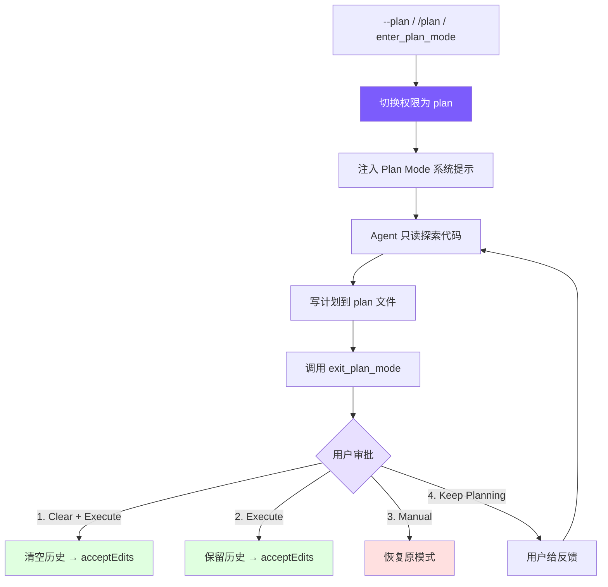

# 10. Plan Mode：只读规划模式

## 本章目标

实现 Plan Mode：让 Agent 先制定计划再执行，避免盲目修改代码。包含模式切换、plan 文件持久化、权限联动和 4 选项审批工作流。



## Claude Code 怎么做的

Claude Code 的 Plan Mode 是完整的 EnterPlanMode / ExitPlanMode 工具对：

1. **进入**：切换到 read-only 模式，生成 plan 文件（`~/.claude/plans/` 目录），注入 plan 系统提示约束 Agent 行为
2. **规划**：Agent 用只读工具探索代码，将实现计划写入 plan 文件
3. **退出**：Agent 调用 ExitPlanMode，用户看到计划后选择执行方式
4. **审批**：用户选择清空上下文执行、保留上下文执行、手动审批执行、或继续修改

关键设计：**Plan Mode 不是"不让 Agent 做事"，而是让 Agent 先想清楚再做**。plan 文件持久化到磁盘意味着即使清空上下文，计划也不会丢失——Agent 可以从零开始执行一个经过审批的方案。

## 我们的实现

### 工具定义

Plan Mode 需要两个工具，标记为 `deferred`（延迟加载，详见[[claude-code-from-scratch/02-tools|第 2 章]]）：

<!-- tabs:start -->
#### **TypeScript**
```typescript
// tools.ts — Plan Mode 工具定义

// ─── Plan mode tools ────────────────────────────────────────
{
  name: "enter_plan_mode",
  description:
    "Enter plan mode to switch to a read-only planning phase. In plan mode, you can only read files and write to the plan file. Use this when you need to explore the codebase and design an implementation plan before making changes.",
  input_schema: {
    type: "object" as const,
    properties: {},
  },
  deferred: true,
},
{
  name: "exit_plan_mode",
  description:
    "Exit plan mode after you have finished writing your plan to the plan file. The user will review and approve the plan before you proceed with implementation.",
  input_schema: {
    type: "object" as const,
    properties: {},
  },
  deferred: true,
},
```
#### **Python**
```python
# tools.py — Plan Mode 工具定义

{
    "name": "enter_plan_mode",
    "description": "Enter plan mode to switch to a read-only planning phase. ...",
    "input_schema": {"type": "object", "properties": {}},
    "deferred": True,
},
{
    "name": "exit_plan_mode",
    "description": "Exit plan mode after you have finished writing your plan to the plan file. ...",
    "input_schema": {"type": "object", "properties": {}},
    "deferred": True,
},
```
<!-- tabs:end -->

两个工具都没有参数——进入和退出是纯状态切换，所有数据（plan 文件路径、审批结果）都在 Agent 内部管理。标记为 `deferred` 是因为大多数会话不需要 Plan Mode，延迟加载避免占用提示词空间。

### 模式切换

Plan Mode 涉及 4 个状态变量：

<!-- tabs:start -->
#### **TypeScript**
```typescript
// agent.ts — Plan Mode 状态

// Plan mode state
private prePlanMode: PermissionMode | null = null;    // 进入前的模式（用于恢复）
private planFilePath: string | null = null;            // plan 文件路径
private baseSystemPrompt: string = "";                 // 不含 plan 注入的基础提示词
private contextCleared: boolean = false;               // 审批时是否清空了上下文
```
#### **Python**
```python
# agent.py — Plan Mode 状态

self._pre_plan_mode: str | None = None      # 进入前的模式
self._plan_file_path: str | None = None     # plan 文件路径
self._base_system_prompt: str = ""           # 基础提示词
self._context_cleared: bool = False          # 是否清空了上下文
```
<!-- tabs:end -->

`prePlanMode` 是关键——它记住进入 Plan Mode 之前的权限模式，这样退出时可以精确恢复。如果用户之前是 `acceptEdits` 模式，退出 Plan Mode 后应该回到 `acceptEdits`，而不是变成 `default`。

切换逻辑是对称的进入/退出：

<!-- tabs:start -->
#### **TypeScript**
```typescript
// agent.ts — togglePlanMode()

togglePlanMode(): string {
  if (this.permissionMode === "plan") {
    // 退出：恢复原模式，清理状态，移除 plan 提示
    this.permissionMode = this.prePlanMode || "default";
    this.prePlanMode = null;
    this.planFilePath = null;
    this.systemPrompt = this.baseSystemPrompt;
    if (this.useOpenAI && this.openaiMessages.length > 0) {
      (this.openaiMessages[0] as any).content = this.systemPrompt;
    }
    printInfo(`Exited plan mode → ${this.permissionMode} mode`);
    return this.permissionMode;
  } else {
    // 进入：保存当前模式，切换权限，生成 plan 文件，注入提示
    this.prePlanMode = this.permissionMode;
    this.permissionMode = "plan";
    this.planFilePath = this.generatePlanFilePath();
    this.systemPrompt = this.baseSystemPrompt + this.buildPlanModePrompt();
    if (this.useOpenAI && this.openaiMessages.length > 0) {
      (this.openaiMessages[0] as any).content = this.systemPrompt;
    }
    printInfo(`Entered plan mode. Plan file: ${this.planFilePath}`);
    return "plan";
  }
}
```
#### **Python**
```python
# agent.py — toggle_plan_mode()

def toggle_plan_mode(self) -> str:
    if self.permission_mode == "plan":
        self.permission_mode = self._pre_plan_mode or "default"
        self._pre_plan_mode = None
        self._plan_file_path = None
        self._system_prompt = self._base_system_prompt
        if self.use_openai and self._openai_messages:
            self._openai_messages[0]["content"] = self._system_prompt
        print_info(f"Exited plan mode → {self.permission_mode} mode")
        return self.permission_mode
    else:
        self._pre_plan_mode = self.permission_mode
        self.permission_mode = "plan"
        self._plan_file_path = self._generate_plan_file_path()
        self._system_prompt = self._base_system_prompt + self._build_plan_mode_prompt()
        if self.use_openai and self._openai_messages:
            self._openai_messages[0]["content"] = self._system_prompt
        print_info(f"Entered plan mode. Plan file: {self._plan_file_path}")
        return "plan"
```
<!-- tabs:end -->

注意系统提示词的更新方式：进入时在 `baseSystemPrompt` 后追加 plan 提示，退出时恢复为 `baseSystemPrompt`。对于 OpenAI 格式，需要直接修改消息数组的第一条（系统消息）。

### Plan 文件与系统提示

Plan 文件路径按会话 ID 生成，确保每个会话有独立的 plan 文件：

<!-- tabs:start -->
#### **TypeScript**
```typescript
// agent.ts — Plan 文件生成

private generatePlanFilePath(): string {
  const dir = join(homedir(), ".claude", "plans");
  if (!existsSync(dir)) mkdirSync(dir, { recursive: true });
  return join(dir, `plan-${this.sessionId}.md`);
}
```
#### **Python**
```python
# agent.py — Plan 文件生成

def _generate_plan_file_path(self) -> str:
    d = Path.home() / ".claude" / "plans"
    d.mkdir(parents=True, exist_ok=True)
    return str(d / f"plan-{self.session_id}.md")
```
<!-- tabs:end -->

Plan 系统提示注入了严格的 read-only 约束和工作流指引：

<!-- tabs:start -->
#### **TypeScript**
```typescript
// agent.ts — buildPlanModePrompt()

private buildPlanModePrompt(): string {
  return `

# Plan Mode Active

Plan mode is active. You MUST NOT make any edits (except the plan file below),
run non-readonly tools, or make any changes to the system.

## Plan File: ${this.planFilePath}
Write your plan incrementally to this file using write_file or edit_file.
This is the ONLY file you are allowed to edit.

## Workflow
1. **Explore**: Read code to understand the task. Use read_file, list_files, grep_search.
2. **Design**: Design your implementation approach.
3. **Write Plan**: Write a structured plan to the plan file including:
   - **Context**: Why this change is needed
   - **Steps**: Implementation steps with critical file paths
   - **Verification**: How to test the changes
4. **Exit**: Call exit_plan_mode when your plan is ready for user review.

IMPORTANT: When your plan is complete, you MUST call exit_plan_mode.
Do NOT ask the user to approve — exit_plan_mode handles that.`;
}
```
#### **Python**
```python
# agent.py — _build_plan_mode_prompt()

def _build_plan_mode_prompt(self) -> str:
    return f"""

# Plan Mode Active

Plan mode is active. You MUST NOT make any edits (except the plan file below),
run non-readonly tools, or make any changes to the system.

## Plan File: {self._plan_file_path}
Write your plan incrementally to this file using write_file or edit_file.
This is the ONLY file you are allowed to edit.

## Workflow
1. **Explore**: Read code to understand the task. Use read_file, list_files, grep_search.
2. **Design**: Design your implementation approach.
3. **Write Plan**: Write a structured plan to the plan file including:
   - **Context**: Why this change is needed
   - **Steps**: Implementation steps with critical file paths
   - **Verification**: How to test the changes
4. **Exit**: Call exit_plan_mode when your plan is ready for user review.

IMPORTANT: When your plan is complete, you MUST call exit_plan_mode.
Do NOT ask the user to approve — exit_plan_mode handles that."""
```
<!-- tabs:end -->

这个提示词做了三件事：
1. **约束行为**：明确禁止编辑和 shell（配合权限检查双重保障）
2. **声明 plan 文件**：告诉模型唯一可写的文件路径
3. **规定工作流**：Explore → Design → Write → Exit，确保模型不会跳步

最后一句"Do NOT ask the user to approve"很重要——没有这句，模型经常会在写完计划后问"这个计划可以吗？"而不是调用 `exit_plan_mode`，导致审批流程无法触发。

### 权限集成

Plan Mode 的 read-only 约束通过 `checkPermission()` 强制执行（详见[[claude-code-from-scratch/06-permissions|第 6 章]]）：

<!-- tabs:start -->
#### **TypeScript**
```typescript
// tools.ts — checkPermission() 中的 Plan Mode 处理

// plan mode: block all write/edit tools (except plan file) and shell
if (mode === "plan") {
  if (EDIT_TOOLS.has(toolName)) {
    const filePath = input.file_path || input.path;
    if (planFilePath && filePath === planFilePath) {
      return { action: "allow" };  // 唯一例外：plan 文件本身
    }
    return { action: "deny", message: `Blocked in plan mode: ${toolName}` };
  }
  if (toolName === "run_shell") {
    return { action: "deny", message: "Shell commands blocked in plan mode" };
  }
}

// plan mode tools: always allow (handled in agent.ts)
if (toolName === "enter_plan_mode" || toolName === "exit_plan_mode") {
  return { action: "allow" };
}
```
#### **Python**
```python
# tools.py — check_permission() 中的 Plan Mode 处理

if mode == "plan":
    if tool_name in EDIT_TOOLS:
        file_path = inp.get("file_path") or inp.get("path")
        if plan_file_path and file_path == plan_file_path:
            return {"action": "allow"}
        return {"action": "deny", "message": f"Blocked in plan mode: {tool_name}"}
    if tool_name == "run_shell":
        return {"action": "deny", "message": "Shell commands blocked in plan mode"}

if tool_name in ("enter_plan_mode", "exit_plan_mode"):
    return {"action": "allow"}
```
<!-- tabs:end -->

这里有一个精巧的设计：**plan 文件路径作为参数传入 `checkPermission()`**。当 Agent 试图写文件时，权限检查会比对目标路径和 plan 文件路径——只有完全匹配才放行。这意味着系统提示词说"只能写 plan 文件"不只是建议，而是代码强制执行的约束。

双重保障：
- **系统提示词**：引导模型不要尝试写其他文件（减少无效 API 调用）
- **权限检查**：即使模型无视提示词，写操作也会被拦截并返回错误

### 工具执行逻辑

`executePlanModeTool()` 处理 `enter_plan_mode` 和 `exit_plan_mode` 的执行：

<!-- tabs:start -->
#### **TypeScript**
```typescript
// agent.ts — executePlanModeTool()

private async executePlanModeTool(name: string): Promise<string> {
  if (name === "enter_plan_mode") {
    if (this.permissionMode === "plan") {
      return "Already in plan mode.";
    }
    this.prePlanMode = this.permissionMode;
    this.permissionMode = "plan";
    this.planFilePath = this.generatePlanFilePath();
    this.systemPrompt = this.baseSystemPrompt + this.buildPlanModePrompt();
    if (this.useOpenAI && this.openaiMessages.length > 0) {
      (this.openaiMessages[0] as any).content = this.systemPrompt;
    }
    printInfo("Entered plan mode (read-only). Plan file: " + this.planFilePath);
    return `Entered plan mode. You are now in read-only mode.\n\n` +
      `Your plan file: ${this.planFilePath}\n` +
      `Write your plan to this file. This is the only file you can edit.\n\n` +
      `When your plan is complete, call exit_plan_mode.`;
  }

  if (name === "exit_plan_mode") {
    if (this.permissionMode !== "plan") {
      return "Not in plan mode.";
    }
    // 读取 plan 文件内容
    let planContent = "(No plan file found)";
    if (this.planFilePath && existsSync(this.planFilePath)) {
      planContent = readFileSync(this.planFilePath, "utf-8");
    }

    // 交互式审批流程
    if (this.planApprovalFn) {
      const result = await this.planApprovalFn(planContent);

      if (result.choice === "keep-planning") {
        // 用户拒绝 — 留在 plan 模式，返回反馈给模型
        const feedback = result.feedback || "Please revise the plan.";
        return `User rejected the plan and wants to keep planning.\n\n` +
          `User feedback: ${feedback}\n\n` +
          `Please revise your plan based on this feedback. When done, call exit_plan_mode again.`;
      }

      // 用户批准 — 确定目标权限模式
      let targetMode: PermissionMode;
      if (result.choice === "clear-and-execute" || result.choice === "execute") {
        targetMode = "acceptEdits";
      } else {
        targetMode = this.prePlanMode || "default";  // manual-execute: 恢复原模式
      }

      // 退出 plan 模式
      this.permissionMode = targetMode;
      this.prePlanMode = null;
      const savedPlanPath = this.planFilePath;
      this.planFilePath = null;
      this.systemPrompt = this.baseSystemPrompt;

      // 清空上下文（如果选择了 clear-and-execute）
      if (result.choice === "clear-and-execute") {
        this.clearHistoryKeepSystem();
        this.contextCleared = true;
        printInfo(`Plan approved. Context cleared, executing in ${targetMode} mode.`);
        return `User approved the plan. Context was cleared. Permission mode: ${targetMode}\n\n` +
          `Plan file: ${savedPlanPath}\n\n## Approved Plan:\n${planContent}\n\nProceed with implementation.`;
      }

      printInfo(`Plan approved. Executing in ${targetMode} mode.`);
      return `User approved the plan. Permission mode: ${targetMode}\n\n` +
        `## Approved Plan:\n${planContent}\n\nProceed with implementation.`;
    }

    // Fallback: 没有审批函数时直接退出（如子 Agent）
    this.permissionMode = this.prePlanMode || "default";
    this.prePlanMode = null;
    this.planFilePath = null;
    this.systemPrompt = this.baseSystemPrompt;
    printInfo("Exited plan mode. Restored to " + this.permissionMode + " mode.");
    return `Exited plan mode. Permission mode restored to: ${this.permissionMode}\n\n` +
      `## Your Plan:\n${planContent}`;
  }

  return `Unknown plan mode tool: ${name}`;
}
```
#### **Python**
```python
# agent.py — _execute_plan_mode_tool()

async def _execute_plan_mode_tool(self, name: str) -> str:
    if name == "enter_plan_mode":
        if self.permission_mode == "plan":
            return "Already in plan mode."
        self._pre_plan_mode = self.permission_mode
        self.permission_mode = "plan"
        self._plan_file_path = self._generate_plan_file_path()
        self._system_prompt = self._base_system_prompt + self._build_plan_mode_prompt()
        if self.use_openai and self._openai_messages:
            self._openai_messages[0]["content"] = self._system_prompt
        print_info("Entered plan mode (read-only). Plan file: " + self._plan_file_path)
        return (
            f"Entered plan mode. You are now in read-only mode.\n\n"
            f"Your plan file: {self._plan_file_path}\n"
            f"Write your plan to this file. This is the only file you can edit.\n\n"
            f"When your plan is complete, call exit_plan_mode."
        )

    if name == "exit_plan_mode":
        if self.permission_mode != "plan":
            return "Not in plan mode."
        plan_content = "(No plan file found)"
        if self._plan_file_path and Path(self._plan_file_path).exists():
            plan_content = Path(self._plan_file_path).read_text()

        if self._plan_approval_fn:
            result = await self._plan_approval_fn(plan_content)
            choice = result.get("choice", "manual-execute")

            if choice == "keep-planning":
                feedback = result.get("feedback") or "Please revise the plan."
                return (
                    f"User rejected the plan and wants to keep planning.\n\n"
                    f"User feedback: {feedback}\n\n"
                    f"Please revise your plan based on this feedback. "
                    f"When done, call exit_plan_mode again."
                )

            if choice in ("clear-and-execute", "execute"):
                target_mode = "acceptEdits"
            else:
                target_mode = self._pre_plan_mode or "default"

            self.permission_mode = target_mode
            self._pre_plan_mode = None
            saved_plan_path = self._plan_file_path
            self._plan_file_path = None
            self._system_prompt = self._base_system_prompt

            if choice == "clear-and-execute":
                self._clear_history_keep_system()
                self._context_cleared = True
                print_info(f"Plan approved. Context cleared, executing in {target_mode} mode.")
                return (
                    f"User approved the plan. Context was cleared. "
                    f"Permission mode: {target_mode}\n\n"
                    f"Plan file: {saved_plan_path}\n\n"
                    f"## Approved Plan:\n{plan_content}\n\n"
                    f"Proceed with implementation."
                )

            print_info(f"Plan approved. Executing in {target_mode} mode.")
            return (
                f"User approved the plan. Permission mode: {target_mode}\n\n"
                f"## Approved Plan:\n{plan_content}\n\n"
                f"Proceed with implementation."
            )

        # Fallback: no approval function
        self.permission_mode = self._pre_plan_mode or "default"
        self._pre_plan_mode = None
        self._plan_file_path = None
        self._system_prompt = self._base_system_prompt
        print_info("Exited plan mode. Restored to " + self.permission_mode + " mode.")
        return (
            f"Exited plan mode. Permission mode restored to: {self.permission_mode}\n\n"
            f"## Your Plan:\n{plan_content}"
        )

    return f"Unknown plan mode tool: {name}"
```
<!-- tabs:end -->

核心逻辑分三层：

1. **enter_plan_mode**：状态切换 + plan 文件创建 + 提示词注入。幂等设计——已在 plan 模式时返回提示而不是报错。

2. **exit_plan_mode（有审批函数）**：读取 plan 文件 → 调用审批回调 → 根据用户选择处理：
   - `keep-planning`：不退出 plan 模式，把用户反馈作为工具结果返回给模型
   - `clear-and-execute`：清空消息历史（释放上下文）→ 切换到 `acceptEdits`
   - `execute`：保留历史 → 切换到 `acceptEdits`
   - `manual-execute`：恢复进入前的模式（用户手动审批每次编辑）

3. **exit_plan_mode（无审批函数）**：直接退出恢复原模式。这个分支用于子 Agent 场景——子 Agent 不需要用户交互式审批。

### 审批工作流

审批通过回调函数注入，解耦了 Agent 和 UI 层：

<!-- tabs:start -->
#### **TypeScript**
```typescript
// cli.ts — 设置审批回调

agent.setPlanApprovalFn((planContent: string) => {
  return new Promise((resolve) => {
    printPlanForApproval(planContent);   // 显示计划内容
    printPlanApprovalOptions();          // 显示 4 个选项

    const askChoice = () => {
      rl.question("  Enter choice (1-4): ", (answer) => {
        const choice = answer.trim();
        if (choice === "1") {
          resolve({ choice: "clear-and-execute" });
        } else if (choice === "2") {
          resolve({ choice: "execute" });
        } else if (choice === "3") {
          resolve({ choice: "manual-execute" });
        } else if (choice === "4") {
          rl.question("  Feedback (what to change): ", (feedback) => {
            resolve({ choice: "keep-planning", feedback: feedback.trim() || undefined });
          });
        } else {
          console.log("  Invalid choice. Enter 1, 2, 3, or 4.");
          askChoice();  // 无效输入重试
        }
      });
    };
    askChoice();
  });
});
```
#### **Python**
```python
# __main__.py — 设置审批回调

async def plan_approval(plan_content: str) -> dict:
    print_plan_for_approval(plan_content)
    print_plan_approval_options()
    while True:
        choice = input("  Enter choice (1-4): ").strip()
        if choice == "1":
            return {"choice": "clear-and-execute"}
        elif choice == "2":
            return {"choice": "execute"}
        elif choice == "3":
            return {"choice": "manual-execute"}
        elif choice == "4":
            feedback = input("  Feedback (what to change): ").strip()
            return {"choice": "keep-planning", "feedback": feedback or None}
        else:
            print("  Invalid choice. Enter 1, 2, 3, or 4.")

agent.set_plan_approval_fn(plan_approval)
```
<!-- tabs:end -->

UI 部分显示计划内容和 4 个选项：

```typescript
// ui.ts — Plan 审批 UI

export function printPlanForApproval(planContent: string) {
  console.log(chalk.cyan("\n  ━━━ Plan for Approval ━━━"));
  const lines = planContent.split("\n");
  const maxLines = 60;
  const display = lines.slice(0, maxLines);
  for (const line of display) {
    console.log(chalk.white("  " + line));
  }
  if (lines.length > maxLines) {
    console.log(chalk.gray(`  ... (${lines.length - maxLines} more lines)`));
  }
  console.log(chalk.cyan("  ━━━━━━━━━━━━━━━━━━━━━━━━\n"));
}

export function printPlanApprovalOptions() {
  console.log(chalk.yellow("  Choose an option:"));
  console.log("    1) Yes, clear context and execute — fresh start with auto-accept edits");
  console.log("    2) Yes, and execute — keep context, auto-accept edits");
  console.log("    3) Yes, manually approve edits — keep context, confirm each edit");
  console.log("    4) No, keep planning — provide feedback to revise");
}
```

四个选项的设计背后是不同的使用场景：

| 选项 | 权限切换 | 上下文 | 适用场景 |
|------|---------|--------|---------|
| 1. Clear + Execute | → acceptEdits | 清空 | 计划完善，上下文已很长，从零执行最高效 |
| 2. Execute | → acceptEdits | 保留 | 计划完善，Agent 已有足够上下文直接执行 |
| 3. Manual | → 恢复原模式 | 保留 | 计划大致可以，但想逐步审批每个修改 |
| 4. Keep Planning | 不变 | 保留 | 计划需要修改，给反馈让 Agent 继续调整 |

### CLI 入口

Plan Mode 有三个入口：

<!-- tabs:start -->
#### **TypeScript**
```typescript
// cli.ts — CLI 参数

// 1. 命令行参数 --plan
} else if (args[i] === "--plan") {
  permissionMode = "plan";

// 2. REPL 命令 /plan
if (input === "/plan") {
  const newMode = agent.togglePlanMode();
  askQuestion();
  return;
}

// 3. Agent 自主调用 enter_plan_mode 工具（通过 ToolSearch 延迟加载）
```
#### **Python**
```python
# __main__.py — CLI 参数

# 1. 命令行参数 --plan
elif arg == "--plan":
    permission_mode = "plan"

# 2. REPL 命令 /plan
if user_input == "/plan":
    agent.toggle_plan_mode()
    continue

# 3. Agent 自主调用 enter_plan_mode 工具
```
<!-- tabs:end -->

三个入口的区别：
- `--plan`：启动时就进入 Plan Mode，整个会话从规划开始
- `/plan`：会话中途切换，适合"先聊后规划"的工作流
- `enter_plan_mode` 工具：Agent 自己判断需要先规划再执行（需要通过 ToolSearch 激活）

## 设计决策

### 为什么 Plan 文件写磁盘？

Plan 文件持久化到 `~/.claude/plans/` 有两个原因：

1. **Clear-and-execute 选项需要**：清空上下文后，对话历史中的 plan 内容会丢失。但 plan 文件在磁盘上，Agent 可以重新读取。
2. **跨会话可用**：用户可以 `--resume` 恢复会话时看到之前的 plan，或者手动查看历史 plan 文件。

### 为什么审批是回调而不是直接实现？

`planApprovalFn` 是外部注入的回调，而不是 Agent 内部直接实现。这让 Agent 类不依赖具体的 UI 实现——CLI 用 readline，IDE 集成可以用 GUI 对话框，测试时可以注入模拟函数。子 Agent 没有审批函数时直接退出，不需要特殊处理。

### 为什么 clear-and-execute 切换到 acceptEdits？

用户既然审批了计划并选择了自动执行，说明他们信任 Agent 的修改方向。切换到 `acceptEdits` 让 Agent 无需反复确认每次文件编辑，大幅提升执行效率。如果用户想逐步审批，有专门的选项 3。

## 简化对比

| 维度 | Claude Code | mini-claude | 差异 |
|------|------------|-------------|------|
| Plan 文件 | 全局 plans 目录 + 语义文件名 | `~/.claude/plans/plan-{sessionId}.md` | 简化命名 |
| 审批选项 | 多种执行模式 + 权限提示 | 4 种选项（clear/execute/manual/revise） | 核心对齐 |
| 权限联动 | 深度集成（7 层权限体系） | checkPermission 特殊分支 + plan 文件白名单 | 简化但等效 |
| 工具加载 | 始终可用 | deferred 延迟加载 | 节省提示词空间 |
| 子 Agent | Plan Agent 类型 | Fallback 直接退出 | 简化分支 |

---

> **下一章**：当单个 Agent 的上下文不够用时——多 Agent 架构，分而治之。
