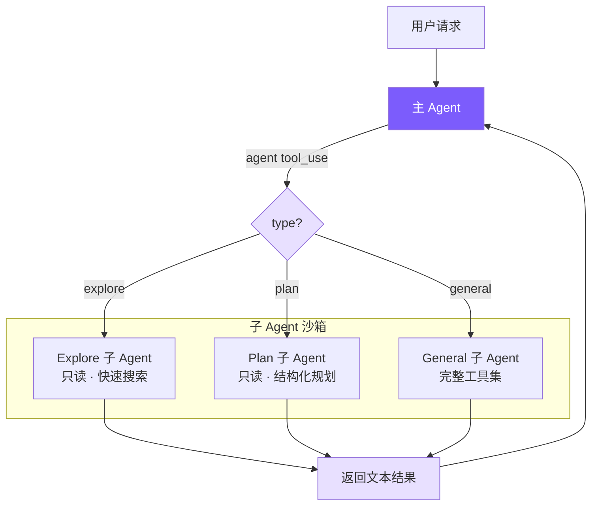

# 11. 多 Agent 架构

## 本章目标

实现 Sub-Agent（子代理）系统：让主 Agent 能派生出独立的子 Agent 执行探索、规划、通用任务，完成后将结果返回主 Agent。这是 Claude Code 处理复杂任务时最重要的"分而治之"机制。



## Claude Code 怎么做的

Claude Code 的多 Agent 体系在 `src/tools/AgentTool/` 中实现，支持三种协作模式：

| 模式 | 特点 |
|------|------|
| **Sub-Agent**（fork-return） | 分叉独立执行，完成后返回结果 |
| **Coordinator** | 一个协调者分配任务给多个 Worker |
| **Swarm Team** | 多 Agent 对等协作，通过信箱通信 |

我们实现的是 Sub-Agent 模式，也是最常用的。

### 内置 Agent 类型

- **Explore**：用 Haiku 模型（更便宜），只读工具集，专门用于代码搜索
- **Plan**：只读 + 结构化输出，设计实现方案
- **General**：完整工具集（除了不能递归创建子 Agent）
- **Custom**：通过 `.claude/agents/*.md` 文件定义

### Coordinator 模式的关键设计

Coordinator 将主 Agent 变为**纯编排者**——工具集被硬限制为只有 `Agent`（派生 Worker）和 `SendMessage`（续传 Worker），完全无法执行文件操作。这个硬约束防止协调器"懒得委托、自己动手"而退化成普通单 Agent。

标准工作流分四阶段：**研究（并行只读）→ 综合（协调器串行理解）→ 实施（按文件集串行）→ 验证**。

其中综合阶段有个反直觉的约束：提示词里明确禁止写 "based on your findings"。这强制协调器真正理解并具体化研究结果（包含文件路径、行号），而不是把理解工作转包给下一个 Worker。

每个 Worker 都是从零开始的独立 Agent，看不到协调器与用户的对话，所以协调器写给 Worker 的 prompt 必须自包含——这是 Coordinator 模式中最容易踩坑的地方。

### 工具过滤：4 层管道

子 Agent 的工具访问经过 4 层过滤，实现纵深防御：

1. 移除元工具（`TaskOutput`、`EnterPlanMode`、`AskUserQuestion` 等）——子 Agent 不应控制 Agent 执行流程
2. 对自定义 Agent 额外限制——用户定义的类型不与内建类型同级信任
3. 异步 Agent 用白名单模式——后台运行无法展示交互 UI，必须严格限制
4. Agent 类型级 `disallowedTools`——如 Explore 显式排除写入工具

前三层是全局策略，第四层是类型策略。即使自定义 Agent 设置了 `disallowedTools: []`，前三层仍然有效。

### 上下文隔离

子 Agent 采用 deny-by-default：消息历史完全独立，`abortController` 单向传播（父中断→子中断，反之不行），子 Agent 的状态变更默认不传播到父级 UI。只有一个例外：Bash 启动的后台进程必须注册到根 store，否则成为僵尸进程。

### Worktree 隔离

多 Agent 并行写文件时，Claude Code 给每个写操作 Agent 分配独立的 Git Worktree——共享 `.git` 目录但有独立工作目录，完全无冲突，开销比 `git clone` 小得多。

## 我们的实现

用 **~199 行** 的 `subagent.ts` + Agent 类的少量改动，实现 Sub-Agent 模式的核心。

| Claude Code | 我们的实现 | 简化原因 |
|-------------|-----------|---------|
| 5 阶段执行流程 | 直接 new Agent + runOnce | 不需要 fork 进程、缓存共享 |
| 4 层工具过滤管道 | 1 个 Set + filter | 只有 3 种固定类型 |
| Haiku 模型给 Explore | 统一用主模型 | 减少配置复杂度 |
| deny-by-default 上下文隔离 | 天然隔离（独立 Agent 实例） | new Agent 自带独立消息历史 |

## 关键代码

### 1. Agent 类型配置 — `subagent.ts`

<!-- tabs:start -->
#### **TypeScript**
```typescript
export type SubAgentType = "explore" | "plan" | "general";

const READ_ONLY_TOOLS = new Set([
  "read_file", "list_files", "grep_search", "run_shell"
]);

function getReadOnlyTools(): ToolDef[] {
  return toolDefinitions.filter((t) => READ_ONLY_TOOLS.has(t.name));
}
```
#### **Python**
```python
READ_ONLY_TOOLS = {"read_file", "list_files", "grep_search"}

def _get_read_only_tools() -> list[ToolDef]:
    return [t for t in tool_definitions if t["name"] in READ_ONLY_TOOLS]
```
<!-- tabs:end -->

为什么 `run_shell` 在"只读"工具集里？`git log`、`find`、`wc` 这类只读命令是代码探索的核心手段，完全禁止 shell 会大幅削弱 Explore 的能力。安全性通过 system prompt 约束保证：

<!-- tabs:start -->
#### **TypeScript**
```typescript
const EXPLORE_PROMPT = `You are an Explore agent — a fast, READ-ONLY sub-agent...

IMPORTANT CONSTRAINTS:
- You are READ-ONLY. Do NOT modify any files.
- If using run_shell, only use read commands (ls, cat, find, grep, git log, etc.)
- Do NOT use write, edit, rm, mv, or any destructive shell commands.

Be fast and thorough. Use multiple tool calls when possible.
Return a concise summary of your findings.`;
```
#### **Python**
```python
EXPLORE_PROMPT = """You are an Explore agent — a fast, READ-ONLY sub-agent specialized for codebase exploration.

IMPORTANT CONSTRAINTS:
- You are READ-ONLY. You only have access to read_file, list_files, and grep_search.
- Do NOT attempt to modify any files.

Be fast and thorough. Use multiple tool calls when possible. Return a concise summary of your findings."""
```
<!-- tabs:end -->

Plan Agent 同样只读，但 prompt 引导它输出结构化方案：

<!-- tabs:start -->
#### **TypeScript**
```typescript
const PLAN_PROMPT = `You are a Plan agent — a READ-ONLY sub-agent specialized for designing implementation plans.

Your job:
- Analyze the codebase to understand the current architecture
- Design a step-by-step implementation plan
- Identify critical files that need modification
- Consider architectural trade-offs

Return a structured plan with:
1. Summary of current state
2. Step-by-step implementation steps
3. Critical files for implementation
4. Potential risks or considerations`;
```
#### **Python**
```python
PLAN_PROMPT = """You are a Plan agent — a READ-ONLY sub-agent specialized for designing implementation plans.

Return a structured plan with:
1. Summary of current state
2. Step-by-step implementation steps
3. Critical files for implementation
4. Potential risks or considerations"""
```
<!-- tabs:end -->

General Agent 拿到除 `agent` 外的全部工具：

<!-- tabs:start -->
#### **TypeScript**
```typescript
const GENERAL_PROMPT = `You are a General sub-agent handling an independent task.
Complete the assigned task and return a concise result. You have access to all tools.`;

export function getSubAgentConfig(type: SubAgentType): SubAgentConfig {
  // 先查自定义 Agent
  const custom = discoverCustomAgents().get(type);
  if (custom) {
    const tools = custom.allowedTools
      ? toolDefinitions.filter(t => custom.allowedTools!.includes(t.name))
      : toolDefinitions.filter(t => t.name !== "agent");
    return { systemPrompt: custom.systemPrompt, tools };
  }
  switch (type) {
    case "explore":
      return { systemPrompt: EXPLORE_PROMPT, tools: getReadOnlyTools() };
    case "plan":
      return { systemPrompt: PLAN_PROMPT, tools: getReadOnlyTools() };
    case "general":
      return {
        systemPrompt: GENERAL_PROMPT,
        tools: toolDefinitions.filter((t) => t.name !== "agent"),
      };
  }
}
```
#### **Python**
```python
GENERAL_PROMPT = "You are a General sub-agent handling an independent task. Complete the assigned task and return a concise result. You have access to all tools."

def get_sub_agent_config(agent_type: str) -> dict:
    custom = _discover_custom_agents().get(agent_type)
    if custom:
        if custom["allowed_tools"]:
            tools = [t for t in tool_definitions if t["name"] in custom["allowed_tools"]]
        else:
            tools = [t for t in tool_definitions if t["name"] != "agent"]
        return {"system_prompt": custom["system_prompt"], "tools": tools}

    read_only = [t for t in tool_definitions if t["name"] in READ_ONLY_TOOLS]
    if agent_type == "explore":
        return {"system_prompt": EXPLORE_PROMPT, "tools": read_only}
    elif agent_type == "plan":
        return {"system_prompt": PLAN_PROMPT, "tools": read_only}
    else:
        return {"system_prompt": GENERAL_PROMPT, "tools": [t for t in tool_definitions if t["name"] != "agent"]}
```
<!-- tabs:end -->

### 2. Agent 工具定义 — `tools.ts`

`agent` 作为一个普通工具注册，`type` 不是 required——LLM 不确定时可以省略，默认回退到 `general`：

<!-- tabs:start -->
#### **TypeScript**
```typescript
{
  name: "agent",
  description:
    "Launch a sub-agent to handle a task autonomously. Sub-agents have isolated context " +
    "and return their result. Types: 'explore' (read-only, fast search), " +
    "'plan' (read-only, structured planning), 'general' (full tools).",
  input_schema: {
    type: "object",
    properties: {
      description: { type: "string", description: "Short (3-5 word) description of the sub-agent's task" },
      prompt: { type: "string", description: "Detailed task instructions for the sub-agent" },
      type: {
        type: "string",
        enum: ["explore", "plan", "general"],
        description: "Agent type. Default: general",
      },
    },
    required: ["description", "prompt"],
  },
}
```
#### **Python**
```python
{
    "name": "agent",
    "description": "Launch a sub-agent to handle a task autonomously. Types: 'explore' (read-only), 'plan' (read-only, structured planning), 'general' (full tools).",
    "input_schema": {
        "type": "object",
        "properties": {
            "description": {"type": "string", "description": "Short (3-5 word) description of the sub-agent's task"},
            "prompt": {"type": "string", "description": "Detailed task instructions for the sub-agent"},
            "type": {"type": "string", "enum": ["explore", "plan", "general"], "description": "Agent type. Default: general"},
        },
        "required": ["description", "prompt"],
    },
}
```
<!-- tabs:end -->

### 3. Agent 类改造 — `agent.ts`

只需 4 处改动，让同一个 Agent 类同时服务于主 Agent 和子 Agent。

#### 3a. 构造函数：接受自定义配置

<!-- tabs:start -->
#### **TypeScript**
```typescript
interface AgentOptions {
  // ...
  customSystemPrompt?: string;
  customTools?: ToolDef[];
  isSubAgent?: boolean;
}

constructor(options: AgentOptions = {}) {
  this.isSubAgent = options.isSubAgent || false;
  this.tools = options.customTools || toolDefinitions;
  this.systemPrompt = options.customSystemPrompt || buildSystemPrompt();
  // ...
}
```
#### **Python**
```python
class Agent:
    def __init__(
        self,
        *,
        # ...
        custom_system_prompt: str | None = None,
        custom_tools: list[ToolDef] | None = None,
        is_sub_agent: bool = False,
    ):
        self.is_sub_agent = is_sub_agent
        self.tools = custom_tools or tool_definitions
        self._base_system_prompt = custom_system_prompt or build_system_prompt()
```
<!-- tabs:end -->

`customTools` 为 `None` 时回退到全量工具列表，对主 Agent 零侵入。

#### 3b. 输出捕获：emitText + outputBuffer

子 Agent 的文本输出不能直接打印，需要收集后返回给主 Agent：

<!-- tabs:start -->
#### **TypeScript**
```typescript
private outputBuffer: string[] | null = null;

private emitText(text: string): void {
  if (this.outputBuffer) {
    this.outputBuffer.push(text);   // 子 Agent：收集
  } else {
    printAssistantText(text);        // 主 Agent：直接打印
  }
}
```
#### **Python**
```python
self._output_buffer: list[str] | None = None

def _emit_text(self, text: str) -> None:
    if self._output_buffer is not None:
        self._output_buffer.append(text)
    else:
        print_assistant_text(text)
```
<!-- tabs:end -->

`outputBuffer` 的三态：`null` = 主 Agent 模式（直接打印），`[]` = 子 Agent 模式（开始收集），`[...]` = 正在积累。流式回调只需调 `emitText`，完全不感知自己在哪个模式下运行。

#### 3c. runOnce：一次性执行入口

<!-- tabs:start -->
#### **TypeScript**
```typescript
async runOnce(prompt: string): Promise<{ text: string; tokens: { input: number; output: number } }> {
  this.outputBuffer = [];
  const prevInput = this.totalInputTokens;
  const prevOutput = this.totalOutputTokens;
  await this.chat(prompt);                         // 复用完整 agent loop
  const text = this.outputBuffer.join("");
  this.outputBuffer = null;
  return {
    text,
    tokens: {
      input: this.totalInputTokens - prevInput,
      output: this.totalOutputTokens - prevOutput,
    },
  };
}
```
#### **Python**
```python
async def run_once(self, prompt: str) -> dict:
    self._output_buffer = []
    prev_in = self.total_input_tokens
    prev_out = self.total_output_tokens
    await self.chat(prompt)
    text = "".join(self._output_buffer)
    self._output_buffer = None
    return {
        "text": text,
        "tokens": {
            "input": self.total_input_tokens - prev_in,
            "output": self.total_output_tokens - prev_out,
        },
    }
```
<!-- tabs:end -->

Token 用增量计算（运行后 - 运行前），因为 Agent 实例的计数器是累积的。`chat()` 完全复用，它不关心自己在主 Agent 还是子 Agent 中——工具集和输出去向已经在构造函数里配置好了。

#### 3d. executeAgentTool：执行子 Agent

<!-- tabs:start -->
#### **TypeScript**
```typescript
private async executeAgentTool(input: Record<string, any>): Promise<string> {
  const type = (input.type || "general") as SubAgentType;
  const description = input.description || "sub-agent task";
  const prompt = input.prompt || "";

  printSubAgentStart(type, description);

  const config = getSubAgentConfig(type);
  const subAgent = new Agent({
    model: this.model,
    customSystemPrompt: config.systemPrompt,
    customTools: config.tools,
    isSubAgent: true,
    permissionMode: this.permissionMode === "plan" ? "plan" : "bypassPermissions",
  });

  try {
    const result = await subAgent.runOnce(prompt);
    this.totalInputTokens += result.tokens.input;
    this.totalOutputTokens += result.tokens.output;
    printSubAgentEnd(type, description);
    return result.text || "(Sub-agent produced no output)";
  } catch (e: any) {
    printSubAgentEnd(type, description);
    return `Sub-agent error: ${e.message}`;
  }
}
```
#### **Python**
```python
async def _execute_agent_tool(self, inp: dict) -> str:
    agent_type = inp.get("type", "general")
    description = inp.get("description", "sub-agent task")
    prompt = inp.get("prompt", "")

    print_sub_agent_start(agent_type, description)

    config = get_sub_agent_config(agent_type)
    sub_agent = Agent(
        model=self.model,
        custom_system_prompt=config["system_prompt"],
        custom_tools=config["tools"],
        is_sub_agent=True,
        permission_mode="plan" if self.permission_mode == "plan" else "bypassPermissions",
    )

    try:
        result = await sub_agent.run_once(prompt)
        self.total_input_tokens += result["tokens"]["input"]
        self.total_output_tokens += result["tokens"]["output"]
        print_sub_agent_end(agent_type, description)
        return result["text"] or "(Sub-agent produced no output)"
    except Exception as e:
        print_sub_agent_end(agent_type, description)
        return f"Sub-agent error: {e}"
```
<!-- tabs:end -->

子 Agent 出错时返回错误字符串，不会让父 Agent 崩溃——父 Agent 的 LLM 看到错误信息后可以自行决定重试或换策略。

权限继承：子 Agent 默认 `bypassPermissions`（主 Agent 已授权，子 Agent 不必再询问用户），但 Plan Mode 必须继承——否则子 Agent 可以绕过只读限制，是个安全漏洞。

`agent` 工具需要特殊分发，因为它需要访问当前 Agent 实例状态（model、permissionMode、token 计数器），无法走无状态的通用分发函数：

<!-- tabs:start -->
#### **TypeScript**
```typescript
private async executeToolCall(name: string, input: Record<string, any>): Promise<string> {
  if (name === "agent") {
    return this.executeAgentTool(input);
  }
  return executeTool(name, input);
}
```
#### **Python**
```python
async def _execute_tool_call(self, name: str, inp: dict) -> str:
    if name == "agent":
        return await self._execute_agent_tool(inp)
    if name == "skill":
        return await self._execute_skill_tool(inp)
    return await execute_tool(name, inp)
```
<!-- tabs:end -->

### 4. isSubAgent 标志

子 Agent 跳过三个只对主 Agent 有意义的操作：

<!-- tabs:start -->
#### **TypeScript**
```typescript
if (!this.isSubAgent) {
  printDivider();
  this.autoSave();
}

if (!this.isSubAgent) {
  printCost(this.totalInputTokens, this.totalOutputTokens);
}
```
#### **Python**
```python
if not self.is_sub_agent:
    print_divider()
    self._auto_save()

if not self.is_sub_agent:
    print_cost(self.total_input_tokens, self.total_output_tokens)
```
<!-- tabs:end -->

- 分隔线：子 Agent 输出已被 buffer 捕获，不会显示在终端
- 会话保存：子 Agent 是一次性任务，保存其会话无意义，且可能覆盖主 Agent 的文件
- 费用打印：token 已汇总到父 Agent，子 Agent 自己打印会造成重复计费的错觉

### 5. 终端 UI — `ui.ts`

<!-- tabs:start -->
#### **TypeScript**
```typescript
export function printSubAgentStart(type: string, description: string) {
  console.log(chalk.magenta(`\n  ┌─ Sub-agent [${type}]: ${description}`));
}

export function printSubAgentEnd(type: string, description: string) {
  console.log(chalk.magenta(`  └─ Sub-agent [${type}] completed`));
}
```
#### **Python**
```python
def print_sub_agent_start(agent_type: str, description: str) -> None:
    console.print(f"\n  [magenta]┌─ Sub-agent [{agent_type}]: {description}[/magenta]")

def print_sub_agent_end(agent_type: str, _description: str) -> None:
    console.print(f"  [magenta]└─ Sub-agent [{agent_type}] completed[/magenta]")
```
<!-- tabs:end -->

### 6. 自定义 Agent 类型：`.claude/agents/*.md`

与 Claude Code 的 `.claude/agents/` 完全一致的扩展方式：

```markdown
<!-- .claude/agents/reviewer.md -->
---
name: reviewer
description: Reviews code for bugs and style issues
allowed-tools: read_file, list_files, grep_search, run_shell
---
You are a code reviewer. Analyze the code thoroughly and report:
1. Bugs and potential issues
2. Style inconsistencies
3. Performance concerns
```

发现机制：项目级（`.claude/agents/`）优先级高于用户级（`~/.claude/agents/`），同名覆盖。frontmatter 复用 `parseFrontmatter()`，与 Memory 和 Skills 共享同一套解析器。

## 关键设计决策

### Fork-return 为什么比 Coordinator 更适合作为起点？

Fork-return 的优势很简单：无共享状态（不可能污染主 Agent 上下文）、控制流确定（发请求等结果）、容错简单（子 Agent 出错主 Agent 继续工作）。Coordinator 在任务并行化上更强，但需要处理 Worker 之间的信息共享、冲突，复杂度高一个数量级。

### 为什么子 Agent 不能创建子 Agent？

General Agent 工具列表里过滤掉了 `agent`。不限制的话，A 创建 B、B 创建 C 的递归嵌套会指数级消耗 token——每层都有自己的系统提示词和消息历史。Claude Code 做了同样的限制，实践中 1 层已覆盖绝大多数场景。

### 为什么 explore/plan 保留 run_shell？

`git log --oneline -20`、`find . -name "*.ts" | wc -l` 这类只读 shell 命令是代码探索的核心手段，完全禁止会大幅削弱能力。这个设计与 Claude Code 的 Explore Agent 一致——用 system prompt 约束而非彻底禁用工具。

### 为什么用 buffer 收集输出而不是回调？

回调方案需要把 `onText` 传入构造函数，然后在 agent loop 里到处判断。Buffer 方案只改 `emitText` 一处，`runOnce` 开启、`chat` 写入、`runOnce` 收集并关闭，生命周期边界清晰，对现有代码零侵入。

---

整个实现的核心洞察：**子 Agent 本质上就是一个配置不同的 Agent 实例**。通过给 Agent 类添加少量可选参数（`customTools`、`customSystemPrompt`、`isSubAgent`），同一套 agent loop 同时服务于主 Agent 和子 Agent，避免了代码重复。

> **下一章**：让 Agent 连接外部工具服务器——MCP 集成。
