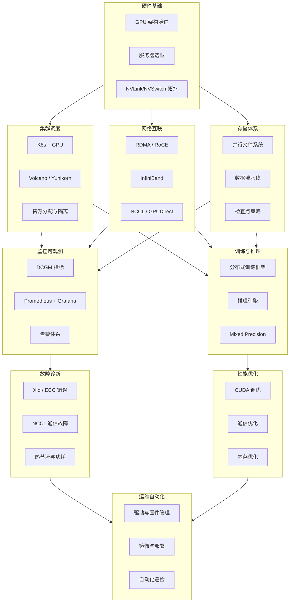

# GPU 集群运维知识总览

> 面向 AI Infra 工程师的 GPU 集群运维知识体系，覆盖从硬件到调度、从网络到存储、从监控到故障排查的全链路。

## 知识体系总览

### 模块结构图

![[assets/知识图谱.svg|1000]]

### 模块依赖关系



## 目录结构

```
07-Knowledge/gpu-cluster-ops/
├── GPU 集群运维知识总览.md          ← 你在这里
├── hardware/                         # 硬件基础
│   ├── NVIDIA GPU 架构演进.md
│   ├── GPU 服务器硬件选型指南.md
│   └── NVLink 与 NVSwitch 拓扑详解.md
├── scheduling/                       # 集群调度
│   ├── K8s GPU 调度机制详解.md
│   ├── Device Plugin 与 DRA 对比.md
│   ├── Volcano 调度器实战.md
│   └── GPU 资源分配与隔离策略.md
├── network/                          # 网络互联
│   ├── RDMA 与 InfiniBand 详解.md
│   ├── NCCL 通信原理与调优.md
│   └── GPU 集群网络拓扑设计.md
├── storage/                          # 存储体系
│   ├── 分布式文件系统选型.md
│   └── 训练数据流水线设计.md
├── monitoring/                       # 监控可观测
│   ├── DCGM 监控体系详解.md
│   └── GPU 集群可观测性方案.md
├── troubleshooting/                  # 故障诊断
│   ├── GPU Xid 错误排查手册.md
│   └── NCCL 通信故障诊断指南.md
├── training/                         # 训练与推理
│   ├── 分布式训练框架对比.md
│   ├── PyTorch 分布式训练实战.md
│   └── 大模型推理引擎对比.md
├── performance/                      # 性能优化
│   ├── GPU 集群性能调优指南.md
│   └── CUDA Kernel 优化基础.md
└── automation/                       # 运维自动化
    ├── GPU 驱动与固件管理.md
    └── 集群自动化部署方案.md
```

## 学习路线

### 🟢 入门阶段（1-2 周）
- 理解 GPU 硬件架构（从 Kepler 到 Blackwell）
- 掌握 NVIDIA 驱动栈：Driver → CUDA → cuDNN → 框架
- 了解 GPU 集群基本概念：节点、机架、胖树拓扑
- 学会使用 `nvidia-smi`、`nvtop`、`dcgmi` 基础命令

### 🟡 进阶阶段（3-4 周）
- 深入 K8s GPU 调度：Device Plugin、MIG、Time-Slicing
- 掌握 RDMA/RoCE 原理与 NCCL 通信模式
- 搭建 DCGM + Prometheus + Grafana 监控体系
- 理解分布式训练：DDP、FSDP、TP、PP 等并行策略

### 🔴 高级阶段（持续）
- GPU 故障诊断：Xid Error、ECC、Thermal Throttling 根因分析
- NCCL 性能调优：PXN、NET/IB、GDR 等技术
- 大规模集群自动化运维与巡检体系
- CUDA Kernel 级性能分析与优化

## 核心概念速查

| 概念 | 简述 | 相关笔记 |
|------|------|----------|
| **CUDA** | NVIDIA 通用并行计算平台 | [[hardware/NVIDIA GPU 架构演进]] |
| **NVLink** | GPU 间高速互联 | [[hardware/NVLink 与 NVSwitch 拓扑详解]] |
| **MIG** | GPU 多实例切分 | [[scheduling/GPU 资源分配与隔离策略]] |
| **RDMA** | 远程直接内存访问 | [[network/RDMA 与 InfiniBand 详解]] |
| **NCCL** | NVIDIA 集合通信库 | [[network/NCCL 通信原理与调优]] |
| **DCGM** | NVIDIA 数据中心 GPU 管理器 | [[monitoring/DCGM 监控体系详解]] |
| **Xid Error** | GPU 硬件/驱动错误码 | [[troubleshooting/GPU Xid 错误排查手册]] |
| **DDP/FSDP** | PyTorch 分布式策略 | [[training/分布式训练框架对比]] |
| **GPUDirect** | GPU 直接访问 RDMA/存储 | [[network/NCCL 通信原理与调优]] |
| **Volcano** | 云原生批量调度器 | [[scheduling/Volcano 调度器实战]] |
| **DRA** | 动态资源分配，替代 Device Plugin 的新框架 | [[scheduling/Device Plugin 与 DRA 对比]] |

## 常用工具链

```
硬件管理:    nvidia-smi, nvml, dcgmi, nvidia-fabricmanager
监控采集:    dcgm-exporter, node-exporter, prometheus
可视化:      Grafana, NVML-Grafana, Netdata
调度器:      Volcano, Yunikorn, Kueue, Run:ai
网络诊断:    ibstat, ibstatus, perftest, nv-bandwidth
存储:        Lustre, GPFS, JuiceFS, WekaFS
训练框架:    PyTorch, DeepSpeed, Megatron-LM, ColossalAI
推理引擎:    vLLM, TensorRT-LLM, SGLang, LMDeploy
配置管理:    Ansible, Terraform, SALT, MAAS
```

## 关联知识

- [[../../Dev-Workflow Kit 学习笔记]] — 日常开发工作流
- [[../k8s/K8s 1.28-1.36 版本更新总结]] — K8s 版本演进
- [[../k8s/特性详解/DRA 动态资源分配详解]] — GPU 在 K8s 中的动态分配
- [[../llm-training/LLM 训练知识总览]] — 大模型训练知识（显存计算、Transformer、混合精度）

## 学习时间

| 阶段 | 预计时间 | 备注 |
|------|----------|------|
| 目录搭建 | 2026-06-29 | 框架创建 |
| 硬件模块完成 | 2026-06-30 | 架构演进/服务器选型/NVLink 拓扑 |
| Device Plugin vs DRA | 2026-06-30 | 调度模块：架构对比/场景决策/迁移指南 |
| 入门内容 | 待定 | 硬件与基础概念 |
| 进阶内容 | 待定 | 调度/网络/监控 |
| 高级内容 | 待定 | 调优与故障诊断 |

## 状态标记

🌱 学习中 | 📖 已掌握 | 🔁 需复习 | 📝 待补充

---

> 本知识库持续更新中。每个子目录内笔记均按 "从原理到实战" 组织，优先覆盖日常运维高频场景。
