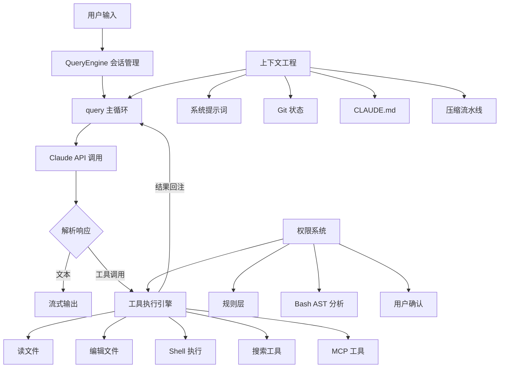

# How Claude Code Works

**深入解读当前最成功的 AI 编程 Agent 的源码架构**

 

[**📘 在线阅读文档**](https://windy3f3f3f3f.github.io/how-claude-code-works/#/)
&nbsp;&nbsp;|&nbsp;&nbsp;
[[how-claude-code-works/README_EN|English]]

 

> 🛠️ **想动手造一个？** 配套项目 **[Claude Code From Scratch](https://github.com/Windy3f3f3f3f/claude-code-from-scratch)** — ~4000 行 TypeScript 或 Python两个版本，11 章分步教程，从零构建你自己的 Claude Code

---

Claude Code 是目前使用最广泛的 AI 编程 Agent，也是我们认为最好用的 AI 编程工具。它能理解整个代码仓库、自主执行多步编程任务、安全地运行命令——而这一切背后是 **50 万行 TypeScript 源码**中沉淀的工程智慧。

Anthropic 开源（x）了这份源码。**但 50 万行代码，从哪里开始读？**

这也是我们创建这个项目的初衷——我们都遇到了没有办法阅读这么庞大代码项目的问题，解决方案是和 Claude Code 一起读，让它写文档配合我们理解源代码。在此同时，我们想把这个过程文档化，就形成了这个项目。

我们和 Claude Code 加班从源码中提炼出 **15 篇专题文档**，覆盖了从核心循环到安全防护的每一个关键设计决策。不管你是想造自己的 AI Agent，还是想更深入地理解和使用 Claude Code，这里都是最短路径（应该？就算不是最短的，我们也会不断更新这个项目）。

  

## 🏗️ 系统架构

## 🤔 这份源码为什么值得深入研究？

大多数 AI Agent 框架都是"demo 级别"——跑通一个场景就宣布成功。Claude Code 不同，它是一个**日活百万级开发者实际使用的生产系统**，需要处理的问题远比 demo 复杂：

- 对话动辄上百万 token，上下文窗口不够用怎么办？（记忆管理、压缩方案是如何设计的超重要）
- 66 个内置工具同时存在，怎么协调？（如果所有工具上下文都给AI，那将直接爆炸）
- 怎么让用户感觉"快"，哪怕模型推理本身就要几十秒？（如何实现流水线设计）
- 用户让 AI 执行 `rm -rf /`，怎么拦住？（安全护栏很重要）

这些问题的解法，就藏在源码里。

## 🔍 从源码中发现的关键设计

> 以下内容均来自对源码的实际分析，不是猜测。

### 为什么 Claude Code 用起来感觉那么快？

它其实做了三件聪明的事：

1. **全链路流式输出** — 不是等模型全部想完再显示，而是每生成一个 token 就立刻展示。从 API 调用到终端渲染，整条链路都是流式的。
2. **工具预执行** — 模型说"我要读某个文件"的时候，这个文件其实已经在读了。系统在模型还在输出的同时就开始解析和执行工具调用，利用模型生成的 5-30 秒窗口，把约 1 秒的工具延迟藏起来了。
3. **9 阶段并行启动** — 启动时把不相关的初始化任务并行执行，关键路径压到约 235ms。

### 出错了怎么办？—— 静默恢复

普通程序遇到错误会报错给用户。Claude Code 的策略是：**能恢复的错误，用户根本看不到。**

比如对话太长超出了上下文窗口，它不会弹个错误框让你手动处理，而是悄悄压缩上下文、自动重试。token 输出达到上限？自动从 4K 升级到 64K 再重试。整个 Agent 循环有 7 种不同的"继续"策略，每种对应一种故障恢复路径。

这就是为什么用 Claude Code 的时候很少遇到报错——不是没有错误，而是大部分都被内部消化了。

### 对话太长怎么办？—— 4 级渐进式压缩

这是整个系统中最精妙的设计之一。当上下文快要超限时，不是一刀切地压缩，而是分 4 个级别逐步处理：

1. **裁剪** — 先把历史消息中的大块内容（旧的工具输出）截断
2. **去重** — 几乎零成本地去除重复内容
3. **折叠** — 把不活跃的对话段落折叠起来，但不修改原始内容（可以展开恢复）
4. **摘要** — 最后手段，启动一个子 Agent 对整个对话做摘要

每一级都可能释放足够的空间，让后面的级别不需要执行。而且压缩后系统会**自动恢复最近编辑的 5 个文件内容**，防止模型忘记刚刚在干什么。

### 怎么防止 AI 执行危险操作？—— 5 层纵深防御

Claude Code 让 AI 直接在你电脑上跑命令，安全设计必须过硬。它不是靠一个"你确定吗？"对话框，而是搭建了 5 层防御体系：

1. **权限模式** — 不同信任级别，限制可执行的操作范围
2. **规则匹配** — 基于命令模式的白名单/黑名单
3. **Bash 命令深度分析** — 这里最硬核：用语法树分析（不是正则匹配）拆解 Shell 命令的真实意图，包含 23 项安全检查，覆盖命令注入、环境变量泄露、特殊字符攻击等
4. **用户确认** — 危险操作弹出确认对话框，但有 200ms 防抖保护，防止键盘连击导致误确认
5. **Hook 校验** — 允许用户自定义安全规则，甚至可以动态修改工具的输入参数（比如自动给 `rm` 加上 `--dry-run`）

这五层任何一层拦住就不会执行，纵深防御。

### 66 个工具如何协同工作？

所有工具——读文件、写文件、跑命令、搜索、甚至第三方 MCP 工具——都遵循**同一套接口规范**。这意味着：

- 第三方工具和内置工具走完全相同的执行流水线，享受同样的安全检查和权限控制
- 只读工具自动并行执行，写操作自动串行，不需要手动管理并发
- 工具输出超过 100K 字符时自动落盘，模型只拿到摘要和文件路径，需要时再读取全文

### 多个 Agent 如何协作？

Claude Code 支持三种多 Agent 模式：

- **子 Agent** — 主 Agent 分派任务给子 Agent，等结果返回
- **协调器** — 纯指挥官模式，协调器只能分配任务，**不能自己读文件、写代码**，强制分工
- **Swarm** — 多个命名 Agent 之间点对点通信，各自独立工作

为了防止多个 Agent 同时改同一个文件产生冲突，系统用 Git Worktree 给每个 Agent 一份独立的代码副本。

## 📚 专题深入

| # | 文档 | 你会了解到 |
|---|------|-----------|
| 1 | [[how-claude-code-works/01-overview|概述]] | 技术选型背后的思考（为什么 Bun/React/Zod）、6 条核心设计原则、9 阶段 235ms 启动流程、数据流全景 |
| 2 | [[how-claude-code-works/02-agent-loop|系统主循环]] | Agent 循环的双层架构、7 种 Continue Sites 故障恢复、工具预执行、StreamingToolExecutor 并发机制 |
| 3 | [[how-claude-code-works/03-context-engineering|上下文工程]] | 4 级压缩流水线完整细节、压缩后自动恢复机制（5 文件 + 技能重激活）、提示词缓存策略与缓存断裂检测 |
| 4 | [[how-claude-code-works/04-tool-system|工具系统]] | 66 个工具的注册与并发控制、MCP 7 种传输详解、连接状态机、OAuth 2.0 + PKCE 认证流程 |
| 5 | [[how-claude-code-works/09-skills-system|技能系统]] | 6 层技能来源与优先级、懒加载与 Token 预算分配、Inline/Fork 双执行模式、白名单权限模型、压缩后技能保留 |
| 6 | [[how-claude-code-works/08-memory-system|记忆系统]] | 4 种记忆类型与封闭分类法、Sonnet 语义召回与异步预取、后台记忆提取 Agent、记忆漂移防御、团队记忆 |
| 7 | [[how-claude-code-works/06-hooks-extensibility|Hooks 与可扩展性]] | 23+ Hook 事件全景、5 种 Hook 类型、6 阶段执行管道、PermissionRequest 4 种能力、信任模型与安全 |
| 8 | [[how-claude-code-works/07-multi-agent|多 Agent 架构]] | 子 Agent 4 种执行模式与 Worktree 隔离、协调器纯编排设计、Swarm 3 种执行后端与信箱通信 |
| 9 | [[how-claude-code-works/10-plan-mode|Plan 模式]] | 两条进入路径、5 阶段与迭代双工作流、附件节流机制、Phase 4 四种实验变体、计划文件管理与恢复、审批与权限恢复 |
| 10 | [[how-claude-code-works/05-code-editing-strategy|代码编辑策略]] | search-and-replace 为什么比整文件重写更好、唯一性约束与抗幻觉设计、编辑前强制读取的代码级实现 |
| 11 | [[how-claude-code-works/15-task-system|任务管理系统]] | 文件级存储与并发锁设计、三层变更检测、依赖追踪与原子认领、多 Agent 任务协调、验证提醒机制 |
| 12 | [[how-claude-code-works/11-permission-security|权限与安全]] | 5 层纵深防御体系、tree-sitter AST 分析 + 23 项安全检查、竞速确认机制与 200ms 防误触 |
| 13 | [[how-claude-code-works/14-system-prompt-design|系统提示词设计]] | 7 层递进式提示词架构、反模式接种与负面清单设计、爆炸半径风险框架、内外分层变体、7 条 Agent 提示词设计原则 |
| 14 | [[how-claude-code-works/12-user-experience|用户体验设计]] | 自研 Ink 渲染器架构、Yoga Flexbox 布局、虚拟滚动与对象池优化、Vim 模式 |
| 15 | [[how-claude-code-works/13-minimal-components|最小必要组件]] | 7 个最小必要组件框架、最小实现 vs 生产级实现的逐项对照、从 500 行到 50 万行的演进路线 |

## 🎯 谁应该读这个？

| 你是 | 你能获得 |
|------|---------|
| 想做 AI Agent 产品的开发者 | 一个经过百万用户验证的架构参考，少走弯路 |
| Claude Code 用户 | 理解它为什么这样工作，学会用 Hooks 和 CLAUDE.md 深度定制 |
| 对 AI 安全感兴趣的人 | 生产级 AI 系统的安全设计实战，不是论文里的理论 |
| 学生或 AI 研究者 | 大规模工程实践的第一手材料，比任何教科书都真实 |

## 📊 关键数据

| 指标 | 数值 |
|------|------|
| 源码总行数 | 512,000+ |
| TypeScript 文件 | 1,884 |
| 内置工具 | 66+ |
| 压缩流水线级数 | 4 级 |
| 权限防御层数 | 5 层 |

## 🗺️ 阅读建议

**只有 10 分钟？**
→ 读 [[how-claude-code-works/quick-start|快速入门]]

**想理解核心原理？**
→ 按顺序读 [[how-claude-code-works/02-agent-loop|主循环]] → [[how-claude-code-works/03-context-engineering|上下文工程]] → [[how-claude-code-works/04-tool-system|工具系统]]

**想自己造一个 AI Agent？**
→ 先读 [[how-claude-code-works/13-minimal-components|最小必要组件]]，然后跟着 **[claude-code-from-scratch](https://github.com/Windy3f3f3f3f/claude-code-from-scratch)** 的 11 章教程动手实现——~4000 行代码，每一步都对照源码讲解

**想定制 Claude Code？**
→ 读 [[how-claude-code-works/06-hooks-extensibility|Hooks 与可扩展性]] + [[how-claude-code-works/08-memory-system|记忆系统]] + [[how-claude-code-works/09-skills-system|技能系统]]

**关注安全？**
→ 读 [[how-claude-code-works/11-permission-security|权限与安全]] + [[how-claude-code-works/05-code-editing-strategy|代码编辑策略]]

## 🤝 贡献者

|  |  |  |  |
|:---:|:---:|:---:|:---:|
| [@Windy3f3f3f3f](https://github.com/Windy3f3f3f3f) | [@davidweidawang](https://github.com/davidweidawang) | [Kaibo Huang](https://scholar.google.com/citations?user=C7B5X5IAAAAJ&hl=zh-CN) | [@longx24](https://github.com/longx24) |

欢迎提 Issue 和 PR！如果你发现分析有误或有更好的理解角度，非常欢迎讨论。

## 🙏 致谢

感谢 [LINUX DO](https://linux.do/) 社区的支持与讨论。

## 💬 更多交流

**加入 AI Agent 工坊 交流群**

QQ 群号：**1090526244**

## 📈 Star History

<picture>
  <source media="(prefers-color-scheme: dark)" srcset="https://api.star-history.com/svg?repos=Windy3f3f3f3f/how-claude-code-works&type=Date&theme=dark" />
  <source media="(prefers-color-scheme: light)" srcset="https://api.star-history.com/svg?repos=Windy3f3f3f3f/how-claude-code-works&type=Date" />
  
</picture>

## 📝 更新记录

| 日期 | 更新内容 |
|------|---------|
| 2026-04-09 | 全面 Review 并修正全部 13 章：修复数字/引用错误（行数、百分比、事件数量、章节编号），为缺少概述的章节补充 high-level 导语，优化章节内部结构（ch05 拆分/交换、ch08 重组），中英文同步更新 |
| 2026-04-03 | 新增第 14 章：系统提示词设计哲学，深入分析提示词内容的设计原理与工程实践 |
| 2026-04-03 | 新增暗色模式、阅读进度条、回到顶部按钮、上下文感知语言切换等 UI 优化 |
| 2026-04-03 | 完成全部 13 篇文档的英文翻译，支持中英双语切换 |
| 2026-04-01 | 拆分记忆与技能为独立章节（11→12 篇），按侧边栏分组重新编号 01-12 |
| 2026-04-01 | 全部 12 章大幅扩充（篇幅翻倍），补充源码级实现细节、Mermaid 架构图、代码示例 |
| 2026-04-01 | 同步更新 quick-start 总览页、README 文档目录描述，匹配各章节新增内容 |
| 2026-03-31 | 新增 3 章：Hooks 与可扩展性、多 Agent 架构、记忆与技能系统 |
| 2026-03-31 | 充实原有 8 章内容，补充启动流程、MCP 集成、压缩恢复机制等专题 |
| 2026-03-31 | 上线 Docsify 文档站点，支持搜索、Mermaid 渲染、章节导航 |
| 2026-03-31 | 初始发布：8 篇核心架构分析文档 |

## 📄 License

MIT
